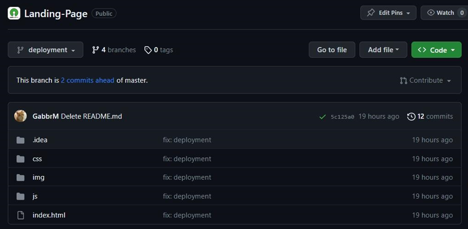
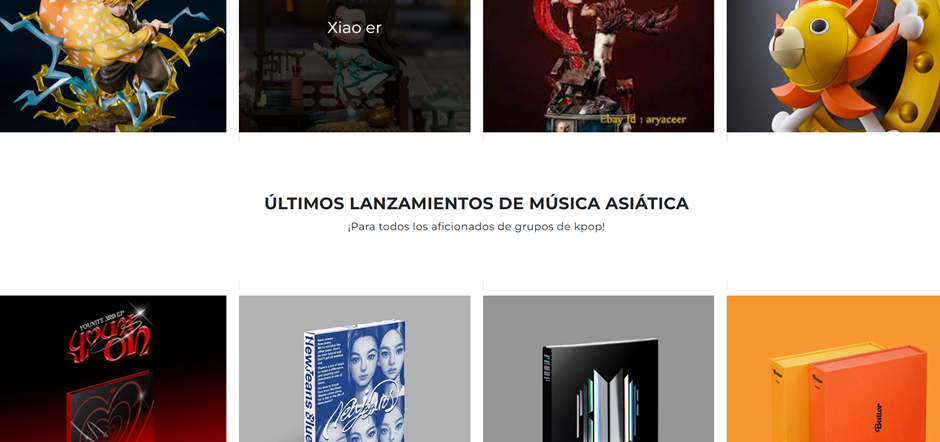
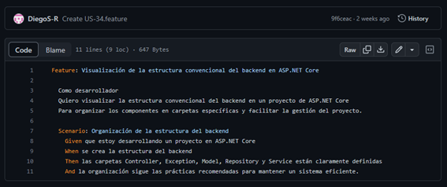

  
___
 

## Registro de versiones

| Versión           | Fecha       | Autor     | Descripción de modificación                                                                                                                                                                                                                                                                                                                                                                                                                                                                                                                                                                                                                                                                                                                                                                                                                                          |
|------------------ |------------ |---------- |--------------------------------------------------------------------------------------------------------------------------------------------------------------------------------------------------------------------------------------------------------------------------------------------------------------------------------------------------------------------------------------------------------------------------------------------------------------------------------------------------------------------------------------------------------------------------------------------------------------------------------------------------------------------------------------------------------------------------------------------------------------------------------------------------------------------------------------------------------------------- |
| Revisión 1 (TB1)  | 01/09/2023  | Lambders  | -Creación del documento.                                                                                                                                                                                                                                                                                                                                                                                                                                                                                                                                                                                                                                                                                                                                                                                                                                             |
| Revisión 2 (TP)   | 23/09/2023  | Lambders  | -Aumento de conclusiones en Student Outcome  -Cambio de fotos en Startup Profiles  -Agregación de cuadro estadístico de entrevistas a ambos segmentos objetivos  -Aumento de información en el capítulo 5  -Agregación de imagen de entrevistador al lado del entrevistado (Entrevistas 6 y 7)  -Aumento de conclusiones (enfatizando entrevistas)  -Agregación de información en git flow.  -Modificación de commits, estos se adaptaron al estándar de commits en github  -Documentación de la nomenclatura de creación de commits en github  -Agregación de gherkin de los Acceptance Test (User Stories)  -Modificación de Story Points en User Stories  -Agregación del velocity en Sprint Planning 1  -Se redactó la determinación de los User Stories correspondientes a cada Sprint  |
|Revisión 3 (TB2)                   | 30/09/2023            |  Lambders         | -Se agregaron títulos únicos a cada User Story  
-Se creó la rama release en Gitflow  
-Se mejoró la modalidad Responsive del Frontend Web Application |
| Revisión 4 (TF1)   |  18/11/2023           |  Lambders         | -Se modificaron las nomenclaturas empleadas  
-Se agregó el Sprint 4                        |
  
___
 

## Project Report Collaboration Insights

**URL Project Report (Github):** 

https://github.com/SI730-Grupo2-WS51-Apps-Web/Project-Report

### Commits en Github:

**Commits en Github en Project-Report**

(Falta)

 

 
**Analíticos de Colaboración en Github:**

Repositorio Project Report (Capstone):

(Falta)
 
 

**Explicación de los commits - (TF1)**

En esta sección, se describa los aportes que los integrantes del equipo han realizado en el repositorio:

a. Nirvana García

(Falta)

b. Gabriel Bernal

 
c. Marcelo Scerpella

(Falta)

d. Michelle Moreno

 
d. Diego Sanchez

(Falta)
 

  
___
 

## Contenido

Registro de Versiones del Informe 

Project Report Collaboration Insights 

Student Outcome 

1.  [Capítulo I: Introducción](#capítulo-i-introducción)

    1.1. [Startup Profile](#11-startup-profile)
        
    1.1.1. [Descripción de la Startup](#111-descripción-de-la-startup)

    1.1.2. [Perfiles de integrantes del equipo](#112-perfiles-de-integrantes-del-equipo)

    1.2. [Solution Profile](#12-solution-profile)

    1.2.1 [Antecedentes y problemática](#121-antecedentes-y-problemática)

    1.2.2 [Lean UX Process](#122-lean-ux-process)
    
    1.2.2.1. [Lean UX Problem Statements](#1221-lean-ux-problem-statements)

    1.2.2.2. [Lean UX Assumptions](#1222-lean-ux-assumptions)

    1.2.2.3. [Lean UX Hypothesis Statements](#1223-lean-ux-hypothesis-statements)

    1.2.2.4. [Lean UX Canvas](#1224-lean-ux-canvas)

    1.3. [Segmentos objetivo](#13-segmentos-objetivo)

2. [Capítulo II: Requirements Elicitation & Analysis](#capítulo-ii-requirements-elicitation--analysis)

    2.1. [Competidores](#21-competidores)

    2.1.1. [Análisis competitivo](#211-análisis-competitivo)

    2.1.2. [Estrategias y tácticas frente a competidores](#212-estrategias-y-tácticas-frente-a-competidores)

    2.2. [Entrevistas](#22-entrevistas)

    2.2.1. [Diseño de entrevistas](#221-diseño-de-entrevistas)

    2.2.2. [Registro de entrevistas](#222-registro-de-entrevistas)

    2.2.3. [Análisis de entrevistas](#223-análisis-de-entrevistas)

    2.3. [Needfinding](#23-needfinding)

    2.3.1. [User Personas](#231-user-persona)

    2.3.2. [User Task Matrix](#223-user-task-matrix)

    2.3.3. [User Journey Mapping](#233-user-jouney-mapping)

    2.3.4. [Empathy Mapping](#234-empathy-mapping)

    2.3.5. [As-is Scenario Mapping](#234-as-is-scenario-mapping)

3. [Capítulo III: Requirements Specification](#capítulo-iii-requirements-specification)

    3.1. [To-Be Scenario Mapping](#31-to-be-scenario-mapping)

    3.2. [User Stories](#32-user-stories)

    3.3. [Impact Mapping](#33-impact-mapping)

    3.4. [Product Backlog](#34-product-backlog)

4. [Capítulo IV: Product Design](#capítulo-iv-product-design)

    4.1. [Style Guidelines](#41-style-guidelines)

    4.1.1. [General Style Guidelines](#411-general-style-guidelines)
   
    4.1.2. [Web Style Guidelines](#412-web-style-guidelines)
   
    4.2. [Information Architecture](#42-information-architecture)
   
    4.2.1. [Organization Systems](#421-organization-systems)
   
    4.2.2. [Labeling Systems](#422-labeling-systems)
   
    4.2.3. [SEO Tags and Meta Tags](#423-seo-tags-and-meta-tags)
   
    4.2.4. [Searching Systems](#424-searching-systems)
   
    4.2.5. [Navigation Systems](#425-navigation-systems)

    4.3. [Landing Page UI Design](#43-landing-page-ui-design)
   
    4.3.1. [Landing Page Wireframes](#431-landing-page-wireframe)
   
    4.3.2. [Landing Page Mock-up](#432-landing-page-mock-up)
   
    4.4. [Web Applications UX/UX Design](#44-web-applications-uxui-design)
   
    4.4.1. [Web Applications Wireframes](#441-web-applications-wireframes)
   
    4.4.2. [Web Applications Wireflow Diagrams](#442-web-applications-wireflow-diagrams)
   
    4.4.2. [Web Applications Mock-ups](#442-web-applications-mock-ups)
   
    4.4.3. [Web Applications User Flow Diagrams](#443-web-applications-user-flow-diagrams)
   
    4.5. [Web Applications Prototyping](#45-web-applications-prototyping)
   
    4.6. [Domain-Driven Software Architecture](#46-domain-driven-software-architecture)
   
    4.6.1. [Software Architecture Context Diagram](#461-software-architecture-context-diagram)
   
    4.6.2. [Software Architecture Container Diagrams](#462-software-architecture-container-diagrams)
   
    4.6.3. [Software Architecture Components Diagrams](#463-software-architecture-components-diagrams)
   
    4.7. [Software Object-Oriented Design](#47-software-object-oriented-design)
   
    4.7.1. [Class Diagrams](#471-class-diagrams)
   
    4.7.2. [Class Dictionary](#472-class-dictionary)
   
    4.8. [Database Design](#48-database-design)
   
    4.8.1. [Database Diagram](#481-database-diagram)

5. [Capítulo V: Product Implementation, Validation & Deployment](#capítulo-v-product-implementation-validation--deployment)

    5.1. [Software Configuration Management](#51-software-configuration-management)
   
    5.1.1. [Software Development Environment Configuration](#511-software-development-environment-configuration)
   
    5.1.2. [Source Code Management](#512-source-code-management)
   
    5.1.3. [Source Code Style Guide & Conventions](#513-source-code-style-guide--conventions)
   
    5.1.4. [Software Deployment Configuration](#514-software-deployment-configuration)
   
    5.2. [Landing Page, Services & Applications Implementation](#52-landing-page-services--applications-implementation)
   
    5.2.1. [Sprint 1](#521-sprint-1)
   
    5.2.1.1. [Sprint Planning 1](#5211-sprint-planning-1)
   
    5.2.1.2. [Sprint Backlog 1](#5212-sprint-backlog-1)
   
    5.2.1.3. [Development Evidence for Sprint Review](#5213-development-evidence-for-sprint-review)
   
    5.2.1.4. [Testing Suite Evidence for Sprint Review](#5214-testing-suite-evidence-for-sprint-review)
   
    5.2.1.5. [Execution Evidence for Sprint Review](#5214-execution-evidence-for-sprint-review)
   
    5.2.1.6. [Services Documentation Evidence for Sprint Review](#5216-services-documentation-evidence-for-sprint-review)
   
    5.2.1.7. [Software Deployment Evidence for Sprint Review](#5217-software-deployment-evidence-for-sprint-review)
   
    5.2.1.8. [Team Collaboration Insights during Sprint](#5218-team-collaboration-insights-during-sprint)

    5.2.2. [Sprint 2](#521-sprint-1)
   
    5.2.2.1. [Sprint Planning 2](#5211-sprint-planning-1)
   
    5.2.2.2. [Sprint Backlog 2](#5212-sprint-backlog-1)
   
    5.2.2.3. [Development Evidence for Sprint Review](#5213-development-evidence-for-sprint-review)
   
    5.2.2.4. [Testing Suite Evidence for Sprint Review](#5214-testing-suite-evidence-for-sprint-review)
   
    5.2.2.5. [Execution Evidence for Sprint Review](#5214-execution-evidence-for-sprint-review)
   
    5.2.2.6. [Services Documentation Evidence for Sprint Review](#5216-services-documentation-evidence-for-sprint-review)
   
    5.2.2.7. [Software Deployment Evidence for Sprint Review](#5217-software-deployment-evidence-for-sprint-review)
   
    5.2.2.8. [Team Collaboration Insights during Sprint](#5218-team-collaboration-insights-during-sprint)

    5.2.3. [Sprint 3](#523-sprint-3)

    5.2.3.1. [Sprint Planning 3](#5211-sprint-planning-1)

    5.2.3.2. [Sprint Backlog 3](#5232-sprint-backlog-3)
    
    5.2.3.3. [Development Evidence for Sprint Review](#5233-development-evidence-for-sprint-review)

    5.2.3.4. [Testing Suite Evidence for Sprint Review](#5234-testing-suite-evidence-for-sprint-review)

    5.2.3.5. [Execution Evidence for Sprint Review](#5235-execution-evidence-for-sprint-review)

    5.2.3.6. [Services Documentation Evidence for Sprint Review](#5236-services-documentation-evidence-for-sprint-review)

    5.2.3.7. [Software Deployment Evidence for Sprint Review](#5237-software-deployment-evidence-for-sprint-review)

    5.2.3.8. [Team Collaboration Insights during Sprint](#5238-team-collaboration-insights-during-sprint)

    5.3 [Validation Interviews](#53-validation-interviews)

    5.3.2. [Registro de Entrevistas](#532-registro-de-entrevistas)

    5.3.3. [Evaluaciones según heurísticas](#533-evaluaciones-según-heurísticas)

    5.4. [Video About the Product](#54-video-about-the-product)

    [Conclusiones y recomendaciones](#conclusiones-y-recomendaciones)
    
    [Video About the Team](#video-about-the-team)

    [Bibliografía](#bibliografía)

    [Anexos](#anexos)

  
___
 

## Student Outcome

### ABET – EAC - Student Outcome 3

**Criterio:** Capacidad de comunicarse efectivamente con un rango de audiencias.
En el siguiente cuadro se describe las acciones realizadas y enunciados de
conclusiones por parte del grupo, que permiten sustentar el haber alcanzado el logro
del ABET – EAC - Student Outcome 3.
| Criterio Específico                                                                                                                                                                    | Acciones realizadas                                                                                                                                                                                                                                                                                                                                                                                                                                                                                                                                                                                                                                                                                                                                                                                                                                                                                                                                                                                                                                                                                                                                                                                                                                                                                                                                                                                                                                                                                                                                                                                                                                                                                                                                                                                                                                                                                                                                                                                                                                                                                                                                                                                                                                             | Conclusiones                                                                                                                                                                                                                                                                                                                                                                                                                                                                                                                                                                                                                                                                                                                                                                                                                                                                                                                                                                                                                                                                                                                                                                                                                                                                                                                                                                                                                                                                                                                                                                                                                                                                                                                                                                                                                                                                                                                                                                                                                                                                                                                                                                                                                                                                                                                                                                                                                                                                                                                                                                                                                                                                                                                                                                                                                                                                                                                                                                                                                                                                                                                                                                        |
|--------------------------------------------------------------------------------------------------------------------------------------------------------------------------------------- |---------------------------------------------------------------------------------------------------------------------------------------------------------------------------------------------------------------------------------------------------------------------------------------------------------------------------------------------------------------------------------------------------------------------------------------------------------------------------------------------------------------------------------------------------------------------------------------------------------------------------------------------------------------------------------------------------------------------------------------------------------------------------------------------------------------------------------------------------------------------------------------------------------------------------------------------------------------------------------------------------------------------------------------------------------------------------------------------------------------------------------------------------------------------------------------------------------------------------------------------------------------------------------------------------------------------------------------------------------------------------------------------------------------------------------------------------------------------------------------------------------------------------------------------------------------------------------------------------------------------------------------------------------------------------------------------------------------------------------------------------------------------------------------------------------------------------------------------------------------------------------------------------------------------------------------------------------------------------------------------------------------------------------------------------------------------------------------------------------------------------------------------------------------------------------------------------------------------------------------------------------------- |------------------------------------------------------------------------------------------------------------------------------------------------------------------------------------------------------------------------------------------------------------------------------------------------------------------------------------------------------------------------------------------------------------------------------------------------------------------------------------------------------------------------------------------------------------------------------------------------------------------------------------------------------------------------------------------------------------------------------------------------------------------------------------------------------------------------------------------------------------------------------------------------------------------------------------------------------------------------------------------------------------------------------------------------------------------------------------------------------------------------------------------------------------------------------------------------------------------------------------------------------------------------------------------------------------------------------------------------------------------------------------------------------------------------------------------------------------------------------------------------------------------------------------------------------------------------------------------------------------------------------------------------------------------------------------------------------------------------------------------------------------------------------------------------------------------------------------------------------------------------------------------------------------------------------------------------------------------------------------------------------------------------------------------------------------------------------------------------------------------------------------------------------------------------------------------------------------------------------------------------------------------------------------------------------------------------------------------------------------------------------------------------------------------------------------------------------------------------------------------------------------------------------------------------------------------------------------------------------------------------------------------------------------------------------------------------------------------------------------------------------------------------------------------------------------------------------------------------------------------------------------------------------------------------------------------------------------------------------------------------------------------------------------------------------------------------------------------------------------------------------------------------------------------------------------ |
| Comunica oralmente sus ideas y/o resultados con objetividad a público de diferentes especialidades y niveles jerárquicos, en el marco del desarrollo de un proyecto en ingeniería|TB1 Gabriel Bernal: Comunicación de ideas para: ●  Startup Profile ●  Solution Profile ●  Antecedentes y problemática  ●  Lean UX ●  Segmentos objetivo ●  Software Architecture Context Diagram ●  Software Architecture Container Diagrams Nirvana García: Comunicación de ideas para: ●  Web Style Guidelines ●  Information Architecture ●  Organization Systems ●  Labeling Systems ●  SEO Tags and Meta Tags  ●  Searching Systems ●  Navigation Systems ●  Landing Page Wireframes ●  Landing Page Mock-up ●  Database Diagram ●  Web Applications Wireflow Diagrams Michelle Moreno: Comunicación de ideas para: ●  Competidores ●  Análisis competitivo  ●  Estrategias y tácticas frente a competidores ●  Needfinding ●  User Personas ●  User Task Matrix  ●  User Journey Mapping ●  Empathy Mapping ●  As-is Scenario Mapping ●  Web Applications Wireframes ●  Web Applications Mock-ups ●  Class Dictionary Marcelo Scerpella: Comunicación de ideas para: ●  Web Applications Prototyping ●  Class Diagrams ●  Software Configuration Management ●  Software Development Environment Configuration ●  Sprint Planning 1 ●  Sprint Backlog 1 Diego Sanchez: Comunicación de ideas para: ●  To-Be Scenario Mapping  ●  User Stories  ●  Impact Mapping  ●  Product Backlog ●  Source Code Management ●  Source Code Style Guide & Conventions ●  Software Deployment Configuration ●  Software Architecture Components Diagrams  TP1 Gabriel Bernal: Comunicación de ideas para: ●  Execution Evidence for Sprint Review Nirvana García: Comunicación de ideas para: ●  Sprint 2 ●  Sprint Planning 2 ●  Sprint Backlog 2 Michelle Moreno: Comunicación de ideas para: ●  Execution Evidence for Sprint Review Marcelo Scerpella: Comunicación de ideas para: ●  Execution Evidence for Sprint Review  
TB2 Diego Sánchez: Comunicación de ideas para: ●Sprint 3 ●Sprint Planning 3 ●Sprint Backlog 3 Gabriel Bernal: Comunicación de ideas para: ●Execution Evidence for Sprint Review Nirvana García: Comunicación de ideas para:
 ●Sprint 3 ●Sprint Planning 3 ●Sprint Backlog 3 Michelle Moreno:  ●Comunicación de ideas para: ●Execution Evidence for Sprint Review Marcelo Scerpella: Comunicación de ideas para:
 ●Execution Evidence for Sprint Review
  
TF1Diego Sánchez: Comunicación de ideas para: ●Sprint 3 ●Sprint Planning 3 ●Sprint Backlog 3 Gabriel Bernal: Comunicación de ideas para: ●Execution Evidence for Sprint Review Nirvana García: Comunicación de ideas para:
 ●Sprint 3 ●Sprint Planning 3 ●Sprint Backlog 3 Michelle Moreno:  ●Comunicación de ideas para: ●Execution Evidence for Sprint Review Marcelo Scerpella: Comunicación de ideas para:
 ●Execution Evidence for Sprint Review| Conclusión 1: Como equipo, hemos llevado a cabo una serie de acciones que demuestran nuestro compromiso con la comunicación efectiva y objetiva dentro del proyecto. Cada miembro ha contribuido con tareas de redacción y documentación que abarcan desde perfiles de inicio y solución, hasta antecedentes y problemáticas, así como segmentos objetivo y metodologías como Lean UX. Estas actividades demuestran una comprensión profunda y una capacidad para comunicar claramente los aspectos clave del proyecto a diferentes audiencias, ya que se ha empleado la comunicación oral entre los integrantes para saber si sus planteamientos, de cada punto de las rúbricas, eran los correctos. Conclusión 2: El equipo ha demostrado habilidades de comunicación efectiva al presentar sus ideas y resultados a audiencias de diferentes especialidades y niveles jerárquicos. Durante la presentación del proyecto, cada miembro pudo explicar de manera clara y concisa los aspectos técnicos y conceptuales del proyecto, utilizando un lenguaje comprensible para todos los participantes. Además, se evidenció la capacidad de adaptación del equipo al nivel de conocimiento de cada audiencia, lo que permitió una comunicación efectiva y una comprensión mutua. Conclusión 3: La comunicación oral dentro del equipo ha sido fundamental para el éxito del proyecto. Los miembros del equipo hemos desarrollado habilidades de escucha activa y hemos fomentado un ambiente de respeto y apertura para la discusión y el intercambio de ideas. Esto ha permitido una colaboración efectiva, donde las ideas y opiniones de cada miembro fueron consideradas y debatidas de manera constructiva. La comunicación oral también ha sido utilizada para resolver conflictos y tomar decisiones en equipo, lo que ha fortalecido la cohesión y el compromiso del grupo. Conclusión 4: Reconocimos la importancia de adaptar su comunicación a diferentes audiencias. Durante el desarrollo del proyecto, se llevaron a cabo presentaciones a stakeholders de diferentes especialidades y niveles jerárquicos. Como equipo, pudimos ajustar nuestro lenguaje y enfoque según las necesidades de cada audiencia, lo que permitió una comunicación efectiva y una comprensión clara de los aspectos clave del proyecto. Esta habilidad de adaptación demostrada por el equipo es fundamental para asegurar que la información se transmita de manera clara y que se logren los objetivos de comunicación establecidos.  Conclusión 5: La comunicación oral efectiva ha sido un factor clave en el éxito del proyecto. La capacidad del equipo para comunicar sus ideas y resultados de manera objetiva ha facilitado la comprensión y el consenso entre los miembros del equipo y las diferentes audiencias involucradas en el proyecto. Esto ha permitido una toma de decisiones informada y una implementación eficiente de las soluciones propuestas. La comunicación oral efectiva también ha contribuido a la construcción de relaciones sólidas con los stakeholders y ha generado confianza en el equipo y en el proyecto en general.  |
| Comunica en forma escrita ideas y/o resultados con objetividad a público de diferentes especialidades y niveles jerárquicos, en el marco del desarrollo de un proyecto en ingeniería.| TB1 Gabriel Bernal: Redacción de: ●  Startup Profile ●  Solution Profile ●  Antecedentes y problemática  ●  Lean UX ●  Segmentos objetivo ●  Software Architecture Context Diagram ●  Software Architecture Container Diagrams Nirvana García: Redacción de: ●  Web Style Guidelines ●  Information Architecture ●  Organization Systems ●  Labeling Systems ●  SEO Tags and Meta Tags  ●  Searching Systems ●  Navigation Systems ●  Landing Page Wireframes ●  Landing Page Mock-up ●  Database Diagram ●  Web Applications Wireflow Diagrams Michelle Moreno: Redacción de: ●  Competidores ●  Análisis competitivo  ●  Estrategias y tácticas frente a competidores ●  Needfinding ●  User Personas ●  User Task Matrix  ●  User Journey Mapping ●  Empathy Mapping ●  As-is Scenario Mapping ●  Web Applications Wireframes ●  Web Applications Mock-ups ●  Class Dictionary Marcelo Scerpella: Redacción de: ●  Web Applications Prototyping ●  Class Diagrams ●  Software Configuration Management ●  Software Development Environment Configuration ●  Sprint Planning 1 ●  Sprint Backlog 1 Diego Sanchez: Redacción de: ●  To-Be Scenario Mapping  ●  User Stories  ●  Impact Mapping  ●  Product Backlog ●  Source Code Management ●  Source Code Style Guide & Conventions ●  Software Deployment Configuration ●  Software Architecture Components Diagrams TP1 Gabriel Bernal: Redacción de: ●  Development Evidence for Sprint Review Nirvana García: Redacción de: ●  Sprint Planning 2 ●  Sprint Backlog 2 ●  Development Evidence for Sprint Review ●  Team Collaboration Insights during Sprint Michelle Moreno: Redacción de: ●  Development Evidence for Sprint Review ●  Software Deployment Evidence for Sprint Review Marcelo Scerpella:Redacción de: ●  Development Evidence for Sprint Review ●  Software Deployment Evidence for Sprint Review Diego Sanchez: Redacción de: ●  Team Collaboration Insights during Sprint
  
**TB2** 
Gabriel Bernal: Redacción de: 
●Development Evidence for Sprint Review 
Nirvana García: Redacción de: 
●Sprint Planning 3 
●Sprint Backlog 3 
●Development Evidence for Sprint Review 
●Team Collaboration Insights during Sprint 
Michelle Moreno: Redacción de: 
●Development Evidence for Sprint Review 
●Software Deployment Evidence for Sprint Review 
Marcelo Scerpella:Redacción de: 
●Development Evidence for Sprint Review 
●Software Deployment Evidence for Sprint Review 
Diego Sanchez: Redacción de: 
●Team Collaboration Insights during Sprint 
  
**TF1** 
Gabriel Bernal: Redacción de:
●Development Evidence for Sprint Review 
Nirvana García: Redacción de: 
●Sprint Planning 4 
Sprint Backlog 4 
●Development Evidence for Sprint Review 
●Team Collaboration Insights during Sprint 
Michelle Moreno: Redacción de: 
●Development Evidence for Sprint Review 
●Software Deployment Evidence for Sprint Review 
Marcelo Scerpella:Redacción de: 
●Development Evidence for Sprint Review 
●Software Deployment Evidence for Sprint Review 
Diego Sanchez: Redacción de: 
●Team Collaboration Insights during Sprint | Conclusión 1: Como equipo, se ha logrado realizar un trabajo destacado en la comunicación escrita de ideas y resultados relacionados con el proyecto de ingeniería. Cada miembro ha contribuido con tareas de redacción y documentación dentro del informe, para desarrollar este proyecto de ingeniería. Conclusión 2: El equipo ha demostrado habilidades sólidas de comunicación escrita al redactar informes y documentación relacionada con el proyecto de ingeniería. Cada miembro ha sido capaz de expresar de manera clara y objetiva las ideas y los resultados obtenidos durante el desarrollo del proyecto. Esto ha permitido una fácil comprensión por parte de audiencias de diferentes especialidades y niveles jerárquicos. Conclusión 3: La comunicación escrita dentro del equipo ha sido fundamental para documentar y compartir de manera efectiva los hallazgos y avances del proyecto. Los informes y documentos elaborados han sido exhaustivos, bien estructurados y claros en su contenido. Esto ha permitido que las personas involucradas en el proyecto, independientemente de su especialidad, comprendan fácilmente las ideas y los resultados presentados. Conclusión 4: El equipo ha demostrado una habilidad destacada para adaptar su comunicación escrita a diferentes audiencias. La redacción utilizada en los informes y documentos ha sido adecuada para el público objetivo, evitando jergas técnicas excesivas y utilizando un lenguaje claro y conciso. Esta adaptabilidad ha facilitado la comprensión y la colaboración entre los miembros del equipo y las partes interesadas externas. Conclusión 5: La comunicación escrita efectiva ha sido un factor clave en el éxito del proyecto. Gracias a la objetividad y claridad en la redacción, se ha logrado transmitir de manera efectiva las ideas y los resultados del proyecto a diferentes especialidades y niveles jerárquicos. Esto ha permitido una toma de decisiones informada, una mejor colaboración entre los equipos y una implementación exitosa de las soluciones propuestas. |                                                                                                                                                                                                                                                                                          |

  
___
 

# Capítulo I: Introducción

## 1.1 Startup Profile

**Lambders** es una innovadora startup peruana que tiene como objetivo revolucionar el comercio electrónico en el país, centrándose especialmente en el mercado asiático. Nos dedicamos apasionadamente a satisfacer las necesidades de aquellos que son fanáticos de la fascinante cultura asiática, ofreciendo una amplia gama de productos auténticos y de alta calidad.

Para garantizar la autenticidad de cada producto que ofrecemos, nos esforzamos por establecer alianzas estratégicas con proveedores confiables y reconocidos en la industria asiática. Trabajamos de cerca con ellos para seleccionar cuidadosamente los productos que cumplen con nuestros estándares de calidad y autenticidad, asegurando que nuestros clientes reciban solo los mejores productos.

En Lambders, nos enorgullece ofrecer un servicio al cliente excepcional. Valoramos las opiniones y sugerencias de nuestros clientes, y nos dedicamos a brindarles una experiencia de compra personalizada y satisfactoria. Nuestro equipo altamente capacitado está disponible para responder preguntas, brindar asesoramiento y ayudar en cada paso del proceso de compra.

Además de mantenernos actualizados con las últimas tendencias del mercado asiático, nos esforzamos por ofrecer productos exclusivos que superen las expectativas de nuestros clientes. Exploramos constantemente nuevas oportunidades de crecimiento y expansión, buscando maneras de mantenernos a la vanguardia de la industria. Estamos comprometidos con la innovación y la mejora continua para ofrecer siempre lo mejor a nuestros clientes.

  
___
 

### 1.1.1. Descripción de la Startup
___
**Misión**

La misión de nuestra startup es fomentar y difundir la pasión por la cultura asiática en Perú, a través de la oferta de productos auténticos y de alta calidad. Asimismo, conectar a los amantes del anime, k-pop y manhua en Perú con productos genuinos que reflejan su pasión por estas formas de entretenimiento. Nos esforzamos por ser los intermediarios entre los aficionados y la cultura asiática, proporcionando una plataforma en la que puedan encontrar una amplia variedad de merchandising a precios justos y de fácil acceso. Finalmente, buscamos garantizar la autenticidad de cada producto y brindar una experiencia de compra satisfactoria.

**Visión**

La visión de nuestra startup es convertirnos en el referente principal del comercio electrónico de merch de la cultura asiática en Perú. Buscamos construir una comunidad sólida, donde los aficionados puedan encontrar productos de alta gama que les permitan expresar su apasionado interés por sus series y grupos favoritos. Buscamos adaptarnos a las necesidades cambiantes de nuestros clientes y mantenernos a la vanguardia de la industria. Además, a través de la innovación constante, la expansión y el crecimiento, aspiramos a ser reconocidos como líderes en el mercado, superando las expectativas de nuestros clientes y contribuyendo al crecimiento y difusión de la cultura del anime, kpop y manhua en Perú.

  
___
 

### 1.1.2. Perfiles de integrantes del equipo

  
___
 

## 1.2 Solution Profile 

Akira es el destino definitivo para los aficionados del mundo del entretenimiento asiático en el Perú. Somos una tienda virtual especializada en la venta de productos auténticos y originales de anime, kpop y manhua en el país, y nos enorgullece ser pioneros en traer la magia de estas apasionantes formas de entretenimiento directamente a tus manos. Nuestro objetivo es satisfacer la creciente demanda de los fanáticos peruanos, proporcionándoles un fácil acceso a la amplia gama de productos auténticos fabricados en Asia. 

Somos un punto de encuentro para aquellos que buscan sumergirse en el mundo del entretenimiento asiático, ofreciendo gran variedad de figuras de anime coleccionables, plush toys, mangas, manhua, merchandising oficial de los grupos de kpop más populares, como álbumes, lightsticks, photocards, y mucho más. Nos enorgullece trabajar en estrecha colaboración con tiendas virtuales reconocidas en Japón, China, Corea del Sur y países importadores originales para garantizar la autenticidad y calidad de cada producto que ofrecemos.

En Akira, nos dedicamos a crear una experiencia de compra excepcional, ofreciendo una diversidad extensa de productos seleccionados para satisfacer los gustos de la comunidad. Nuestra plataforma intuitiva y amigable permite una navegación fluida y una búsqueda eficiente, asegurando que nuestros clientes puedan acceder a los productos con mayor facilidad mediante un filtrado avanzado que les permitirá navegar por categorías específicas, marcas populares y las últimas tendencias. De esa manera, tendrán la oportunidad de explorar productos novedosos, atendiendo sus requerimientos de manera efectiva y experimentando un servicio al cliente de primer nivel.

  
___
 

### 1.2.1 Antecedentes y problemática 

 

**What (Qué):**

**¿Cuál es el problema?**

El problema que abordamos en Akira es la carencia de una vía fácil y confiable para acceder a productos originales relacionados con el anime, kpop y manhua en el mercado peruano. Este limitante desanima a los interesados de la cultura asiática de adquirir artículos auténticos y también frena el crecimiento potencial de la comunidad.

La mayoría de las opciones actuales carecen de la garantía de autenticidad y calidad lo que genera escepticismo entre los consumidores. Además, la escasa disponibilidad de estos productos en el mercado peruano, obliga a los consumidores a recurrir a compras internacionales, lo cual resulta costoso en términos de envíos y tiempos de entrega.

Por ello, tenemos como objetivo el proporcionar una solución que ofrezca una experiencia de compra sin problemas a los fanáticos y brindarles la comodidad de encontrar todo lo que desean en un solo lugar y cumpliendo con los estándares de calidad.

  

**When (Cuándo):**

**¿Cuándo sucede el problema?**

Cuando los amantes del entretenimiento asiático en Perú se enfrentan a dificultades para encontrar aquellos productos asiáticos de su interés, debido a la falta de opciones confiables en las escasas plataformas existentes dentro el mercado peruano. Si hablamos de dichas plataformas, estas brindan productos muy limitados en cuanto a variedad de animes, cantidad de grupos de kpop de los que traen mercadería, entre otros, y asimismo, los productos que ofrecen suelen encontrarse a precios muy elevados y poco accesibles para un público regular. 

Todo esto genera que la comunidad de clientes no puedan satisfacer sus deseos de adquirir su mercadería asiática, o deba gastar una cantidad considerable de dinero para conseguirlo.

  

**Where (dónde):**

**¿Dónde está el cliente cuando usa el servicio?**

Al ser un servicio virtual, el cliente se encontrará en cualquier dispositivo que le permita ingresar a la página web para poder realizar una compra. Este dispositivo debe contar con conexión a internet y debe ser compatible con navegadores web como Chrome, Safari, Firefox o Microsoft Edge, en sus versiones actualizadas.

Asimismo, el cliente puede encontrarse en algún ambiente físico como su casa, su institución educativa, centro de trabajo, entre otros, lugar donde se sienta cómodo y en confianza para realizar alguna compra dentro de la plataforma o solo decida revisar el amplio catálogo de productos de la cultura asiática que ofrecemos.

  

**Why (por qué):**

**¿Cuál es la causa del problema?**

La causa del problema reside en la preocupación por la autenticidad de los productos, ya que en el mercado existen productos falsificados o de calidad inferior, generando dudas o desconfío en los consumidores sobre la genuinidad de los productos.

Además, los consumidores albergan una sensación de incertidumbre acerca de la seguridad de las transacciones y la incertidumbre de si los productos realmente serán entregados. Otros problemas serían la falta de garantías y la experiencia de estafas en línea que pueden disuadir a los consumidores de realizar compras en línea.

Por otro lado, este mercado aún no ha sido explorado a fondo, lo que representa una oportunidad para Akira de proporcionar productos en tendencia y auténticos de manera segura y conveniente para los usuarios.

  

**Who (quién):**

**¿Quiénes están involucrados?** 

Tenemos como principales involucrados a los participantes de la startup Lambders, los cuales se encargarán de la creación de la plataforma e-commerce de productos asiáticos y su correcta gestión, nuestros proveedores, siendo tiendas del extranjero reconocidas mundialmente por su autenticidad que nos brindarán el stock de productos necesarios para ofrecer a nuestros clientes, y la comunidad de clientes, los cuales se encuentran interesados por adquirir mercadería relacionada al entretenimiento asiático desde la comodidad de sus hogares, en Perú.

  

**How (cómo):**

**¿En qué condiciones los clientes usan nuestro producto?** 

Nuestros clientes utilizarán nuestra plataforma cuando deseen adquirir productos originales de la cultura asiática en el Perú. En nuestro país, los lugares donde se pueden adquirir este tipo de mercancía son muy limitados, siendo usualmente las páginas en redes sociales como Facebook o Instagram, tiendas físicas dentro de Arenales, el Centro Comercial de cultura asiática más referente de Lima, Perú o por último, tiendas virtuales del extranjero (principalmente de Japón, China y Corea del Sur). Ellos acceden a Akira cuando nos tomen en cuenta como una opción confiable, segura y cómoda para realizar compras de sus preciados productos auténticos.

**¿Qué llevó a la persona a llegar a nuestro servicio?**

El motivo principal que conduce a los consumidores a utilizar nuestro servicio es la escasez de páginas confiables para adquirir artículos auténticos relacionados con el anime, kpop, manhua, entre otros.

Además, el haber tenido malas experiencias con diversas páginas de venta de productos asiáticos por recibir productos falsificados o de calidad baja generan desconfianza en los consumidores.

Sin embargo, la necesidad de acceso fácil y seguro a productos originales motivaría a los consumidores a llegar a nuestro servicio ya que la creciente demanda en el país hace que los usuarios busquen opciones que cumplan sus expectativas.

  

**How much (cuánto)**

**¿Cuánta es la demanda de la problemática?**

Alrededor del mundo, la industria del anime ha experimentado un crecimiento significativo desde el inicio de la década pasada. Esto puede observarse en el volumen de ingresos procedentes de la comercialización del ánime fuera de japón, cuyo volumen neto también ha ido en aumento.

[Anexo C]

Según RPP, a pesar de la recesión económica experimentada durante la pandemia, el volumen de ventas de manga de la campaña navideña del 2021 se triplicó con respecto a las ventas registradas en el año anterior. Esto se debe a la aparición de una nueva empresa de Streaming multimedia llamada Crunchyroll, que se especializa en la difusión de la cultura audiovisual asiática. Otro factor clave que recalca el artículo para justificar el aumento del interés de los peruanos por la industria del entretenimiento del país del sol naciente es el aumento del catálogo de animación nipona en Netflix, debido a la decadencia de la industria del entretenimiento norteamericano.

El artículo también explica que la razón por la cual las plataformas de streaming y el público en general están apostando por la industria del anime es la ineficacia que ha demostrado la industria del entretenimiento americano al tratar temas como la diversidad racial o sexual, temas que, según el propio artículo, el anime y el manga llevan incorporando desde hace años de forma apropiada, y de forma que resulta interesante para el consumidor final.

Este auge en la industria del ánime también aumenta el consumo de otros bienes relacionados con la industria del ánime, como lo son la venta de mangas, o de cosplays (La Cámara, 2022). La industria es tan rentable que durante la pandemia se abrieron ciento treinta nuevos negocios relacionados al mundo del cosplay.

Como explica Agusto Venegas en la entrevista que concedió a La Cámara, un fanatico del anime puede llegar a gastar hasta 1000 soles mensuales al comprar o intercambiar figuritas coleccionables. En el mismo artículo, Emma Torres, dueña de Impulso Cosplay, indicó que un fanatico puede gastar entre 80 y 500 soles en un cosplay.

El *K-Pop*, por su parte, también ha vivido un enorme apogeo en Latinoamérica, y especialmente en Perú. Según Google Trends, la cantidad de usuarios que buscaron BTS en Perú en Youtube, aumentó drásticamente entre 2008 y 2022. La popularidad de este grupo fué tán grande, que superó la cantidad de búsquedas de Ariana Grande, una cantante de pop.

[Anexo C]

  
___
 

## 1.2.2 Lean UX Process

## **1.2.2.1. Lean UX Problem Statements**

a. Hemos detectado el gran limitante de artículos disponibles que enfrentan los fanáticos de la cultura asiática en cuanto a la adquisición de productos originales de sus animes favoritos, grupos de K-Pop, mangas y demás ramas en el mundo del entretenimiento asiático. Esta falta de variedad y acceso a artículos auténticos dificulta la satisfacción de su pasión por estos contenidos y limita su capacidad de obtener productos exclusivos y genuinos.

b. Hemos notado que las opciones de compra de estos productos asiáticos no se encuentran en rangos de precio asequibles para los compradores regulares, problemática que limita el acceso a la adquisición de dichos productos y afecta negativamente a la experiencia de compra. Este alto costo se debe a la escasez de tiendas especializadas en el rubro de productos orientales en el Perú, por lo que la falta de competencia y gran demanda genera un aumento en los precios. En consecuencia, los clientes se encuentran obligados a pagar precios excesivos o tienen que renunciar a la compra de sus productos por inaccesibilidad financiera.

c. Hemos observado que en el mercado peruano actual existen carencias en cuanto a la diversidad de productos ofrecidos por las tiendas existentes. Esta carencia de variedad se hace evidente a través de la repetición de productos en las ofertas de esas tiendas. Por ende, esta repetitividad de productos genera limitantes opciones a los consumidores y también esto desencadena un desinterés progresivo debido a la falta de novedades en los productos.

d. Hemos notado que las tiendas tienden a enfocarse en solo un segmento del mercado oriental, como por ejemplo, la venta de álbumes de kpop o las figuras coleccionables de anime. Esta limitación en la variedad de productos es notoria tanto en las tiendas físicas como en las tiendas virtuales ya que las tiendas no se han arriesgado a abarcar todo el mundo del entretenimiento asiático. Por lo que esta restricción puede llevar a los consumidores a explorar nuevas alternativas como las tiendas internacionales, y existe la posibilidad de que las tiendas locales pierdan clientes.

e. Hemos observado la inseguridad de muchos usuarios al realizar compras en línea en tiendas virtuales enfocadas al mercado oriental que no ofrecen una gran variedad de opciones de pago seguras y confiables. Actualmente, en el mercado peruano de este rubro, las pocas tiendas existentes cuentan con opciones limitadas de métodos de pago, restringiendo las opciones a pago en efectivo, Yape o Plin, y rechazando pagos con tarjetas de crédito, débito o PayPal. La exclusión de métodos de pago populares y ampliamente utilizados, limita la conveniencia y flexibilidad que los usuarios esperan al realizar compras en línea, e incluso llegan a limitar su crecimiento, perdiendo oportunidades de negocio.

f. Hemos notado que los clientes en Perú de este rubro tienen dificultades para encontrar información detallada sobre los productos en las tiendas ya existentes, como descripciones, recomendaciones de uso, calificaciones de las ventas, lo que dificulta su toma de decisiones de compra informadas. Muchos de estos clientes buscan conocer detalles concretos de los productos, como el tamaño de la figura coleccionable, cuántas personas han comprado un producto específico en la plataforma e-commerce, cuál es el rango de calificación de los compradores del producto, entre otras características, ya que esta amplitud de información los hace sentir más seguros en cuanto a realizar una compra. 

g. Hemos detectado que el prolongado tiempo de espera asociado a la entrega de productos adquiridos virtualmente de tiendas asiáticas hacia latinoamérica, genera incomodidad y un sentimiento de impaciencia en los consumidores. Además, afecta negativamente la experiencia de compra ya que desgasta la confianza que tiene el cliente. Por ende, un e-commerce local capaz de solventar este desafío, a través de la implementación de almacenes estratégicos dentro del país es una opción innovadora.

  
___
 

## 1.2.2.2. Lean UX Assumptions

**Assumptions Worksheet**

*¿Quién es el usuario?*

- Jóvenes consumidores del entretenimiento asiático
- Mayoristas y vendedores de productos asiáticos

 

*¿Qué problemas tiene nuestro producto? ¿Resolver?*

- Alcance geográfico limitado a envíos nacionales en Perú.
- Obtener una variedad constante de productos originales del entretenimiento asiatico.
- Limitante comunicación con proveedores en Asia debido a barreras idiomáticas y culturales.
- Posibles dificultades para mantener precios competitivos debido a costos de importación y envío.

 

*¿Qué características son importantes?*
- Amplia variedad de productos asiáticos, abarcando la mayoría de rubros de entretenimiento oriental, incluyendo merch de K-pop, figuras de anime, plushies, mangas, manhuas, y demás.
- Ofrecimiento de un catálogo de productos 100% originales, provenientes de las tiendas oficiales de Corea, Japón y China.
- Sistema de calificación y reseñas para que los clientes compartan sus experiencias y opiniones sobre los productos adquiridos.
- Brindar descuentos, promociones especiales y programas de fidelidad donde los clientes obtengan una mayor participación en Akira.
- Proceso de envío con seguimiento a tiempo real, demostrando su eficiencia y confiabilidad mediante un rastreo de paquetes.
Alianzas con proveedores de confianza en Asia para garantizar un servicio seguro y productos auténticos.

 

*¿Dónde encaja nuestro producto en su trabajo o vida?* 
- En el caso de los jóvenes fanáticos del entretenimiento asiático, Akira proporciona acceso a productos difíciles de conseguir de este rubro en el Perú, y así, nuestros clientes puedan conseguir sus preciados productos y satisfagan pasatiempos como coleccionar y leer.
- En los mayoristas y vendedores de productos asiáticos en Perú, Akira les brinda la oportunidad de expandir el catálogo de productos que usualmente venden en sus tiendas, generando mayores ganancias y desarrollando un alcance más fructífero con los  fanáticos peruanos del entretenimiento asiatico.

 

*¿Cuándo y cómo es nuestro producto? ¿Usado?* 
- El producto será usado cuando los clientes deseen encontrar y comprar fácilmente una diferente variedad de mercancía asiática, además, en un intervalo de tiempo reducido en cuanto al envío de los productos.
- El producto será usado cuando los vendedores peruanos de productos asiáticos deseen aumentar el stock de productos que ofrezcan o, necesiten reponer stock de productos que ya venden. 
- El producto será a través de una aplicación web mediante algún dispositivo con conexión a internet, y un navegador web como Chrome, Microsoft Edge o Firefox.

 

*¿Cómo debe verse nuestro producto y cómo comportarse?* 
- El diseño debe ser atractivo y coherente con el tema del entretenimiento asiatico.
- La navegación debe ser sencilla e intuitiva. Los usuarios deben poder encontrar fácilmente las categorías, filtros y distintas opciones del producto.
- La plataforma debe ser compatible con dispositivos de distintas dimensiones como celulares, tablets, laptops y computadoras, poseyendo un diseño responsive.
- La plataforma debe cargar rápidamente para evitar que los usuarios se frustren.
- Cada producto debe tener una descripción completa de sus características y poseer imágenes de alta calidad para apreciarlo correctamente.
- Enviar notificaciones a los usuarios interesados cuando un producto agotado vuelve a estar disponible, para que puedan ser los primeros en comprarlo.
Permitir a los usuarios dejar reseñas y comentarios sobre los productos adquiridos.

  
___
 

**Business Outcomes**
- Convertir a Akira en la plataforma líder en la venta de productos auténticos de entretenimiento asiatico en el mercado peruano, estableciendo una reputación sólida y confiable.
- El 60% de los clientes que visitaron la página han encontrado lo que buscaban en la plataforma.
- El 15% de los clientes que visitaron la página han comprado un producto al menos una vez.

 

**User Benefits**
- Acceder a una amplia variedad de productos auténticos del mercado asiatico.
- Ahorro de tiempo en la búsqueda del producto deseado.
- Facilidad en la compra y envío de cualquier producto de la plataforma.
- Reducción de espera en los tiempos de envío que regularmente existen entre Asia y Latinoamérica.

 

**Assumptions Steps**

*a. Creo que mis clientes necesitan:* 
- Acceso oportuno a productos propios de la cultura popular asiática.
- Expresar sus experiencias y expectativas de compra de productos dentro de un e-commerce.
- Interactuar con plataformas intuitivas y visualmente atractivas, para facilitar experiencias.
- Ofertas, promociones o incentivos de reducción de precio en sus compras.
- Encontrar un e-commerce que incida en confiabilidad en cuanto a autenticidad de productos asiáticos, no productos copias ni piratas.

*b. Estas necesidades se pueden resolver con:* 
- Una tienda virtual que otorgue una amplia variedad de productos auténticos y originarios de Asia, facilitando la obtención de los productos deseados por parte de los aficionados al entretenimiento asiático en el Perú.
- Un sistema de reseñas donde los usuarios puedan dejar opiniones objetivas y fundamentadas sobre animes y grupos de kpop.
- Una base de datos completa y actualizada con información detallada sobre los productos que se vendan en la plataforma.
- Funcionalidades de interacción social, como comentarios y mensajes privados entre usuarios.
- Un diseño visualmente atractivo y coherente con el tema del entretenimiento asiático.

*c. Mis clientes iniciales son (o serán):*
- Personas aficionadas al anime, kpop y manhua en el Perú que buscan productos auténticos y originales relacionados con la cultura popular asiática.
- Mayoristas y vendedores de productos de la cultura asiática que quieran obtener productos más rebuscados o busquen un proveedor más llamativo.

*d. El valor #1 que un cliente quiere de mi producto es veracidad. (utilidad, funcionalidades que le resuelven un problema)* 
- La garantía de que los productos ofrecidos son auténticos y originales de Asia, lo que brinda confianza en la calidad y la autenticidad de lo que están adquiriendo.
- Reseñas objetivas y fundamentadas que les ayuden a tomar decisiones informadas en cuanto a sus compras dentro de Akira.
- Crear bundles temáticos que incluyan varios productos relacionados con un anime o grupo de kpop específico, estos a un precio ligeramente reducido en comparación con la compra de los productos por separado.

e. El cliente también puede obtener estos beneficios adicionales:
- Acceso a contenido exclusivo, como entrevistas, noticias y lanzamientos anticipados (opción premium).
- Participar en concursos y sorteos exclusivos para ganar mercancía y experiencias únicas relacionadas con el anime y kpop.
- Integración de funciones de gamificación para fomentar la participación activa de los usuarios, como desafíos, logros y rankings basados en la interacción y contribución en la plataforma.
- La posibilidad de calificar y comentar las reseñas para fomentar la interacción y la comunidad.
- Filtrar productos asiáticos por país (Japón, Corea o China), por tipo (libro, figura de acción, y demás), fecha de lanzamiento, popularidad, etc.

*f. Voy a adquirir la mayoría de mis clientes a través de:* 
- Estrategias de marketing digital enfocadas en comunidades en línea de personas interesadas en adquirir productos relacionados al entretenimiento asiático.
- Publicidad física dentro del Centro Comercial Arenales (el CC. de cultura asiática más popular de Lima, Perú), mediante pancartas y carteles.
- Redes sociales como Instagram, TikTok y Facebook.
- Colaboraciones con influencers y creadores de contenido relacionados con anime y kpop.
- Anuncios en plataformas de streaming y sitios web especializados.

*g. Haré dinero a través de:* 
- Las ganancias de las ventas de productos de la cultura del entretenimiento oriental 
- El cobro de tarifas de envío.
- Membresías premium con acceso a contenido exclusivo y funciones adicionales.
- Colaboraciones y patrocinios con marcas y empresas relacionadas con el anime y kpop.
- Anuncios en plataformas de streaming (Youtube y Twitch).
- Ofrecer servicios de envoltura de regalos personalizados por un costo adicional

*h. Mi competencia principal en el mercado:* 
- Tiendas virtuales y físicas nacionales que ofrecen productos relacionados con el entretenimiento asiático.
- Tiendas virtuales internacionales que manejan el mercado de la venta de productos del entretenimiento asiático y sus costos de envío a Perú no tan excesivos.

*i. Los venceremos debido a:* 
- Nuestra dedicación a la transparencia y calidad, así como la cercana colaboración con proveedores confiables de Asia, nos permitirán ofrecer productos originales destacables del mercado.
- La calidad y confiabilidad de nuestras reseñas al comprar productos, respaldadas por un sistema de calificación y comentarios.
- La amplia y actualizada base de datos de información detallada sobre los productos presentes en la plataforma.
- El diseño atractivo y coherente con el tema del entretenimiento asiático.
La interacción y la comunidad activa que fomentamos en nuestra plataforma.

*j. Mi mayor riesgo del producto es:* 
- La falta de confianza por parte de los clientes en la autenticidad de los productos que ofrecemos, esto podría afectar negativamente nuestra reputación y ventas.
- La generación de reseñas falsas o sesgadas en la compra de productos que puedan afectar la confiabilidad de la plataforma.

*k. Resolveremos esto a través de:* 
- Asociaciones sólidas con proveedores de confianza en Asia, brindando garantías sobre la autenticidad y calidad de nuestros productos,  obteniendo retroalimentación positiva de los clientes.
- Implementando un sistema de moderación y verificación de reseñas para garantizar su veracidad mediante.

*l. ¿Qué otras suposiciones tenemos? ¿Eso, si se prueba que es falso, causará que nuestro negocio / proyecto no funcione?* 
- Podrían ser la eficacia de nuestras estrategias de marketing en línea para atraer clientes, y la capacidad de mantener una oferta de productos actualizada y relevante. Si se prueba que alguna de estas suposiciones es falsa, podría afectar negativamente la viabilidad de nuestro negocio.
- Otra suposición es que los usuarios estarán dispuestos a pagar por la membresía premium para acceder a contenido exclusivo y funciones adicionales. Si esto se prueba falso, podría afectar la generación de ingresos y la sostenibilidad del proyecto.

  
___
 

## 1.2.2.3. Lean UX Hypothesis Statements

**Hypothesis 1**

Creemos que tener suscripciones premium que ofrezcan a los usuarios acceso exclusivo a productos antes que los usuarios regulares, podremos evaluar si existe un interés real en inversiones para experiencias y productos diferenciados
Sabremos que hemos tenido éxito
Cuando veamos un aumento significativo en la adquisición de suscripciones premium y una mayor participación en la reserva anticipada de productos

 

**Hypothesis 2**

Creemos que al ofrecer promociones y descuentos exclusivos para los usuarios podremos evaluar si esta estrategia impulsa un aumento en la conversión de usuarios regulares a suscriptores premium
Sabremos que hemos tenido éxito
Cuando veamos un aumento del 20% en el número de ventas en un periodo de seis meses

 

**Hypothesis 3**

Creemos que al optimizar y mejorar la flexibilidad de la experiencia de usuario en la navegación y búsqueda de productos podremos determinar si logramos aumentar el tiempo promedio de permanencia en el sitio
Sabremos que hemos tenido éxito
Cuando veamos un incremento en el tiempo de permanencia en un 25% en el transcurso de tres meses

 

**Hypothesis 4**

Creemos que al establecer alianzas estratégicas con marcas reconocidas en la industria del entretenimiento asiático podremos determinar si logramos aumentar nuestros ingresos y ampliar nuestra base de usuarios
Sabremos que hemos tenido éxito
Cuando veamos un incremento del 14% en los ingresos mensuales y un aumento del 10% en el tráfico de usuarios en un período de cuatro meses. 

 

**Hypothesis 5**

Creemos que al implementar un sistema de seguimiento de pedidos en tiempo real, lograremos brindar a nuestros clientes confianza en el proceso de entrega de sus productos
Sabremos que hemos tenido éxito
Cuando recibamos retroalimentación positiva de al menos 85% de los clientes encuestados sobre el proceso de entrega en un plazo de tres meses 

 

**Hypothesis 6**

Creemos que al implementar un sistema de reseñas y calificaciones de los productos, generados por los mismos clientes que adquirieron un producto en particular, provocaremos mayor confianza y fidelidad entre nuestra comunidad
Sabremos que hemos tenido éxito
Cuando veamos que el 40% de los compradores dentro de Akira emplean el sistema de reseñas y calificaciones de los productos que adquieren, y además, observemos un incremento en las ventas de los productos más valorados y mejor calificados.

 

**Hypothesis 7**

Creemos que al ofrecer envío gratuito en compras superiores a cierto monto, incentivaremos a los clientes a adquirir más productos en  la plataforma
Sabremos que hemos tenido éxito 
Cuando veamos un aumento del 30% en el valor promedio de las compras realizadas y, un aumento en la tasa de conversión de clientes regulares a clientes que califican para el envío gratuito

 

**Hypothesis 8**

Creemos que al implementar un sistema de recompensas por traer a nuevos compradores a la plataforma, incentivaremos a los clientes existentes a recomendarnos a sus amigos y conocidos
Sabremos que hemos tenido éxito
Cuando veamos que la cantidad de personas que se registren y realicen una compra incremente exponencialmente luego de implementar este sistema

 

**Hypothesis 9**

Creemos que al establecer una política de devolución y reembolso flexible y transparente, generaremos confianza y satisfacción a nuestros clientes
Sabremos que hemos tenido éxito
Cuando veamos una disminución de quejas por productos que llegaron en mal estado o demás posibles escenarios negativos

 

**Hypothesis 10**

Creemos que, otorgando beneficios en la compra de los clientes en su fecha de cumpleaños, aumentaremos la popularidad de Akira por este gesto tan personalizado y cercano con la comunidad
Sabremos que hemos tenido éxito
Cuando veamos un aumento en la participación de los clientes en un 40% en la fecha de su cumpleaños, reflejado en un incremento en las ventas durante ese período

  
___
 

## 1.2.2.4. Lean UX Canvas

| **Lean UX Canvas** | **Título: Akira**   | **Fecha: 21/08/2023**   **Iteracíon: TB1** |
| ------------------ | ------------------- | --------------------- |
| **1. Problema de negocios**    •Nuestra plataforma ofrece a los consumidores del entretenimiento asiático un acceso amplio de productos ante la limitada oferta, desafíos de envío y los elevados precios actualmente debido a que hemos detectado que el rango de precios de los productos no son asequibles para los compradores regulares en el Perú. Asimismo, el prolongado tiempo de espera asociado a la entrega de productos adquiridos hacia latinoamérica, genera incomodidad e impaciencia en los consumidores. | **5. Ideas de las soluciones:**  1. Filtro de búsqueda basado en categorías.  2. Filtro de búsqueda según el nombre del producto.  3. Funcionalidad de carrito para los productos seleccionados.  4. Presentación visual del estado del envío de los pedidos.  5. Implementación de códigos promocionales para ofertas especiales.  6. Reseñas y calificaciones de productos comprados por parte de los clientes.  7. Recomendaciones de productos relacionados.  8. Sección de preguntas frecuentes para resolver dudas.  9. Opción de devoluciones y políticas de reembolso claras.  10. Interfaz amigable para facilitar la adquisición de productos. | **2. Resultados comerciales**  • Convertir a Akira en la plataforma líder en la venta de productos auténticos de entretenimiento asiático en el mercado peruano.  • La cantidad de reseñas con puntaje positivo supera significativamente a la cantidad de reseñas negativas.  • El 60% de los clientes que visitaron la página han encontrado lo que buscaban en la plataforma.  • El 15% de los clientes que visitaron la página han comprado un producto al menos una vez.  • Al menos el 20% del total de las descargas de la app en un mes provienen de personas que descargaron la app desde un enlace posteado en una red social.  • El 40% de los usuarios premium en la aplicación han utilizado alguna vez el sistema de chats y han obtenido respuesta en un plazo menor a 24 horas. |
| **3. Usuarios y Clientes**  • Jóvenes consumidores de entretenimiento asiático, tales como otakus, kpopers, cosplayers, fujoshis, entre otros.  • Mayoristas o vendedores de productos de entretenimiento asiático. ||**4. Beneficios del usuario**   •Acceder a una amplia variedad de productos auténticos del mercado asiatico.  • Ahorro de tiempo en la búsqueda del producto deseado.  • Facilidad en la compra y envío de cualquier producto de la plataforma. |
|**6. Hipótesis**  • Creemos que la implementación de promociones y descuentos periódicos aumentará las ventas y fidelizará a los fanáticos jóvenes de la cultura asiática. Sabremos que hemos tenido éxito cuando veamos un aumento del 15% en las ventas durante los períodos de promoción en comparación con los períodos sin promociones. • Creemos que al ofrecer envío gratuito para pedidos superiores a cierto monto, incentivaremos a los clientes a realizar compras más grandes y aumentaremos el valor promedio de cada pedido. Sabremos que hemos tenido éxito cuando veamos un incremento del 10% en el valor promedio de los pedidos realizados después de implementar esta estrategia. • Creemos que ofrecer un programa de recompensas por fidelidad, donde los clientes acumulen puntos por cada compra realizada, incentivará a los fanáticos a realizar compras recurrentes en Akira. Sabremos que hemos tenido éxito cuando veamos un aumento del 10% en el número de clientes que realizan compras repetidas y un aumento del 5% en la tasa de retención de clientes. • Creemos que al implementar un sistema de seguimiento de pedidos en tiempo real, lograremos brindar a nuestros clientes confianza en el proceso de entrega de sus productos. Sabremos que hemos tenido éxito cuando recibamos retroalimentación positiva de al menos 85% de los clientes encuestados sobre el proceso de entrega en un plazo de tres meses.|**7. ¿Qué es lo más importante que necesitamos aprender primero?** •  Conocer el costo de adquisición y mantenimiento de los productos de kpop, anime y relacionados a la cultura asiática que ofrecemos en Akira. • Evaluar el impacto de las estrategias de publicidad en redes sociales para atraer a nuestro público objetivo de fanáticos jóvenes de la cultura asiática. • Determinar si los clientes están satisfechos con la calidad de los productos y servicios ofrecidos por Akira, y si esto se reflejará en reseñas y opiniones positivas. • Comprender la disposición de los fanáticos a participar en la interacción y responder preguntas relacionadas con las reseñas de los productos que han comprado. • Evaluar la disposición de los clientes a pagar una membresía premium para acceder a beneficios adicionales y exclusivos en Akira.| **8. ¿Cuál es la menor cantidad de trabajo que necesitamos hacer para resolver las dudas y para hacer lo siguiente más importante?** •Crear un grupo de importacion en facebook y calcular la velocidad con la que se llena el cupo de productos en kilos. • Realizar una investigación de mercado para identificar a los competidores directos en el mercado de productos de kpop, anime y entretenimiento asiático, y estimar el costo de adquisición y mantenimiento de inventario para Akira. • Realizar encuestas a los fanáticos jóvenes de la cultura asiática para evaluar su respuesta hacia la publicidad en redes sociales y analizar su comportamiento de compra en línea. • Conducir encuestas a los clientes de Akira para determinar si están dispuestos a dejar reseñas positivas después de recibir productos de calidad y un buen servicio. • Llevar a cabo entrevistas con los clientes de Akira para determinar su disposición a pagar una membresía premium que brinde beneficios exclusivos, como descuentos especiales y acceso anticipado a nuevos productos.|

  
___
 

## 1.3. Segmentos objetivo 

**Segmento Uno: Jóvenes fanáticos del entretenimiento** 

Nuestro primer segmento se dirige a un grupo demográfico clave: los adolescentes y adultos jóvenes de entre 16 y 35 años, residentes en Lima, Perú. 

Este segmento se caracteriza por su afinidad hacia la cultura del entretenimiento asiático y la adopción de dispositivos electrónicos como parte integral de su vida diaria. Ya sea que utilicen una laptop, una computadora de escritorio, un smartphone o una tablet, estos jóvenes están constantemente conectados y buscan experiencias relacionadas con la cultura asiática que puedan disfrutar a través de sus dispositivos.

 

**Segmento Dos: Vendedores de productos asiáticos** 

Nuestro segundo segmento se enfoca en los vendedores de productos asiáticos en Lima, Perú, que desean ampliar su catálogo de productos o reponer sus stocks. 

Este segmento está compuesto por emprendedores y propietarios de tiendas físicas o virtuales que se especializan en la venta de figuras y coleccionables relacionados con la cultura asiática. Estos vendedores, que tienen entre 20 y 40 años de edad, reconocen el potencial y la demanda creciente de productos asiáticos en el mercado peruano.

  
___
 

# Capítulo II: Requirements Elicitation & Analysis 

## 2.1. Competidores

En el mercado de tiendas en línea enfocadas en productos relacionados con la cultura asiática, Lambders se encuentra en un entorno competitivo. A continuación, se presentan los principales competidores directos:

● Sagami Store: Esta reconocida tienda virtual se especializa en la importación y venta de figuras coleccionables de Japón. Con una amplia selección de productos auténticos y de alta calidad, Sagami Store ha ganado popularidad entre los aficionados a las figuras y coleccionables japoneses en Perú. Su enfoque en la calidad de los productos y la importación directa desde Japón les ha permitido construir una sólida base de clientes.

● Japan.pe: Esta plataforma se destaca por ofrecer un servicio personalizado de "personal shoppers" en Japón. Su equipo de expertos en compras se encarga de ayudar a los usuarios a adquirir cualquier producto permitido desde Japón hasta Perú. Japan.pe ha establecido una reputación sólida como un servicio confiable y eficiente, brindando a los consumidores peruanos acceso a una amplia gama de productos japoneses auténticos que de otra manera serían difíciles de obtener.

● K.Story.Peru: Dirigida a los amantes del K-pop, K.Story.Peru es una tienda en línea especializada en la venta de merchandising de grupos de K-pop. Su catálogo incluye una variedad de productos como álbumes, pósters, ropa y accesorios relacionados con los grupos de música K-pop más populares. K.Story.Peru ha logrado captar la atención de los fanáticos peruanos del K-pop al ofrecer productos exclusivos y de calidad que les permiten mostrar su apoyo y amor hacia sus artistas favoritos.

Estos competidores directos representan desafíos significativos en el mercado de tiendas en línea enfocadas en la cultura asiática. 

  
___
 

### **2.1.1. Análisis competitivo**

<table>
  <thead>
    <tr>
      <th colspan="6">Competitive Analysis Landscape</th>
    </tr>
    <tr>
      <th colspan="2">¿Por qué llevar a cabo este análisis?</th>
      <th colspan="4">El objetivo de este apartado es analizar las características y metas que posee la competencia y compararla con Akira</th>
    </tr>
    <tr>
      <th colspan="2"></th>
      <th>Su startup Akira</th>
      <th>Competidor 1 (Sagami Store)</th>
      <th>Competidor 2 (Japan.pe)</th>
      <th>Competidor 3 (K.Story.Peru)</th>
    </tr>
  </thead>
  <tbody>
    <tr>
      <td colspan="">Perfil</td>
      <td>Overview</td>
      <td>Plataforma destinada a los amantes de la cultura asiática que quieran comprar productos auténticos, originales relacionados con el anime, kpop y manhua.</td>
      <td>Página destinada a las personas que quieren comprar solo figuras coleccionables de Japón.</td>
      <td>Página destinada a las personas que quieren comprar diferentes merchandising de Japón.</td>
      <td>Página destinada a la comunidad kpoper que desea comprar merchandising de sus grupos favoritos.</td>
    </tr>
    <tr>
      <td></td>
      <td>Ventaja competitiva ¿Qué valor ofrece a los clientes?</td>
      <td>Nuestra startup se destaca por ofrecer una amplia gama de productos originales relacionados a la cultura asiática.   Akira ofrece a los clientes la comodidad de encontrar figuras coleccionables, mangas y merchandising en una sola plataforma confiable.</td>
      <td>Esta tienda se especializa en importar figuras coleccionables de Japón, lo que la hace una opción focalizada para los amantes de este rubro.  Además, ofrece una selección de figuras auténticas de Japón, brindando a los clientes la posibilidad de enriquecer sus colecciones.</td>
      <td>Esta tienda ofrece una combinación de figuras de acción, mangas, peluches, entre otros productos.  Japan.pe proporciona figuras originales y mercancía japonesa en general, permitiendo a los clientes explorar diferentes aspectos de la cultura japonesa.</td>
      <td>Es una tienda que ofrece merchandising específico para los kpopers.  K.Story.Peru ofrece a los fanáticos la oportunidad de acceder a productos originales y oficiales de sus grupos favoritos desde álbumes y lightsticks hasta photocards y otros artículos relacionados.</td>
    </tr>
    <tr>
      <td>Perfil de marketing</td>
      <td>Mercado objetivo</td>
      <td>Personas interesadas, coleccionistas y amantes de la cultura asiática.</td>
      <td>Coleccionistas de figuras coleccionables en el rubro del anime.</td>
      <td>Aficionados con la cultura japonesa.</td>
      <td>La comunidad aficionada al K-Pop.</td>
    </tr>
    <tr>
      <td></td>
      <td>Estrategias de marketing</td>
      <td>El aplicar marketing con redes sociales nos permitirá posicionarnos en el mercado y difundir nuestros productos.</td>
      <td>Cuenta con una página web, WhatsApp Business e Instagram.</td>
      <td>Cuenta con Instagram, página web y Facebook.</td>
      <td>Cuenta con Instagram, Facebook, Twitter, Tiktok.</td>
    </tr>
    <tr>
      <td>Perfil de producto</td>
      <td>Productos & Servicios</td>
      <td>Página web donde podrán comprar figuras, mangas, manhuas y merchandising de kpop.</td>
      <td>Página web donde venden figuras coleccionables solo de Japón.</td>
      <td>Página web donde venden mangas y cualquier rubro de merchandising japonés.</td>
      <td>Página web donde se compra merchandising solamente de Corea del Sur.</td>
    </tr>
    <tr>
      <td></td>
      <td>Precios & Costos</td>
      <td>El usuario podrá ingresar a la página web libremente como usuario normal, pero tenemos una suscripción premium en el cual el usuario tiene diversos beneficios.</td>
      <td>El servicio es gratuito y no hay costo alguno por escribir al WhatsApp Business si hay alguna duda.</td>
      <td>Es gratis y no hay pago de suscripciones.</td>
      <td>No hay que pagar para acceder a las páginas y no hay publicidad.</td>
    </tr>
    <tr>
      <td></td>
      <td>Canales de distribución (Web)</td>
      <td>Akira contará con una página web.</td>
      <td>El único canal es mediante su página web.</td>
      <td>El único canal es mediante su Instagram.</td>
      <td>El único canal de distribución de este competidor es mediante su página web.</td>
    </tr>
    <tr>
      <td>Análisis SWOT</td>
      <td colspan="5">Realice esto para su startup y sus competidores. Sus fortalezas deberían apoyar sus oportunidades y contribuir a lo que ustedes definen como su posible ventaja competitiva.</td>
    </tr>
    <tr>
      <td></td>
      <td>Fortalezas</td>
      <td>Abarcamos todo el mundo del entretenimiento asiático, tanto en el Pop Koreano, animes y manhuas (libros chinos).</td>
      <td>Su plataforma es visualmente armoniosa para los clientes, una interfaz visualmente atractiva y con una usabilidad muy bien considerada.</td>
      <td>Un concepto totalmente innovador, donde el cliente elige productos de tiendas oficiales y realiza un pedido a una persona individual, la cual maneja la página.</td>
      <td>Cuenta con una amplia variedad de productos en los limitados grupos de kpop con los que trabaja, no se reduce únicamente a álbumes y lightsticks, abarca accesorios, bolsos, lapiceros y demás.</td>
    </tr>
    <tr>
      <td></td>
      <td>Debilidades</td>
      <td>Recursos económicos y financieros limitados para el desarrollo completo de la plataforma.  Falta de contactos dentro de la industria de las exportaciones de productos asiáticos.</td>
      <td>La tienda se muestra en mantenimiento por largos periodos de tiempo, generando incomodidad y confusión a su clientela.</td>
      <td>Los precios de envío son excesivamente elevados, superando los s/.400.</td>
      <td>Los grupos de kpop que abarcan son muy reducidos y no tan populares, además que actualmente, muchos de su lista se encuentran en hiatus (grupo disuelto).</td>
    </tr>
    <tr>
      <td></td>
      <td>Oportunidades</td>
      <td>Amplia base de usuarios potenciales.  Principales canales de promoción con bajo o nulo costo de publicidad.</td>
      <td>Al ser visualmente agradable, su empleabilidad es muy intuitiva, y se logra apreciar una amplia gama de filtros de búsqueda en cuanto a tipos de anime, figuras, entre otros.</td>
      <td>El contar con alianzas con tiendas totalmente exclusivas, ya que en Perú, encontrar maneras de adquirir productos de estas tiendas es muy complejo, por lo que Japan Pe se encuentra en ventaja.</td>
      <td>El tener una amplia variedad de productos de un solo grupo hace de que las fans de estos generen una mayor demanda en esos productos específicos.</td>
    </tr>
    <tr>
      <td></td>
      <td>Amenazas</td>
      <td>Nuevos competidores que aborden la venta de diversa mercancía del entretenimiento asiático en el Perú.  Actualmente no contamos con una competencia tan completa como la nuestra.</td>
      <td>Que el problema del mantenimiento prolongado genere tanto fastidio a sus clientes que su propia comunidad deje de recomendar su e-commerce, ya que existen otras.</td>
      <td>El precio excesivo de envío genere completo desinterés en que su clientela desee continuar comprando en esta plataforma, ya que pueden encontrar alternativas más accesibles.</td>
      <td>La desintegración de las bandas de las que ofrece mercadería, ya que más de la mitad de su lista de bandas ya no labura en el mundo del kpop actualmente, y si no amplía su variedad de grupos, todo lo que ofrezca será muy obsoleto para el público actual.</td>
    </tr>
  </tbody>
</table>

### **2.1.2. Estrategias y tácticas frente a competidores**

**Calidad y confiabilidad del producto:**

- Venderemos productos diferenciados para los gustos de nuestro primer segmento, con ello, nos destacamos del resto de la competencia. Además, ofreceremos unas ofertas en base al poder adquisitivo de los jóvenes.
- Buen diseño de la interfaz, interactivo e intuitivo, además de mantener presente los fundamentos de usabilidad en aplicaciones.
- Brindar información más detallada en comparación a nuestros principales competidores sobre los productos presentes en el catálogo de Akira.
- Verificación y validación de que las opiniones y comentarios sobre experiencias de compra no contengan palabras soez, agresión a otros usuarios y demás comportamientos poco éticos.
- Incentivar a los clientes a aumentar sus compras en la plataforma mediante diversas promociones, beneficios y ofertas, que muestran nuestra afinidad con la comunidad.
- Mostrar nuestras alianzas con las plataformas oficiales de merchandising de entretenimiento asiático, para ser transparentes en cuanto a confiabilidad y autenticidad de nuestros productos.

**Canales de comunicación diversos con el mercado objetivo:**

- Chats de soporte técnico relacionados a alguna petición de devolución del producto por daños de fábrica o en el envío
- Canal de sugerencias, donde los usuarios puedan sugerir mejoras en la aplicación, ideas de traer a la plataforma productos asiáticos no disponibles en Akira, y demás.
- Chatbot que soporte preguntas frecuentes dentro de la plataforma.

**Precios comerciales asequibles:**

- Ofrecer descuentos y promociones a los usuarios más recurrentes, para incentivarlos a realizar más compras por ese sentimiento de familiaridad.
- Ajustar el precio de membresías premium, para que sean asequibles a nuestros segmentos objetivos.

**Publicidad intensiva en redes sociales:**

- Realizar pequeños anuncios y videos cortos en plataformas de streaming como Youtube y Twitch para tener un mayor alcance que la competencia.
- Abrir una cuenta comercial de difusión en Instagram que realice publicaciones entretenidas con información de nuestros productos, novedades y mucho más.
- Usar los anuncios que te ofrece Facebook, Instagram, Tiktok y “X”.
- Abrir una cuenta de Tiktok para generar publicidad y alcance a nuestra nueva plataforma, para lograr posicionarnos en el mercado con entretenimiento en redes.

**Testimonios, confianza y creatividad:**

- Implementar un apartado en la app donde los usuarios puedan leer comentarios sobre la experiencia de otros usuarios que realizaron compras en Akira, de esta manera, generaremos mayor confianza al resto de la comunidad.

  
___
 

## **2.2. Entrevistas.**

### **2.2.1. Diseño de entrevistas.**

**Segmento Uno: Jóvenes entre 16 a 30 años fanáticos de la cultura asiática**

**Kpopers**

    1. Presentación del entrevistado (Nombre, edad, ocupación)
    2. ¿Qué grupos de KPOP escuchas?
    3. ¿Qué tan actualizado estás con respecto al mundo del KPOP?
    4. ¿Qué tipo de merchandising compras?
    5. ¿Con cuánta frecuencia compras esta mercadería?
    6. ¿Cuánto dinero has invertido en ello y cuál ha sido tu adquisición más cara?
    7. ¿Qué artículos de merch has comprado recientemente?
    8. ¿Cuál es la suma más alta que gastarías en un producto de este tipo?
    9. ¿Qué problemas te has encontrado al comprar merch?
    10. ¿En dónde sueles comprar tu merch? (ya sea virtual o presencial)
    11. ¿Alguna vez le has recomendado una tienda a algún amigo, o viceversa?
    12. ¿Cómo conociste esas tiendas?
    13. ¿Qué otras empresas o tiendas relacionadas a la cultura asiática conoces?
    14. ¿Qué tan satisfecho estás con la variedad de productos de KPOP que existen actualmente?
    15. ¿Cuántas veces has visto un producto de tu interés que solo está disponible en Asia?
    16. ¿Qué eventos, en Perú, relacionados con la cultura asiática conoces? ¿Sueles asistir?
    17. ¿Alguna vez adquiriste algún producto que llegó con errores de fábrica? ¿Pudiste hacer algo al respecto?    
    
**Otakus**

    1. Presentación del entrevistado (Nombre, edad, ocupación)
    2. ¿Qué géneros de anime consumes?
    3. ¿Cuáles son tus animes preferidos?
    4. ¿Qué tipos de merch de anime conoces?
    5. ¿Qué tan frecuentemente compras merchandising?
    6. ¿Cuánto dinero has invertido en ello y cuál ha sido tu adquisición más cara?
    7. ¿Qué artículos de merch has comprado recientemente?
    8. ¿Cuál es la suma más alta que gastarías en un producto de este tipo?
    9. ¿Cuántas veces has querido conseguir algún producto y no la encontraste en este país?
    10. ¿Qué priorizas al comprar merch de anime? (Marca/Precio/Calidad)
    11. ¿En dónde sueles comprar tu merch?
    12. ¿Qué problemas te has encontrado al comprar merch?
    13. ¿Qué otros lugares conoces para adquirir manga y productos de anime originales?
    14. ¿Cómo conociste esas tiendas?
    15. ¿Alguna vez le has recomendado una tienda a algún amigo, o viceversa?
    16. ¿Qué eventos, en Perú, relacionados con la cultura asiática conoces? ¿Sueles asistir?
    17. ¿Estarías interesado en productos exclusivos de Asia o ediciones limitadas?
    18. ¿Alguna vez adquiriste algún producto que llegó con errores de fábrica? ¿Pudiste hacer algo al respecto?
    

  
___
 

**Segmento Dos: Vendedores de productos asiáticos**

    1. Presentación del entrevistado (Nombre, edad, ocupación)
    2. ¿Qué tipos de productos importas o adquieres para vender en tu tienda?
    3. ¿Cuáles son los productos más populares entre tus clientes?
    4. ¿Cómo te aseguras de que los productos que ofreces sean auténticos y originales?
    5. ¿Cómo mantienes actualizado tu inventario y aseguras que los productos estén en stock?
    6. ¿Tienes alguna estrategia para mantener al día las tendencias y gustos cambiantes de los fans?
    7. ¿Cuál es tu enfoque en términos de precios competitivos y asequibles?
    8. ¿Qué canales de marketing utilizas para promocionar tus productos y atraer nuevos clientes?
    9. ¿Colaboras con influencers o bloggers de la comunidad para promocionar tus productos?
    10. ¿Participas en eventos o convenciones relacionadas con la cultura asiática para promocionar tu tienda?
    11. ¿Ofreces descuentos o promociones especiales en momentos específicos, como días festivos o por compra de productos mayor a un precio específico?
    12. ¿Tienes problemas al importar productos de Asia u otro país extranjero? Si es así, ¿Cómo los superas?
    13. ¿Cómo manejas los productos que se agotan rápidamente y siguen siendo populares entre los clientes?
    14. ¿Qué estrategias implementas para diferenciarte de la competencia y destacar en el mercado?
    15. ¿Ofreces servicios de reparación o reemplazo de piezas para figuras dañadas o rotas?
    16. ¿Realizas reembolsos de productos si es que tuvieron fallas de fabrica o alguna situación similar?
    17. ¿Qué es lo que más disfrutas de trabajar en la industria de productos asiáticos y coleccionables?

  
___
 

### **2.2.2. Registro de entrevistas**

Video de las entrevistas: [Needfingind Interview](https://upcedupe-my.sharepoint.com/personal/u202110244_upc_edu_pe/_layouts/15/stream.aspx?id=%2Fpersonal%2Fu202110244%5Fupc%5Fedu%5Fpe%2FDocuments%2FOpen%20Source%2Fupc%2Dpre%2D202302%2Dsi729%2Dws52%2Dlambders%2D%20needfinding%2Dsprint%2D1%2Emp4&nav=eyJyZWZlcnJhbEluZm8iOnsicmVmZXJyYWxBcHAiOiJTdHJlYW1XZWJBcHAiLCJyZWZlcnJhbFZpZXciOiJTaGFyZURpYWxvZyIsInJlZmVycmFsQXBwUGxhdGZvcm0iOiJXZWIiLCJyZWZlcnJhbE1vZGUiOiJ2aWV3In19&nav=eyJyZWZlcnJhbEluZm8iOnsicmVmZXJyYWxBcHAiOiJTdHJlYW1XZWJBcHAiLCJyZWZlcnJhbFZpZXciOiJTaGFyZURpYWxvZyIsInJlZmVycmFsQXBwUGxhdGZvcm0iOiJXZWIiLCJyZWZlcnJhbE1vZGUiOiJ2aWV3In19&ga=1)

    

**Entrevista N°1 (Fanática del entretenimiento asiático)**

Entrevistador: Marcelo Scerpella Zarkovic
Entrevistada: Rizi
Tiempo en el video: [00:00:00] - [00:03:52]

Rizi es una influencer y streamer relacionada con el mundo del ánime y la cultura otaku. En sus propias palabras, se dedica a varios oficios para ganarse la vida. Sus géneros favoritos son el shonen y el josei, lo que se evidencia en sus animes favoritos, Full Metal Alchemist (Shonen) y Nana (Josei). Le gusta comprar artículos relacionados al mundo del ánime, en concreto figuras, ropa, y arte independiente. Su salario se reparte en tres rubros: alquiler de su departamento, comida, y artículos de anime. En sus propias palabras, gasta todo lo que puede en este rubro. Ha importado productos de anime del extranjero, y considera que el precio de importación es un problema al comprarlos, ya que si costara menos, podría comprar más artículos. Cuando ha comprado artículos por internet, la han intentado estafar algunas veces, pero pudo percatarse a tiempo y evitar ser estafada. Al comprar artículos de ánime, prioriza la marca, el precio, y la calidad de las figuras. Dice que, en el tiempo que lleva comprando, hasta ahora no ha recibido un producto defectuoso, pero que se moriría si le llegara a pasar. Recomienda tiendas del mundo del ánime a sus amigos, y sus amigos también le recomiendan tiendas a ella, lo que es bueno, porque significa que hay mucho marketing en el medio. También va frecuentemente a eventos relacionados con el medio, lo que significa que publicitarnos en estos eventos sería una buena estrategia de marketing.

---

**Entrevista N°2 (Fanática del entretenimiento asiático)**

Entrevistadora: Nirvana García Vásquez

Entrevistada: Gabriela Laos

Tiempo en el video: [00:03:52] - [00:13:26]

Gabriela es una gran fanática del mundo del pop coreano (K-Pop) desde hace unos años, y nos comenta que compra mercadería una vez por semana como mínimo. Entre los productos que más consume se encuentran los álbumes originales, photocards y lightsticks, pagando por todos sus productos una suma aproximada de s/.5 000. Ella acepta que en Perú no es tan complicado comprar este tipo de mercadería, pero existen dos grandes desventajas al momento de comprar, el tener que confiar en la autenticidad de un producto cuando se le compra a vendedores sueltos (no tiendas), y el tener que pagar grandes cantidades de dinero por un producto que realmente no cuesta así, ya que el monopolio en Lima, Perú, infla mucho los precios de merch de K-pop. Asimismo, en el caso de las ediciones limitadas de merch que únicamente aparecen en los comebacks de los grupos en Corea, nunca llega al mercado peruano, y si es logra llegar, el precio aumenta 7 veces su valor original. Gabriela nos cuenta que ha asistido a ferias de K-Pop en “Campo Marte”, ubicado en el distrito de Jesús María, y en este lugar existe mucha difusión de diversas tiendas de la cultura asiática.

---

**Entrevista N°3 (Vendedor de productos asiáticos)**

Entrevistadora: Michelle Francesca Moreno Best

Entrevistado: Giancarlos Viñal

Tiempo en el video: [00:13:26] - [00:27:40]

Giancarlos tiene 28 años y  es uno de los encargados de la tienda MasGamers Store el cual se encuentra en el piso 2 del centro comercial Arenales. Nos comenta que se enfocan en traer figuras anime coleccionables y otros artículos relacionados con videojuegos, como icónicos personajes como Mario Bros y Sonic. En la entrevista nos destaca que uno de los productos que están en tendencias actualmente son los Funko Pop. La tienda trabaja con empresas internacionales que traen los productos de manera masiva desde lugares como Japón, China y Estados Unidos. Además, nos comenta que utilizan las redes sociales como Instagram, Facebook, entre otros, para darse a conocer. En momentos especiales como fiestas patrias y Halloween, ofrecen descuentos y ofertas brindando la oportunidad a los clientes de adquirir sus artículos a precios más accesibles.

---

**Entrevista N°4 (Fanática del entretenimiento asiático)**

Entrevistador: Gabriel Adrian Bernal Moreno

Entrevistada: Maria Tinoco 

Tiempo en el video: [00:27:41] - [00:34:23]

En esta ocasión, tuvimos el privilegio de entrevistar a María, una fanática seguidora de la cultura asiática centrada en el anime y los mangas. María compartió sus géneros favoritos, acción y romance, revelando su afinidad por las emociones intensas y las relaciones cautivadoras en las historias. Además, mencionó que conoce con una diversa gama de artículos, desde productos hechos por fanáticos hasta piezas oficiales, evidenciando su dedicación a esta afición. También invirtió entre 200 y 300 soles en su colección. Del mismo modo, enfrenta desafíos al encontrar productos en Perú, a veces recurriendo a plataformas internacionales originarios de Estados Unidos o de Japón en donde los precios de envío son muy elevados. María prioriza calidad y precio al comprar, pero lidia con obstáculos como el que se agoten rápidamente los artículos en tiendas físicas y el riesgo de compras en línea. En resumen, la entrevista brindó una visión completa de María por el anime y los mangas, así como los desafíos al comprar merch.

---

**Entrevista N°5 (Vendedor de productos asiáticos)**

Entrevistadora: Nirvana Gabriela García Vásquez

Entrevistado: Fernando Alquino

Tiempo en el video: [00:34:23] - [00:41:47]

Realizamos la entrevista a un vendedor especializado dentro del rubro de los mangas , comics japoneses, dentro de la tienda Shao Games, local físico ubicado en el Centro Comercial Arenales. Fernando nos comenta que la tienda cuenta con una sub-tienda virtual llamada Gekko, en donde también venden mangas de su stock en Shao Games. El género de mangas más buscado y vendido por su comunidad de clientes es el romance, tanto en las ramas de BL (amor entre hombres) como el shoujo (amor heterosexual). Considera que destacan entre la competencia por el hecho de tener mayor variedad de mangas y traer los tomos tres semanas después de sus lanzamientos en las editoriales originales, siendo esto algo poco común en Perú, donde los periodos de espera de los tomos recién estrenados puede tardar más de dos meses. La estrategia de marketing de Gekko es emplear las redes sociales como Instagram, Facebook y Tiktok, donde no solo promocionan sus productos y nuevas adquisiciones, sino que además, realizan colaboraciones con dos tiktokers relacionados al mundo de los mangas en Perú, para aumentar el alcance de la tienda. Además, aumentan considerablemente sus ventas cuando realizan ofertas especiales por Halloween, fiestas patrias, navidad, cyberdays, entre otros. Su proveedor principal se encuentra en España, siendo el país que fabrica los tomos originales traducidos al español (ya que el idioma original es japonés). 

---
**Entrevista N°6 (Fanático del entretenimiento asiático)**

Entrevistador: Diego  Aquije Quiroga

Entrevistado: Geremy Alexandro Esquivel Janampa

Tiempo en el video: [00:41:47] - [00:47:09]

El entrevistado fue Geremy Alexandro Esquivel Janampa, un entusiasta universitario apasionado por la cultura asiática, especialmente el anime y los mangas. Geremy compartió su pasión por los shonen como One Piece y Dragon Ball consumiendo de vez en cuando comedias románticas. Los productos que consume son mangas, dvds, figuras, ropa, accesorios, implementos para el hogar, etc. La frecuencia con la que compra merch oscila entre 1 vez por semana o 1 vez cada dos semanas. El dinero que invirtió en ello se aproxima entre los 3000-4000 soles y su adquisición  más cara relacionada al anime fue una figura de 250 soles. La suma más alta que él contempla gastar en este tipo de producto es de 250 soles. El considera que su obtención es complicada ya que debe esperar varios meses para conseguirlos y su disponibilidad es limitada . Su prioridad es la calidad a la hora de obtener un producto.  

---

  
___
 

### 2.2.3. Análisis de entrevistas

**Segmento Uno: Jóvenes fanáticos del entretenimiento asiático**

| **Rubricas** | **Maria Tinoco**   | **Gabriela Laos** | **Anderson Alvarado** | **Geremy Alexandro** | **Jair Flores** | **Streamer "Rizi"**|
| ------------ | ------------------ | ----------------- |---|--|---|--|
| Consumen contenido de entretenimiento de índole audiovisual de origen japonés (Anime, manga, videojuegos)|X|||X|X|X|
|Consumen contenido de entretenimiento de índole musical de origen coreano (Kpop)||X|X|X| | | |
|Coleccionan artículos de bajo costo relacionados con su afición (Compran gorros, tazas, o comida)|X|X| | |X| |
|Coleccionan artículos de alto costo relacionados con su afición (Compran figuras coleccionables,  casacas, polos)| |X|X|X| |X|
|Presentan problemas al adquirir los artículos que desean conseguir por problemas relacionados a la disponibilidad nacional|X|X|X|X|X|X|X|
|Presentan problemas al adquirir los artículos que desean por falta de conocimiento en materia de proveedores de productos de  entretenimiento importados|X| |X|X|X|X|
|Pagarían una comisión adicional al precio del producto y del envío para poder conseguir productos exclusivos importados del extranjero|X|X|X| | |X|
|Asisten a ferias relacionadas al medio de entretenimiento que consumen| |X|X|X|X|X|
|Consumen contenido  en redes sociales relacionado al medio de entretenimiento asiatico que consumen|X|X|X|X|X|X|
|Gastan más de 100 soles al mes en productos relacionados al medio de entretenimiento asiático que consumen.| |X|X|X|X|X|

Mediante el recuadro anterior se puede destacar que todos los entrevistados son consumidores de contenido de Kpop, dos de nuestros entrevistados coleccionan artículos de bajo costo como gorras, tazas, entre otros. Sin embargo, también dos de ellos compran merchandising de costos elevados como photocards y figuras coleccionables, gastando un aproximado de 100 soles al mes. El 100% de los entrevistados presentan problemas al adquirir diversos artículos porque no hay en el país. Además, pagan una comisión adicional al precio del producto seleccionado para poder obtener los productos que no se venden en el país y también utilizan las redes sociales para estar al tanto de las novedades del entretenimiento asiático que consumen.

Mediante un formulario a nuestros entrevistados, generamos los porcentajes de respuestas positivas o negativas de nuestro análisis.

El consumo de contenido audiovisual de origen japonés (animes) es predominante entre los entrevistados, con un 80% mostrando interés en este tipo de entretenimiento. El 20% restante se centra exclusivamente en el consumo de contenido musical de origen coreano (Kpop).

El 40% de nuestros entrevistados, consumen contenido de entretenimiento de índole musical de origen coreano (Kpop). El otro 60% consume solo anime.

El 60% de nuestros entrevistados coleccionan artículos de bajo costo relacionados a su afición, como gorros, tazas, comida, entre otros. 

El 60% de nuestros entrevistados coleccionan artículos de alto costo relacionados a su afición, como figuras coleccionables, casacas, polos, entre otros.

Todos los entrevistados (100%) enfrentan dificultades para adquirir los artículos deseados debido a problemas relacionados con la disponibilidad nacional. Esto indica que existe una demanda insatisfecha en el mercado peruano en cuanto a productos de entretenimiento asiático.

El 80% de los entrevistados no está familiarizado con opciones de proveedores de productos importados, lo que sugiere una falta de conocimiento sobre las alternativas disponibles para satisfacer su afición. Esto destaca la necesidad de mejorar la información y la accesibilidad a los proveedores de productos importados.

Un 60% de los entrevistados estaría dispuesto a pagar una comisión adicional para obtener productos exclusivos importados del extranjero, lo que indica un alto grado de interés por obtener artículos únicos y difíciles de encontrar en el mercado nacional.

La mayoría de los entrevistados (80%) asiste a ferias relacionadas con el medio de entretenimiento que consumen, lo que muestra un compromiso activo con la comunidad y la participación en eventos relevantes.

Los entrevistados (100%) utilizan las redes sociales como su principal fuente de contenido relacionado con el entretenimiento asiático. Esto subraya la importancia de las redes sociales como plataforma de difusión y promoción para los vendedores de productos de anime y Kpop.

La mayoría de los entrevistados (80%) gastan más de 100 soles al mes en productos relacionados con el medio de entretenimiento asiático, lo que indica una inversión significativa en su afición.

---

**Segmento Dos: Vendedores de productos asiáticos**

| **Rubricas** | **Giancarlos Viñal** | **Fernando Alquino** |
|--------------|----------------------|----------------------|
|Presentan distribuidores asiáticos|X| |
|Cuentan con canales de comunicación como redes sociales|X|X|
|Disfrutan de trabajar en la industria|X|X|
|Presentan problemas al importar productos del extranjero| | |
|Colaboran con influencers| |X|
|Brindan reemplazos o reembolsos de productos en caso de errores de fabricación|X| |
|Participan en eventos y ferias|X| |
|Hacen descuentos en fechas importantes|X|X|
|Sienten limitantes al querer adquirir algún producto|X|X|
|Conocimiento en los productos que ofrecen|X|X|

Mediante el cuadro anterior se puede destacar que la mayoría de los entrevistados cuentan con canales de comunicación, dos de nuestros entrevistados tienen distribuidores asiáticos, el cual les son útiles a la hora de demostrar que sus productos son originales. Solo uno de nuestros entrevistados ha tenido colaboraciones con influencers de su rubro. política de reembolso si es que el producto está dañado de fábrica y participación en eventos o ferias. Además, dos de nuestros entrevistados sienten limitantes al querer adquirir algunos productos y el 100% saben sobre los productos que están ofreciendo en sus tiendas.

Mediante un formulario a nuestros entrevistados, generamos los porcentajes de respuestas positivas o negativas de nuestro análisis.

El 66.7% de nuestros entrevistados, presentan distribuidores asiáticos, el otro 33.3% presenta distribuidores españoles.
 

 
El 100% de nuestros entrevistados cuenta con canales de comunicación como redes sociales (Instagram, Titkok y Facebook siendo los principales), lo que sugiere que las plataformas digitales son una forma efectiva de interactuar y comunicarse con ellos.
 

Todos los entrevistados (100%) muestran un alto nivel de satisfacción y disfrute al trabajar en la industria del anime y el Kpop, lo que indica un fuerte aprecio por estos medios de entretenimiento.

 

 
El 66.7% de nuestros entrevistados presenta problemas al importar productos del extranjero (Asia). El otro 33.3% no presenta estos problemas debido a que importa sus productos desde España (Europa).

 

El 66.7% de nuestros entrevistados colaboran con influencers para promocionar sus tiendas, lo que indica una estrategia efectiva de marketing para llegar a su público objetivo. El otro 33.3% no ocupan este tipo de promoción.

 

 
El 66.7% de nuestros entrevistados brindan reemplazos o reembolsos de productos en caso de errores de fabricación, lo que demuestra un compromiso con la satisfacción del cliente y la calidad de los productos. El otro 33.3% no realiza ningún tipo de reembolso.

 

El 66.7% de nuestros entrevistados participan en eventos y ferias. El otro 33.3% no ha participado aún en eventos o ferias, pero mencionaron que participarán en los últimos meses del año 2023. Esto indica un interés activo en involucrarse en la comunidad y en eventos relacionados.
 

 
El 100% de nuestros entrevistados realizan descuentos de productos o promociones en fechas importantes, como el día del niño, halloween, navidad, entre otros.

 

Todos los entrevistados (100%) sienten limitaciones al querer adquirir productos, lo que indica que existen obstáculos y desafíos en importar la mercancía que venden para satisfacer las necesidades y peticiones que exigen sus clientes.

  
El 100% de nuestros entrevistados tienen conocimientos en los productos que ofrecen,  lo que sugiere que están informados y conscientes de las últimas tendencias y novedades en el mundo del anime y el Kpop.

  
___
 

## **2.3. Needfinding**

### **2.3.1. User Persona**

Para garantizar una comprensión profunda de nuestros segmentos objetivo, hemos llevado a cabo un exhaustivo proceso de elaboración de User Personas. Hemos creado un User Persona para cada uno de los segmentos clave que hemos identificado. 

**Segmento Uno: Jóvenes fanáticos del entretenimiento asiático**

Para comprender mejor las necesidades, deseos y comportamientos de los jóvenes fanáticos, llevamos a cabo entrevistas en profundidad con individuos pertenecientes a este segmento. Estas entrevistas nos permitieron obtener información valiosa sobre sus intereses, preferencias, hábitos de compra y experiencias relacionadas con la cultura asiática.

Utilizando los datos recopilados de estas entrevistas, hemos creado un User Persona detallado. Este User Persona representa a un adolescente o adulto joven típico que forma parte de nuestro primer segmento objetivo. Incluye información demográfica relevante, como edad, ubicación y tipo de dispositivo electrónico que utilizan. Además, se detallan sus gustos, comportamientos de compra, motivaciones y desafíos específicos. Este User Persona nos ayuda a comprender mejor a nuestro público objetivo y a diseñar estrategias y experiencias de usuario más efectivas y personalizadas.

**Segmento Dos: Vendedores de productos asiáticos**

En cuanto a nuestro segundo segmento, que se compone de vendedores de productos asiáticos, también realizamos entrevistas específicas con representantes de estas tiendas. Estas entrevistas nos brindaron información valiosa sobre sus necesidades comerciales, desafíos, preferencias de productos y estrategias de venta.

A partir de los datos obtenidos en estas entrevistas, hemos creado un User Persona detallado que representa a un propietario o gerente de tienda mayorista o minorista en el mercado peruano. Este User Persona incluye información demográfica relevante, como edad y tipo de negocio (físico o en línea). También se proporciona información sobre sus intereses comerciales, objetivos, desafíos y necesidades específicas. Este User Persona nos ayuda a comprender las perspectivas y prioridades de nuestros socios comerciales y a adaptar nuestras estrategias de colaboración y apoyo para satisfacer sus necesidades.

**User Persona: Jóvenes fanáticos del entretenimiento asiático**

---

**User Persona: “Vendedores de productos asiáticos”**

  
___
 

### 2.2.3. User Task Matrix

Para la elaboración de los User Task Matrix, se están considerando dos segmentos, los cuales son el de fanáticos del entretenimiento asiáticos y el de los vendedores de productos asiáticos.

<table>
  <tbody>
    <tr>
      <td rowspan="2">Tareas</td>
      <td colspan="2">Alejandro Cruz Rodríquez</td>
    </tr>
    <tr>
      <td>Frecuencia</td>
      <td>Importancia</td>
    </tr>
    <tr>
      <td>Buscar nuevos lanzamientos de mangas y figuras de anime.</td>
      <td>Often</td>
      <td>High</td>
    </tr>
    <tr>
      <td>Investigar tendencias actuales en mangas, anime y videojuegos.</td>
      <td>Sometimes</td>
      <td>Medium</td>
    </tr>
    <tr>
      <td>Realizar pedidos de productos para la tienda.</td>
      <td>Often</td>
      <td>High</td>
    </tr>
    <tr>
      <td>Actualizar la página web de la tienda con nuevos productos y contenido relevante.</td>
      <td>Often</td>
      <td>High</td>
    </tr>
    <tr>
      <td>Gestionar el inventario y la logística de productos importados.</td>
      <td>Often</td>
      <td>High</td>
    </tr>
    <tr>
      <td>Mantenerse informado sobre las últimas novedades en tecnología de ventas y marketing.</td>
      <td>Sometimes</td>
      <td>Medium</td>
    </tr>
    <tr>
      <td>Evaluar la satisfacción del cliente y recopilar retroalimentación.</td>
      <td>Often</td>
      <td>Medium</td>
    </tr>
  </tbody>
</table>

Esta matriz de tareas refleja las actividades que Alejandro Cruz Rodríquez, el user persona, realiza regularmente para mantener su tienda mayorista de manga, anime y videojuegos actualizada y atractiva para sus clientes. Cada tarea se evalúa en términos de su frecuencia e importancia para llevar a cabo dichas tareas.

---

<table>
  <tbody>
    <tr>
      <td rowspan="2">Tareas</td>
      <td colspan="2">Fiorella Castillo Gómez</td>
    </tr>
    <tr>
      <td>Frecuencia</td>
      <td>Importancia</td>
    </tr>
    <tr>
      <td>Buscar en la tienda nuevos lanzamientos de merch de kpop, mangas , animes, y productos asiáticos en general.</td>
      <td>Often</td>
      <td>High</td>
    </tr>
    <tr>
      <td>ISolicitar información sobre la fecha de llegada de los nuevos productos.</td>
      <td>Often</td>
      <td>High</td>
    </tr>
    <tr>
      <td>Obtener detalles sobre las ofertas y descuentos actuales.</td>
      <td>Rarely</td>
      <td>Low</td>
    </tr>
    <tr>
      <td>Comprar los productos de su interés en la página.</td>
      <td>Sometimes</td>
      <td>High</td>
    </tr>
    <tr>
      <td>Mantenerse al tanto de las ediciones limitadas y ofertas por Halloween y otras festividades.</td>
      <td>Often</td>
      <td>Medium</td>
    </tr>
    <tr>
      <td>Compartir hallazgos y novedades con amigos y seguidores.</td>
      <td>Often</td>
      <td>Medium</td>
    </tr>
  </tbody>
</table>

 Esta matriz de tareas muestra cómo Fiorella Castillo Gómez podría interactuar con la tienda en línea a lo largo de su proceso de investigación, exploración, decisión y compra. Cada tarea representa una actividad relevante para Fiorella en su experiencia de compra.

  
___
 

 ### 2.3.3. User Jouney Mapping

[Anexo E] 

  
___
 

### 2.3.4. Empathy Mapping

**Segmento objetivo “Jóvenes fanáticos del entretenimiento asiático”**

**Segmento Objetivo: “ Vendedores de productos asiático”**

  
___
 

### 2.3.4. As-is Scenario Mapping

**As-Is Scenario Map – Segmento Jóvenes fanáticos del entretenimiento asiático**

Fiorella Castillo quiere conseguir merchandising de Asia.

|**FASES**|**BUSCAR LOS ARTICULOS DE COLECCION**|**ENCARGAR LA COMPRA DE LOS PRODUCTOS**|**REALIZAR EL PAGO**|**RECIBIR EL PRODUCTO**|
|-----|---------------------------------|-----------------------------------|----------------|-------------------|
|**DOING**|  • Busco en muchos grupos de facebook los productos que deseo conseguir.  • Busco en perfiles de instagram si alguno vende productos de anime que deseo comprar en mi país.  • Busco en tiendas físicas si alguna vende el producto que quiero comprar, o si me permite importarlo.|  • Negocio el precio del producto con el vendedor.  • Encargo el producto que quiero comprar al vendedor que haya elegido.|  • Pago el producto por cuotas o el precio total.  • Espero la confirmación del vendedor.  • Sigo atentamente las actualizaciones de estado de mi pedido.  • Le pregunto al vendedor en donde va mi pedido.  • Encargo el producto que quiero comprar al vendedor que haya elegido.|  • Recibo el producto que solicité.  • Reviso que el producto no esté adulterado y sea oficial, en caso no este como el vendedor me dijo, hacer mi reclamo.  • Realizo el reclamo correspondiente con el vendedor en caso de ser necesario.|
|**THINKING**|  • No puede ser otra vez esta cuenta es de otro país.   • Tendré que encargar que lo traigan del extranjero o conformarme con lo que venden aquí.  • Otra vez tendré que gastar un dineral por mis figuras.  • Ojalá no me intenten vender un fanmade como si fuera producto oficial.|  • Espero que el producto no salga muy caro.  • No puedo creer que estos productos estén tan caros.  • Ojalá los vendedores tengan precios más asequibles.|  • Ojalá no me estafen y me envíen el producto en buen estado, no usado.  • Ojalá no se queden con mi dinero y no me traigan nada.  • Ojalá mi producto llegue en buen estado y a tiempo.|  • Al fin llegó la figura por la que tanto tiempo estuve esperando.  • No hay mucho que pueda hacer si el producto llegó en mal estado, pues el vendedor no querrá asumir la perdida y yo ya le pagué.  • Pienso que podría existir alguna app o página web para poder pedir mis productos de forma segura, y con garantía por si llegan en mal estado.|
|**FEELING**|  • Frustración al no saber si encontraré el producto que estoy buscando.  • Estrés por el tiempo que conlleva realizar la búsqueda del producto.  • Preocupación porque me vayan a estafar y me vendan un producto no oficial como oficial.|  • Ansiedad por averiguar el precio del producto y las comisiones del vendedor.  • Frustración al no encontrar una opción más accesible para comprar el producto.  • Inseguridad al no saber cómo llegará el producto, y al no contar con una garantía para este.|  • Ansiedad por descubrir si el proveedor que elegí sea bueno y haga que mi producto llegue bien y a tiempo.  • Preocupación de que el vendedor vaya a quedarse con mi dinero y no me llegue nada.  • Tristeza por no haber encontrado una opción más barata y menos usurera.|  • Alegría por al fin haber recibido el producto por el que estuve esperando tanto tiempo.  • Preocupación de que realmente sea un producto oficial y nuevo.  • Incertidumbre al no saber si encontraré los siguientes productos que desee en el futuro, o de que el proveedor pueda enfrentar problemas en aduanas.|

**As - Is Scenario Map – Segmento Vendedores de productos del entretenimiento asiático**

Alejandro Cruz Rodriguez quiere importar productos de japón

|**FASES**|**IDENTIFICAR PRODUCTOS A IMPORTAR**|**ESTABLECER CONTACTOS Y NEGOCIACIONES**|**REALIZAR PEDIDOS Y COORDINAR ENVÍOS**|**RECIBIR EL PRODUCTO**|
|-----|---------------------------------|-----------------------------------|----------------|-------------------|
|**DOING**|  • Investigo sobre los principales productos en tendencia.  • Busco catálogos y stock en línea de proveedores de confianza en Asia.  • Investigo reseñas y recomendaciones de productos populares.|  • Contacto a varios proveedores japoneses por correo electrónico para iniciar las conversaciones.  • Solicitando información detallada sobre precios, cantidades mínimas y condiciones de envío.|  •Manteniendo una comunicación constante con los proveedores para asegurarse de que todo esté en orden.  • Coordinando los detalles de envío, incluidos métodos de transporte y fechas de entrega.|  • Recibo el producto que solicité.  • Comprobando la calidad y autenticidad de los productos importados.  • Realizo el reclamo correspondiente con el vendedor en caso de ser necesario.|
|**THINKING**|  • Espero encontrar productos en stock en mis proveedores de confianza.   • Espero que guiándome de las reseñas escoja productos de buena calidad.|  • Reflexionando sobre cuáles proveedores pueden ofrecer un trato que encaje con mis exigencias.  • Pensando en cómo los acuerdos con proveedores pueden influir en la variedad y calidad de la oferta.|  • Evaluando la eficiencia y confiabilidad de diferentes métodos de envío internacional.  • Pensando en cómo solicitar a los compradores información acerca del proceso de envío y las fechas estimadas de llegada.|  • Después de mucho tiempo de espera llegó el producto.  • Reflexionando sobre la eficiencia y precisión del proceso de envío y entrega.  • Pienso que podría existir alguna app o página web para poder pedir mis productos de forma segura, y con garantía por si llegan en mal estado.|
|**FEELING**|  • Frustración al no saber si se llegará a concretar un trato confiable con el proveedor.  • Preocupación por algún inconveniente o peligro que pueda contemplar el traslado de los productos.|  • Ansiedad por que el trato con el proveedor sea verídico.  • Frustración al no tener suficiente transparencia por parte del proveedor acerca del producto.  • Inseguridad al no saber si el proveedor tendrá los debidos cuidados con los productos al momento del envío.|  • Esperanza de que el producto pueda llegar en perfecto estado.  • Estrés porque no recibo una actualización constante del estado de la entrega.  • Inseguridad de que el proveedor no cumpla con su palabra.|  • Impotencia porque el producto que solicité llegó en mal estado.  • Frustración al no poder realizar un reclamo porque el proveedor no se quiere hacer cargo y el courier tampoco.  • Decepción porque perdí dinero y tiempo.|

  
___
 

# Capítulo III: Requirements Specification  

## 3.1. To-Be Scenario Mapping

**Segmento Objetivo: Jóvenes fanáticos**

Fiorella Castillo quiere conseguir merchandising asiático

| FASES    | BUSCAR LOS ARTÍCULOS DE COLECCIÓN                                                                                                                                                                                          | ENCARGAR LA COMPRA DE LOS PRODUCTOS                                                                                                                                                                                                         | REALIZAR EL PAGO                                                                                                                                                                                                                                              | RECIBIR EL PRODUCTO                                                                                                                                               |
|----------|----------------------------------------------------------------------------------------------------------------------------------------------------------------------------------------------------------------------------|---------------------------------------------------------------------------------------------------------------------------------------------------------------------------------------------------------------------------------------------|---------------------------------------------------------------------------------------------------------------------------------------------------------------------------------------------------------------------------------------------------------------|-------------------------------------------------------------------------------------------------------------------------------------------------------------------|
| DOING    | - Abro la página web de Akira. - Busco los productos que deseo encontrar. - Filtro los productos que deseo por artista o franquicia, por categoría, o por precio.                                                    | - Agrego los artículos que deseo al carrito. - Fijo la cantidad de unidades del producto que deseo comprar. - Reviso los productos en el carrito antes de realizar la compra. - Fijo la dirección de destino de mis productos.  | - Agrego un método de pago para mis productos, o utilizo un código QR para pagar con una billetera virtual. - Realizo el pago del pedido. - Recibo un correo con la confirmación de mi compra de forma automática e instantánea.                        | - Recibo el producto en óptimas condiciones, en el tiempo pactado, y en caso de ser necesario, ejerzo la garantía de envío para reponerlo si llegó en mal estado. |
| THINKING | -¡Al fin! Alguien que vende todos los productos que quiero en un mismo sitio! -Ya no tendré que volver a buscar 20 proveedores para hacer mis compras.                                                                  | - ¡Qué buenos precios! ¡Ahora puedo comprar más productos que antes! - Ojalá el envío y las comisiones no sean tan caros como pasa con los otros proveedores.                                                                         | - Qué bueno que el precio de envío y las comisiones sean tan bajas. - Que bueno saber que tengo un servicio de garantía que me protege en caso mis productos lleguen en mal estado.                                                                        | - Que bueno que mis productos llegaron bien y en tan poco tiempo. - De ahora en adelante compraré mis productos en este sitio                                  |
| FEELING  | - Felicidad por haber encontrado los productos que estaba buscando desde hace mucho tiempo. - Alivio al saber que no tendré que volver a buscar otra vez en 200 páginas de facebook o instagram el producto que quiero. | - Tranquilidad al ver que los precios base de los productos son baratos y asequibles. - Alegría al ver que los productos pueden enviarse a cualquier dirección.                                                                          | - Tranquilidad al saber que el pedido se realizó con éxito. - Confianza al recibir el correo de confirmación de la compra.  - Tranquilidad al saber que si ocurre un percance durante el envío, podré reemplazar o reembolsar los productos dañados. | - Satisfacción al recibir los productos que esperé por tanto tiempo. - Alegría al ver que mis productos llegaron en buen estado.                            |

  

**Segmento Objetivo: Jóvenes fanáticos**

Alejandro Cruz Rodriguez quiere importar productos de japón

| FASES    | IDENTIFICAR PRODUCTOS A IMPORTAR                                                                                                                                                                                                                                                         | ESTABLECER CONTACTOS Y NEGOCIACIONES                                                                                                                                                                                                                 | REALIZAR PEDIDOS Y COORDINAR ENVÍOS                                                                                                                                                                                                                                          | RECIBIR EL PRODUCTO                                                                                                                                                                       |
|----------|------------------------------------------------------------------------------------------------------------------------------------------------------------------------------------------------------------------------------------------------------------------------------------------|------------------------------------------------------------------------------------------------------------------------------------------------------------------------------------------------------------------------------------------------------|------------------------------------------------------------------------------------------------------------------------------------------------------------------------------------------------------------------------------------------------------------------------------|-------------------------------------------------------------------------------------------------------------------------------------------------------------------------------------------|
| DOING    | - Abro la página web de Akira - Busco los productos que deseo vender - Filtro los productos que deseo por artista o franquicia, por categoría, o por precio                                                                                                                        | - Envío un mensaje a través del sitio web de Akira para iniciar el contacto. - Espero su respuesta y me preparo para establecer una conversación más detallada. - Comparto mis requisitos y expectativas para la importación de productos.  | -Selecciono los productos específicos que se acordaron durante las negociaciones. - Coordinando los detalles de envío, incluidos los métodos de transporte y las fechas estimadas de entrega. - Realizo los pagos iniciales de acuerdo con los términos acordados.  | - Inspecciono minuciosamente los paquetes al momento de la entrega para verificar su estado exterior. - Abro el paquete y reviso que el producto coincida con los detalles del pedido. |
| THINKING | - Por fin encontré una plataforma que vende todos los productos que quiero en un mismo sitio. - Las reseñas de las personas recomiendan importar productos de Akira.                                                                                                                  | - Siento seguridad al saber que Akira ha brindado recomendaciones y transparencia en sus operaciones. - Pienso en cómo mantener un equilibrio entre obtener buenos precios y asegurarse de la calidad de los productos                            | - Considero cómo mantener una comunicación constante con los proveedores para asegurarme de que todo marche como lo esperado. - Pienso en la presentación de los productos durante el proceso de entrega para mantener la calidad percibida.                              | - El producto se encuentra en óptimas condiciones. - El proveedor cumplió con lo acordado.                                                                                          |
| FEELING  | - Siento confianza de encontrar una aplicación que me brinde información resumida en reseñas con filtros de seguridad y verificación de su objetividad y veracidad constantemente. - Confianza gracias a la transparencia que Akira manifiesta respecto al traslado de sus productos. | - Experimento confianza al mantener una comunicación fluida y transparente con el proveedor. - Felicidad por lograr acuerdos beneficiosos para mi.                                                                                             | - Confianza en que la coordinación de envíos se llevará a cabo de manera eficiente y confiable. - Emoción al avanzar desde las negociaciones a la etapa concreta de realizar pedidos.                                                                                     | - Emoción y alivio al recibir finalmente los productos importados. - Satisfacción al verificar que los productos coinciden con las descripciones y las expectativas.                   |

  
___
 

## 3.2. User Stories

| EPIC ID relacionada   | User Story ID  | Título                                               | Descripción                                                                                                                                                                                                                                                                    | Criterios de Aceptación                                                                                                                                                                                                                                                                                                                                                                                                                                                                                                                                                                                                                                                                                                                                                                                                                                                                                                                                                                                                                                                                                                                                                                                                                                                                                                                     |
|---------------------- |--------------- |----------------------------------------------------- |------------------------------------------------------------------------------------------------------------------------------------------------------------------------------------------------------------------------------------------------------------------------------- |-------------------------------------------------------------------------------------------------------------------------------------------------------------------------------------------------------------------------------------------------------------------------------------------------------------------------------------------------------------------------------------------------------------------------------------------------------------------------------------------------------------------------------------------------------------------------------------------------------------------------------------------------------------------------------------------------------------------------------------------------------------------------------------------------------------------------------------------------------------------------------------------------------------------------------------------------------------------------------------------------------------------------------------------------------------------------------------------------------------------------------------------------------------------------------------------------------------------------------------------------------------------------------------------------------------------------------------------- |
| EP-01 (##5176440)  | US-01          | Accesibilidad de la página                           | Como usuario, quiero ver un landing page visualmente atractiva y profesional para obtener una buena primera impresión de la empresa.                                                                                                                                           | Escenario 1: Landing page visualmente atractiva  Dado que soy un usuario interesado en los productos de Lambders Cuando visito la landing page de Lambders por primera vez Entonces espero ver un diseño moderno y estéticamente agradable Y una combinación de colores armoniosa y coherente Y encuentro imágenes de alta calidad que representen los productos de manera visualmente atractiva Y percibo una disposición ordenada y equilibrada de los elementos en la página  Escenario 2: Landing page profesional  Dado que soy un usuario buscando información sobre Lambders Cuando ingreso a la landing page de Lambders Entonces espero encontrar una presentación profesional de la empresa y sus servicios Y una tipografía legible y adecuada para transmitir información de manera clara y profesional Y una navegación fluida y sin problemas en la página Y percibo consistencia en el diseño y alineación con los estándares de diseño y usabilidad actuales                                                                                                                                                                                                                                                                                                                |
| EP-01 (##5176440)  | US-02          | Accesibilidad de la página                           | Como usuario, quiero una interfaz intuitiva y fácil de utilizar para comprender rápidamente qué hace la empresa y qué es lo que me ofrece.                                                                                                                                     | Escenario 1: Interfaz intuitiva y fácil de utilizar  Dado que soy un usuario nuevo en el landing page de Lambders Cuando ingreso a la página principal Entonces espero encontrar una interfaz clara y organizada Y veo una sección destacada que presenta de manera concisa lo que hace la empresa Y encuentro un menú de navegación visible y fácil de entender, que muestra las secciones principales del sitio Y noto que la información se presenta de forma descriptiva y fácil de comprender  Escenario 2: Comprender rápidamente la propuesta de valor  Dado que soy un potencial cliente interesado en los servicios de Lambders Cuando visito la página principal de Lambders Entonces espero encontrar una interfaz que destaque rápidamente la propuesta de valor de la empresa Y veo una sección destacada que resalta los beneficios y soluciones que Akira ofrece Y noto que la información sobre los productos se presentan de manera clara y fácil de comprender, evitando tecnicismos excesivos                                                                                                                                                                                                                                                                               |
| EP-01 (##5176440)  | US-03          | Accesibilidad de la página                           | Como usuario, quiero interactuar con un landing page responsive, para que se adapte a mi resolución de pantalla.                                                                                                                                                               | Escenario 1: Landing page responsive en pantalla de escritorio  Dado que soy un usuario que visita la landing page de Lambders desde mi computadora de escritorio Cuando accedo a la página principal Entonces espero que la landing page se adapte automáticamente a la resolución de mi pantalla Y veo que los elementos y secciones de la página se distribuyen de manera óptima en el espacio disponible Y noto que el contenido se muestra de forma legible y clara, sin requerir desplazamiento horizontal excesivo Y puedo interactuar con los elementos de la página, como botones y enlaces, de manera precisa y sin problemas  Escenario 2: Landing page responsive en dispositivo móvil  Dado que soy un usuario que visita la landing page de Lambders desde mi teléfono móvil Cuando ingreso a la página principal Entonces espero que la landing page se ajuste automáticamente a la resolución de mi pantalla móvil Y veo que los elementos y secciones de la página se adaptan y reorganizan de manera óptima para una visualización móvil Y el contenido se muestra de forma legible y clara, sin requerir zoom excesivo o desplazamiento horizontal Y puedo interactuar fácilmente con los elementos de la página mediante gestos táctiles, como deslizamientos y toques  |
| EP-01 (##5176440)  | US-04          | Accesibilidad de la página                           | Como usuario, quiero que la landing page de Lambders me muestre una sección dando a conocer su producto Akira, para así poder generar mi atención y curiosidad hacia este.                                                                                                     | Escenario 1: Sección destacada sobre el producto Akira  Dado que soy un usuario interesado en el producto Akira de Lambders Cuando visito la landing page de Lambders Entonces espero encontrar una sección destacada que presente de manera atractiva y concisa el producto Akira Y encuentro imágenes o gráficos que ilustren visualmente a Akira                                                                                                                                                                                                                                                                                                                                                                                                                                                                                                                                                                                                                                                                                                                                                                                                                                                                                                                                                                          |
| EP-01 (##5176440)  | US-05          | Accesibilidad de la página                           | Como usuario, quiero que la landing page de Lambders me muestre los segmentos objetivos con los que busca un enfoque para realizar sus productos, para poder descubrir si soy parte de este o simplemente informarme sobre aquello.                                            | Escenario 1: Sección de segmentos objetivos en la landing page   Dado que soy un usuario interesado en los productos de Lambders Cuando visito la landing page de Lambders Entonces espero encontrar una sección que presente de manera clara y concisa los segmentos objetivos de Lambders Y veo los diferentes segmentos con los que Lambders busca enfocar sus productos Y cada segmento objetivo está acompañado de una breve descripción que resalta los desafíos y necesidades específicas de ese segmento                                                                                                                                                                                                                                                                                                                                                                                                                                                                                                                                                                                                                                                                                                                                                                                                          |
| EP-01 (##5176440)  | US-06          | Accesibilidad de la página                           | Como usuario, quiero que la landing page de Lambders tenga una sección de "Acerca de nosotros" que presente la historia de la empresa, su misión y valores, para entender mejor su propósito y generar confianza en la marca.                                                  | Escenario 1: Sección "Acerca de nosotros" en la landing page   Dado que soy un usuario interesado en el startup Lambders  Cuando visito la landing page de Lambders Entonces espero encontrar una sección claramente visible titulada "Acerca de nosotros" Y veo una descripción completa de Lambders Y noto que se presentan los valores fundamentales de Akira, resaltando los principios éticos y la cultura empresarial                                                                                                                                                                                                                                                                                                                                                                                                                                                                                                                                                                                                                                                                                                                                                                                                                                                                                               |
| EP-01 (##5176440)  | US-07          | Accesibilidad de la página                           | Como usuario, quiero que la landing page de Lambders tenga una sección que me muestre a todos sus aliados en cuanto a Empresas Asiáticas con las que trabaja, para que me inspiren confianza.                                                                                  | Escenario 1: Sección de aliados asiáticos en la landing page  Dado que soy un usuario interesado en los aliados asiáticos de Lambders Cuando visito la landing page de Lambders Entonces espero encontrar una sección dedicada a los aliados asiáticos de la empresa Y veo una lista de empresas asiáticas reconocidas con las que Lambders ha establecido colaboraciones o asociaciones                                                                                                                                                                                                                                                                                                                                                                                                                                                                                                                                                                                                                                                                                                                                                                                                                                                                                                                                     |
| EP-01 (##5176440)  | US-08          | Accesibilidad de la página                           | Como usuario, quiero que la landing page de Akira tenga una sección de contacto claramente visible, con información de contacto como dirección de correo electrónico o número de teléfono, para poder comunicarme con el equipo o hacer consultas.                             | Escenario: Sección de contacto en la landing page de Akira Dado que soy un usuario interesado en contactar con el equipo de Lambders Cuando visito la landing page de Akira Entonces espero encontrar una sección claramente visible titulada "Contacto" Y veo la información de contacto, como la dirección de correo electrónico y el número de teléfono del equipo de Akira Y encuentro enlaces o botones que me permitan acceder a las redes sociales de Akira para obtener más opciones de contacto                                                                                                                                                                                                                                                                                                                                                                                                                                                                                                                                                                                                                                                                                                                                                                                                                     |
| EP-01 (##5176440)  | US-09          | Accesibilidad de la página                           | Como usuario, quiero una interfaz intuitiva y fácil de navegar para poder encontrar rápidamente los productos y opciones que me interesan.                                                                                                                                     | Escenario 1: Interfaz intuitiva y fácil de utilizar  Dado que soy un usuario nuevo en el sitio web de Akira Cuando ingreso a la página de inicio Entonces puedo ver de manera clara y concisa los productos que ofrecen Y encuentro secciones o pestañas distribuidas para cada categoría de productos Y puedo comprender rápidamente la navegación y la disposición de los elementos en la interfaz  Escenario 2: Información detallada y accesible  Dado que soy un usuario en el sitio web de Akira Cuando navego por las diferentes secciones de la interfaz Entonces encuentro información detallada sobre los productos  Y puedo visualizar descripciones claras y concisas de cada producto Y puedo ver imágenes que ilustran los productos de manera visualmente atractiva                                                                                                                                                                                                                                                                                                                                                                                                                                                                                                                |
| EP-02 (##5176441)  | US-10          | Integración de sistema de registro/inicio de sesión  | Como usuario, quiero ser capaz de crear una cuenta para poder hacer compras en Akira de manera segura.                                                                                                                                                                         | Escenario 1: Creando una nueva cuenta  Dado que soy un nuevo usuario en el sitio web de Akira Cuando hago clic en el botón "Registrarse" Entonces debería ser dirigido a la página de creación de cuenta Y debería poder ingresar mis datos personales, como nombre, correo electrónico, contraseña Y al enviar exitosamente, se debería crear mi cuenta                                                                                                                                                                                                                                                                                                                                                                                                                                                                                                                                                                                                                                                                                                                                                                                                                                                                                                                                                                  |
| EP-02 (##5176441)  | US-11          | Integración de sistema de registro/inicio de sesión  | Como usuario, quiero ser capaz de iniciar sesión en la aplicación para poder ver los lo que ofrece Akira                                                                                                                                                                       | Escenario 1: Iniciando sesión en la aplicación  Dado que soy un usuario registrado de Akira Cuando hago clic en el botón "Iniciar sesión" e ingreso mis datos Entonces la aplicación debería validar mis datos y otorgarme acceso a mi cuenta Y debería ser redirigido al panel de control de mi cuenta o a la página principal de Akira                                                                                                                                                                                                                                                                                                                                                                                                                                                                                                                                                                                                                                                                                                                                                                                                                                                                                                                                                                                     |
| EP-03 (##5176442)  | US-12          | Implementación de perfil de usuario                  | Como usuario, quisiera poder gestionar mi cuenta, para poder actualizar o agregar mi información actual.                                                                                                                                                                       | Escenario 1: Actualizando información de la cuenta  Dado que soy un usuario con sesión iniciada en la aplicación Cuando navego hacia la sección de configuración de la cuenta Entonces debería ver un formulario con mi información actual prellenada Y debería poder editar los campos correspondientes para actualizar mi información Y al guardar los cambios, mi información                                                                                                                                                                                                                                                                                                                                                                                                                                                                                                                                                                                                                                                                                                                                                                                                                                                                                                                                          |
| EP-03 (##5176442)  | US-13          | Implementación de perfil de usuario                  | Como usuario, quiero poder tener un pequeño acceso a las funciones más importantes relacionadas a mi cuenta desde cualquier página de la aplicación.                                                                                                                           | Escenario 1: Accediendo a funciones importantes desde cualquier página  Dado que soy un usuario con sesión iniciada en la aplicación Cuando navego por cualquier página de la aplicación Entonces debería tener acceso rápido a funciones importantes relacionadas con mi cuenta, como "Mi cuenta" Y al hacer clic, debería ser redirigido a la página correspondiente sin problemas                                                                                                                                                                                                                                                                                                                                                                                                                                                                                                                                                                                                                                                                                                                                                                                                                                                                                                                                         |
| EP-03 (##5176442)  | US-14          | Implementación de perfil de usuario                  | Como usuario quiero ser capaz de cerrar sesión en mi cuenta luego de haber usado la aplicación, para tener la certeza de que nadie que use la computadora después de mi pueda acceder a mis datos de la aplicación o a la información personal que le he brindado a la misma.  | Escenario 1: Cerrando sesión en la cuenta  Dado que soy un usuario con sesión iniciada en la aplicación Cuando hago clic en la opción "Cerrar sesión" en cualquier página de la aplicación Entonces debería ser redirigido a la página de inicio de sesión Y debería recibir una confirmación de que mi sesión se ha cerrado correctamente                                                                                                                                                                                                                                                                                                                                                                                                                                                                                                                                                                                                                                                                                                                                                                                                                                                                                                                                                                                   |
| EP-03 (##5176442)  | US-15          | Implementación de perfil de usuario                  | Como usuario, quiero poder visualizar información detallada los datos de mi cuenta.                                                                                                                                                                                            | Escenario 1: Visualizando información de la cuenta  Dado que soy un usuario con sesión iniciada en la aplicación Cuando navego hacia la sección de configuración de la cuenta o "Mi cuenta" Entonces debería ver una página que muestre información detallada de mi cuenta, como nombre, dirección, información de contacto, etc. Y la información debería ser precisa y reflejar los datos que he proporcionado durante la creación o actualización de mi cuenta                                                                                                                                                                                                                                                                                                                                                                                                                                                                                                                                                                                                                                                                                                                                                                                                                                                            |
| EP-03 (##5176442)  | US-16          | Implementación de perfil de usuario                  | Como usuario, quiero poder cambiar mi contraseña por si deseo añadirle mayor seguridad a mi cuenta.                                                                                                                                                                            | Escenario 1: Cambiando la contraseña de la cuenta  Dado que soy un usuario con sesión iniciada en la aplicación Cuando navego hacia la sección de configuración de la cuenta o "Mi cuenta" Y selecciono la opción para cambiar mi contraseña Entonces debería ver un formulario donde pueda ingresar mi contraseña actual y la nueva contraseña deseada Y al guardar los cambios, mi contraseña debería actualizarse correctamente y ser válida para futuras sesiones de inicio de sesión                                                                                                                                                                                                                                                                                                                                                                                                                                                                                                                                                                                                                                                                                                                                                                                                                                 |
| EP-03 (##5176442)  | US-17          | Implementación de perfil de usuario                  | Como usuario, quiero poder ver mi historial de compras, pedidos pendientes visualizar el estado de mis pedidos en mi perfil.                                                                                                                                                   | Escenario 1: Visualizando historial de compras y pedidos  Dado que soy un usuario con sesión iniciada en la aplicación Cuando navego hacia la sección de historial de compras o pedidos en mi perfil Entonces debería ver una lista de mis pedidos pendientes Y para cada pedido, debería poder ver información relevante como el número de pedido, estado del pedido, detalles de los productos comprados, etc.                                                                                                                                                                                                                                                                                                                                                                                                                                                                                                                                                                                                                                                                                                                                                                                                                                                                                                             |
| EP-03 (##5176442)  | US-18          | Implementación de perfil de usuario                  | Como usuario, quiero tener la opción de eliminar permanentemente mi cuenta de Akira si decido dejar de utilizar la plataforma.                                                                                                                                                 | Escenario 1: Eliminar permanentemente la cuenta Dado que soy un usuario autenticado en Akira Cuando accedo a la configuración de mi cuenta Y selecciono la opción de eliminar permanentemente mi cuenta Entonces se me muestra una confirmación para asegurarme de mi decisión Y al confirmar, mi cuenta y todos mis datos asociados se eliminan de forma permanente de Akira                                                                                                                                                                                                                                                                                                                                                                                                                                                                                                                                                                                                                                                                                                                                                                                                                                                                                                                                                |
| EP-04 (##5176443)  | US-19          | Búsqueda de productos y filtrado                     | Como usuario quiero una barra de búsqueda que me permita filtrar los productos por nombre para poder encontrar los productos que busco más fácilmente.                                                                                                                         | Escenario 1: Buscar un producto por su nombre  Dado que soy un usuario en la página principal de Akira Cuando ingreso el nombre de un producto en la barra de búsqueda Y presiono el botón de búsqueda Entonces se muestran los resultados de búsqueda relacionados con el nombre del producto ingresado Y puedo ver los productos que coinciden con el nombre buscado                                                                                                                                                                                                                                                                                                                                                                                                                                                                                                                                                                                                                                                                                                                                                                                                                                                                                                                                                    |
| EP-04 (##5176443)  | US-20          | Búsqueda de productos y filtrado                     | Como usuario, quiero poder filtrar los productos existentes de acuerdo a categorías, para poder encontrar los productos que busco más fácilmente                                                                                                                               | Escenario 1: Filtrar productos por categoría Dado que soy un usuario en la página principal de Akira Cuando selecciono una categoría específica de productos Entonces se muestran solo los productos que pertenecen a esa categoría Y puedo ver los productos filtrados según la categoría seleccionada                                                                                                                                                                                                                                                                                                                                                                                                                                                                                                                                                                                                                                                                                                                                                                                                                                                                                                                                                                                                                         |
| EP-05 (##5176444)  | US-21          | Categorización de productos                          | Como usuario, quiero poder ver la disponibilidad de los productos en tiempo real.                                                                                                                                                                                              | Escenario 1: Ver disponibilidad de un producto  Dado que soy un usuario en la página de un producto en Akira Cuando visualizo la información del producto Entonces puedo la cantidad de items disponibles por stock Y puedo tomar una decisión informada sobre la compra en base a la disponibilidad mostrada                                                                                                                                                                                                                                                                                                                                                                                                                                                                                                                                                                                                                                                                                                                                                                                                                                                                                                                                                                                                                |
| EP-05 (##5176444)  | US-22          | Categorización de productos                          | Como usuario, que me den funcionalidades de visualización del producto, tales como ver especificaciones de este, fotos referenciales del producto y demás, para poder tomar la decisión de comprar el producto.                                                                | Escenario 1: Ver información detallada del producto Dado que soy un usuario en la página de un producto en Akira Cuando visualizo la información del producto Entonces puedo ver las especificaciones detalladas del producto  Y puedo ver fotos referenciales del producto para tener una idea clara de su apariencia, para tomar una decisión informada sobre la compra del producto.                                                                                                                                                                                                                                                                                                                                                                                                                                                                                                                                                                                                                                                                                                                                                                                                                                                                                                                                         |
| EP-06 (##5176445)  | US-23          | Proceso de compra                                    | Como usuario, quiero poder agregar el producto a mi carrito de compras.                                                                                                                                                                                                        | Escenario 1: Agregar producto al carrito Dado que soy un usuario en la página de un producto en Akira Cuando selecciono la opción de agregar el producto al carrito Entonces el producto se añade exitosamente a mi carrito de compras Y se muestra un mensaje de confirmación indicando que el producto fue agregado correctamente   Escenario 2: Verificar producto en el carrito Dado que soy un usuario en la página de un producto en Akira Cuando selecciono la opción de agregar el producto al carrito Entonces puedo acceder a mi carrito de compras para verificar que el producto se encuentra en él Y puedo ver la cantidad de unidades del producto que he agregado al carrito                                                                                                                                                                                                                                                                                                                                                                                                                                                                                                                                                                                                                |
| EP-06 (##5176445)  | US-24          | Proceso de compra                                    | Como usuario, quiero poder modificar (aumentar o disminuir) la cantidad de unidades que deseo adquirir por producto.                                                                                                                                                           | Escenario 1: Aumentar la cantidad de unidades del producto  Dado que soy un usuario en la página de mi carrito de compras en Akira Cuando encuentro un producto en el carrito Y selecciono la opción de aumentar la cantidad de unidades del producto Entonces la cantidad de unidades del producto se incrementa en uno Y el total del carrito de compras se actualiza automáticamente  Escenario 2: Disminuir la cantidad de unidades del producto  Dado que soy un usuario en la página de mi carrito de compras en Akira Cuando encuentro un producto en el carrito Y selecciono la opción de disminuir la cantidad de unidades del producto Entonces la cantidad de unidades del producto se reduce en uno Y el total del carrito de compras se actualiza automáticamente                                                                                                                                                                                                                                                                                                                                                                                                                                                                                                                    |
| EP-06 (##5176445)  | US-25          | Proceso de compra                                    | Como usuario, quiero poder ver un resumen de los productos en mi carrito antes de proceder al pago.                                                                                                                                                                            | Escenario 1: Ver resumen de productos en el carrito Dado que soy un usuario en la página de mi carrito de compras en Akira Cuando accedo a la página de resumen del carrito Entonces se muestra un listado de todos los productos que he agregado al carrito Y puedo ver detalles como el nombre del producto, la cantidad de unidades y el precio por unidad  Escenario 2: Calcular el total del carrito de compras Dado que soy un usuario en la página de mi carrito de compras en Akira Cuando accedo a la página de resumen del carrito Entonces se muestra el total a pagar por todos los productos en el carrito Y en costo de envío Y puedo ver el total que debo pagar antes de proceder al pago                                                                                                                                                                                                                                                                                                                                                                                                                                                                                                                                                                                                  |
| EP-06 (##5176445)  | US-26          | Proceso de compra                                    | Como usuario, quiero poder modificar las cantidades de los productos en mi carrito de compras y eliminar productos si cambio de opinión.Como usuario, quiero tener la opción modificar mi dirección de envio por si deseo que este llegue a otro lugar.                        | Escenario 1: Modificar la cantidad de unidades de un producto en el carrito  Dado que soy un usuario en la página de mi carrito de compras en Akira Cuando encuentro un producto en el carrito Y modifico la cantidad de unidades del producto Entonces la cantidad de unidades del producto se actualiza según mi modificación Y el total del carrito de compras se actualiza automáticamente  Escenario 2: Eliminar un producto del carrito  Dado que soy un usuario en la página de mi carrito de compras en Akira Cuando encuentro un producto en el carrito Y selecciono la opción de eliminar el producto Entonces el producto se elimina por completo del carrito Y el total del carrito de compras se actualiza automáticamente, excluyendo el producto eliminado                                                                                                                                                                                                                                                                                                                                                                                                                                                                                                                         |
| EP-06 (##5176445)  | US-27          | Proceso de compra                                    | Como usuario, quiero tener la opción modificar mi dirección de envio por si deseo que este llegue a otro lugar.                                                                                                                                                                | Escenario 1: Modificar la dirección de envío  Dado que soy un usuario autenticado en Akira Cuando accedo a la configuración de mi cuenta Y selecciono la opción de modificar mi dirección de envío Entonces se me permite editar mi dirección de envío Y la dirección de envío en mi perfil se actualiza con la nueva dirección ingresada  Escenario 2: Verificar la dirección de envío modificada  Dado que soy un usuario autenticado en Akira Cuando accedo a la configuración de mi cuenta Y verifico la sección de dirección de envío Entonces puedo confirmar que la dirección de envío se ha modificado correctamente Y puedo asegurarme de que los futuros pedidos se enviarán a la nueva dirección especificada                                                                                                                                                                                                                                                                                                                                                                                                                                                                                                                                                                          |
| EP-06 (##5176445)  | US-28          | Proceso de compra                                    | Como usuario, quiero tener la opción modificar mi método de pago, por si deseo realizar la compra con otra tarjeta.                                                                                                                                                            | Escenario 1: Modificar el método de pago Dado que soy un usuario autenticado en Akira Cuando accedo a la configuración de mi cuenta Y selecciono la opción de modificar mi método de pago Entonces se me permite editar mi tarjeta de crédito o débito Y el método de pago en mi perfil se actualiza con la nueva tarjeta seleccionada   Escenario 2: Verificar el método de pago modificado Dado que soy un usuario autenticado en Akira Cuando accedo a la configuración de mi cuenta Y verifico la sección de métodos de pago Entonces puedo confirmar que el método de pago se ha modificado correctamente Y puedo asegurarme de que los futuros pagos se realizarán con la nueva tarjeta especificada                                                                                                                                                                                                                                                                                                                                                                                                                                                                                                                                                                                           |
| EP-06 (##5176445)  | US-29          | Proceso de compra                                    | Como usuario, quiero recibir una confirmación de compra exitosa.                                                                                                                                                                                                               | Escenario 1: Confirmación de compra exitosa Dado que soy un usuario que ha realizado una compra en Akira Cuando finalizo el proceso de pago Entonces se muestra un mensaje de confirmación de compra exitosa  Escenario 2: Verificar el historial de pedidos Dado que soy un usuario autenticado en Akira Cuando accedo a la sección de historial de pedidos en mi cuenta Entonces puedo ver una lista de todos los pedidos que he realizado anteriormente Y puedo seleccionar un pedido específico para ver los detalles y la confirmación de compra exitosa                                                                                                                                                                                                                                                                                                                                                                                                                                                                                                                                                                                                                                                                                                                                                    |
| EP-06 (##5176445)  | US-30          | Proceso de compra                                    | Como usuario, quisiera tener un registro de mis pedidos, para recordar los detalles de este (productos, precio, total pagado, entre otros).                                                                                                                                    | Escenario 1: Ver historial de pedidos Dado que soy un usuario en Akira Cuando accedo a la sección de historial de pedidos en mi cuenta Entonces puedo ver una lista de todos los pedidos que he realizado anteriormente Y puedo ver detalles como la fecha del pedido, los productos adquiridos, el precio por unidad y el total pagado  Escenario 2: Visualizar los detalles de un pedido específico  Dado que soy un usuario en Akira Cuando accedo a la sección de historial de pedidos en mi cuenta Y selecciono un pedido específico de la lista Entonces se muestran los detalles completos del pedido, incluyendo los productos, las cantidades, el precio por unidad y el total pagado Y puedo revisar los detalles del pedido para recordar la información y los productos adquiridos                                                                                                                                                                                                                                                                                                                                                                                                                                                                                                          |
| EP-06 (##5176445)  | US-31          | Proceso de compra                                    | Como usuario, quiero poder revisar el progreso del envío de los productos que he solicitado.                                                                                                                                                                                   | Escenario 1: Seguimiento del envío Dado que soy un usuario que ha realizado un pedido en Akira Cuando accedo a la sección de seguimiento de envío en mi cuenta Entonces puedo ver el estado actual del envío de mis productos  Escenario 2: Notificaciones de actualización de envío Dado que soy un usuario que ha realizado un pedido en Akira Cuando se produce una actualización en el estado de envío de mis productos Entonces recibo notificaciones o correos electrónicos informativos                                                                                                                                                                                                                                                                                                                                                                                                                                                                                                                                                                                                                                                                                                                                                                                                                      |
| EP-07 (##5176446)  | US-32          | Contacto con Akira                                   | Como usuario, quiero tener la opción de comunicarme con el servicio de atención al cliente de Akira a través de diferentes canales, como correo electrónico o número de teléfono.                                                                                              | Escenario 1: Comunicación por correo electrónico Dado que soy un usuario en el sitio web de Akira Cuando necesito ponerme en contacto con el servicio de atención al cliente Entonces encuentro la dirección de correo electrónico proporcionada en la sección de contacto Y envío un correo electrónico detallando mi consulta o problema  Escenario 2: Comunicación telefónica Dado que soy un usuario en el sitio web de Akira Cuando necesito asistencia inmediata del servicio de atención al cliente Entonces encuentro el número de teléfono proporcionado en la sección de contacto Y llamo al número de teléfono para hablar directamente con un representante del servicio de atención al cliente Y obtengo respuestas y soluciones a mis consultas o problemas de manera oportuna                                                                                                                                                                                                                                                                                                                                                                                                                                                                                                               |
| EP-07 (##5176446)  | US-33          | Contacto con Akira                                   | Como usuario, quiero visualizar las redes sociales de la tienda para poder encontrarme al tanto de sus novedades.                                                                                                                                                              | Escenario 1: Acceso a las redes sociales Dado que soy un usuario en el sitio web de Akira Cuando quiero encontrar las redes sociales de la tienda Entonces encuentro los iconos de las redes sociales en la página principal o en el pie de página del sitio web Y hago clic en los iconos para acceder a las páginas de redes sociales de Akira                                                                                                                                                                                                                                                                                                                                                                                                                                                                                                                                                                                                                                                                                                                                                                                                                                                                                                                                                                                |

  
___
 

## 3.3. Impact Mapping

Link del miro: https://miro.com/app/board/uXjVMpj6i0M=/

  
___
 

## 3.4. Product Backlog

Product Backlog en Pivotal Tracker: https://www.pivotaltracker.com/n/projects/2678604 

Visualizamos la creación de nuestros 7 Epics y 33 User Stories.

Con el transcurso del desarollo de los sprints, se fueron iniciando todos los user stories

Para finalmente culminar con la implementación de todo nuestro Product Backlog (sprint 1 y 2).

Vemos un total de 71 Story Points y un velocity aproximado de 10 pts (Lambders tiene la capacidad de desarrollar 10 story points por sprint).

Se muestra la tabla generada de Product Backlog:

| Orden | User Story ID | Título                                    | Descripción                                                                                                                                                                                           | Story Points |
|-------|--------------|------------------------------------------|-------------------------------------------------------------------------------------------------------------------------------------------------------------------------------------------------------|--------------|
| 1     | US-01        | Accesibilidad de la página               | Como usuario, quiero ver un landing page visualmente atractiva y profesional para obtener una buena primera impresión de la empresa.                                                                  | 3            |
| 2     | US-02        | Accesibilidad de la página               | Como usuario, quiero una interfaz intuitiva y fácil de utilizar para comprender rápidamente qué hace la empresa y qué es lo que me ofrece.                                                          | 3            |
| 3     | US-03        | Accesibilidad de la página               | Como usuario, quiero interactuar con un landing page responsive, para que se adapte a mi resolución de pantalla.                                                                                     | 3            |
| 4     | US-04        | Accesibilidad de la página               | Como usuario, quiero que la landing page de Lambders me muestre una sección dando a conocer su producto Akira, para así poder generar mi atención y curiosidad hacia este.                           | 2            |
| 5     | US-05        | Accesibilidad de la página               | Como usuario, quiero que la landing page de Lambders me muestre los segmentos objetivos con los que busca un enfoque para realizar sus productos, para poder descubrir si soy parte de este o simplemente informarme sobre aquello. | 1            |
| 6     | US-06        | Accesibilidad de la página               | Como usuario, quiero que la landing page de Lambders tenga una sección de "Acerca de nosotros" que presente la historia de la empresa, su misión y valores, para entender mejor su propósito y generar confianza en la marca.   | 2            |
| 7     | US-07        | Accesibilidad de la página               | Como usuario, quiero que la landing page de Lambders tenga una sección que me muestre a todos sus aliados en cuanto a Empresas Asiáticas con las que trabaja, para que me inspiren confianza.         | 1            |
| 8     | US-08        | Accesibilidad de la página               | Como usuario, quiero que la landing page de Akira tenga una sección de contacto claramente visible, con información de contacto como dirección de correo electrónico o número de teléfono, para poder comunicarme con el equipo o hacer consultas. | 2            |
| 9     | US-09        | Accesibilidad de la página               | Como usuario, quiero una interfaz intuitiva y fácil de navegar para poder encontrar rápidamente los productos y opciones que me interesan.                                                               | 2            |
| 10    | US-10        | Integración de sistema de registro/inicio de sesión | Como usuario, quiero ser capaz de crear una cuenta para poder hacer compras en Akira de manera segura.                                                                                              | 3            |
| 11    | US-11        | Integración de sistema de registro/inicio de sesión | Como usuario, quiero ser capaz de iniciar sesión en la aplicación para poder ver los lo que ofrece Akira.                                                                                         | 2            |
| 12    | US-12        | Implementación de perfil de usuario       | Como usuario, quisiera poder gestionar mi cuenta, para poder actualizar o agregar mi información actual.                                                                                          | 2            |
| 13    | US-13        | Implementación de perfil de usuario       | Como usuario, quiero poder tener un pequeño acceso a las funciones más importantes relacionadas a mi cuenta desde cualquier página de la aplicación.                                                      | 1            |
| 14    | US-14        | Implementación de perfil de usuario       | Como usuario quiero ser capaz de cerrar sesión en mi cuenta luego de haber usado la aplicación, para tener la certeza de que nadie que use la computadora después de mi pueda acceder a mis datos de la aplicación o a la información personal que le he brindado a la misma. | 3            |
| 15    | US-15        | Implementación de perfil de usuario       | Como usuario, quiero poder visualizar información detallada los datos de mi cuenta.                                                                                                                 | 2            |
| 16    | US-16        | Implementación de perfil de usuario       | Como usuario, quiero poder cambiar mi contraseña por si deseo añadirle mayor seguridad a mi cuenta.                                                                                                  | 2            |
| 17    | US-17        | Implementación de perfil de usuario       | Como usuario, quiero poder ver mi historial de compras, pedidos pendientes visualizar el estado de mis pedidos en mi perfil.                                                                        | 3            |
| 18    | US-18        | Implementación de perfil de usuario       | Como usuario, quiero tener la opción de eliminar permanentemente mi cuenta de Akira si decido dejar de utilizar la plataforma.                                                                      | 2            |
| 19    | US-19        | Búsqueda de productos y filtrado         | Como usuario quiero una barra de búsqueda que me permita filtrar los productos por nombre para poder encontrar los productos que busco más fácilmente.                                                   | 3            |
| 20    | US-20        | Búsqueda de productos y filtrado         | Como usuario, quiero poder filtrar los productos existentes de acuerdo a categorías, para poder encontrar los productos que busco más fácilmente.                                                     | 3            |
| 21    | US-21        | Categorización de productos               | Como usuario, quiero poder ver la disponibilidad de los productos en tiempo real.                                                                                                                     | 3            |
| 22    | US-22        | Categorización de productos               | Como usuario, que me den funcionalidades de visualización del producto, tales como ver especificaciones de este, fotos referenciales del producto y demás, para poder tomar la decisión de comprar el producto.                  | 3            |
| 23    | US-23        | Proceso de compra                         | Como usuario, quiero poder agregar el producto a mi carrito de compras.                                                                                                                               | 3            |
| 24    | US-24        | Proceso de compra                         | Como usuario, quiero poder modificar (aumentar o disminuir) la cantidad de unidades que deseo adquirir por producto.                                                                             | 2            |
| 25    | US-25        | Proceso de compra                         | Como usuario, quiero poder ver un resumen de los productos en mi carrito antes de proceder al pago.                                                                                                | 2            |
| 26    | US-26        | Proceso de compra                         | Como usuario, quiero poder modificar las cantidades de los productos en mi carrito de compras y eliminar productos si cambio de opinión.                                                         | 3            |
| 27    | US-27        | Proceso de compra                         | Como usuario, quiero tener la opción modificar mi dirección de envío por si deseo que este llegue a otro lugar.                                                                                  | 2            |
| 28    | US-28        | Proceso de compra                         | Como usuario, quiero tener la opción modificar mi método de pago, por si deseo realizar la compra con otra tarjeta.                                                                             | 2            | 
| 29    | US-29        | Proceso de compra                                | Como usuario, quiero recibir una confirmación de compra exitosa.                                                                                                             | 1            |
| 30    | US-30        | Proceso de compra                                | Como usuario, quisiera tener un registro de mis pedidos, para recordar los detalles de este (productos, precio, total pagado, entre otros).                                     | 3            |
| 31    | US-31        | Proceso de compra                                | Como usuario, quiero poder revisar el progreso del envío de los productos que he solicitado.                                                                                   | 2            |
| 32    | US-32        | Contacto con Akira                              | Como usuario, quiero tener la opción de comunicarme con el servicio de atención al cliente de Akira a través de diferentes canales, como correo electrónico o número de teléfono. | 2            |
| 33    | US-33        | Contacto con Akira                              | Como usuario, quiero visualizar las redes sociales de la tienda para poder encontrarme al tanto de sus novedades.                                                            | 1            |

  
___
 

# Capítulo IV: Product Design 

## 4.1. Style Guidelines

## 4.1.1. General Style Guidelines

  

**Logotipos**

  

**Fonts**

- Montserrat Light (Diseñado por Julieta Ulanovsky)

Esta fuente es moderna, legible y versátil. La elegimos ya que su estilo limpio y minimalista complementa la estética del logo, transmitiendo una imagen de profesionalismo y seriedad.

  

**Paleta de colores**

**Significado de Paleta de color:**

Se seleccionó el color rojo ya que evoca energía y emoción, transmitiendo la vitalidad que se encuentra en la cultura asiática. Este se asocia a la buena suerte y la prosperidad en la cultura asiática, lo que refuerza la idea de que los usuarios pueden encontrar productos de calidad y oportunidades en nuestra plataforma.

  
___
 

## 4.1.2. Web Style Guidelines

**Tamaño de pantalla Web: tamaño**

Referencia de tamaño: 1440 x 1024

 

**Paleta de colores**

  

**Tipografía**

- Montserrat Light (Diseñado por Julieta Ulanovsky)

- Japan Brush (Diseñado por Intype)

  

**Tamaño de fuente**

- Tamaño máximo de fuente: 65 pts.

- Tamaño mínimo de fuente: 16 pts.

  

**Input Text:**

  

**Despliegues:**

  

**Botones:**

  

**Extras:**

  
___
 

## 4.2. Information Architecture

## 4.2.1. Organization Systems

Link para mejor visualización de los organization systems: 

https://miro.com/app/board/uXjVPTYasuY=/#tpicker-content 

Como equipo hemos decidido utilizar una estructura jerárquica (visual hierarchy) tanto para la app como para la página web con el objetivo de lograr una experiencia de usuario satisfactoria. La estructura será para ambos segmentos objetivos:

  
___
 

## 4.2.2. Labeling Systems

Nuestro sistema de etiquetado dentro del navbar consta de dos apartados, primero explicaremos la parte visual que el usuario puede ver directamente cuando entra a la página web. Está compuesta por un hamburger icon que desplegará el segundo apartado del sistema de etiquetado, una etiqueta de “Contáctanos” para que el usuario pueda acceder a nuestro número, correo y redes sociales, el carrito de compras del usuario y el botón de perfil de usuario. Además, en ciertas pestañas, se visualiza el input “Buscar”, para que el usuario pueda buscar un producto dentro de toda la plataforma Akira.

 

El segundo apartado se muestra cuando el usuario le da click al hamburger icon del navbar, el cual contiene las etiquetas K-Pop, Anime, Lectura, New Ingresos, Lo más Top, Preguntas Frecuentes y Contáctanos.

  
___
 

## 4.2.3. SEO Tags and Meta Tags 

**a. SEO Tags**

Title Tag:

- Akira - Tu tienda online de entretenimiento asiático | Lambders

Meta Description Tag

- "Explora Akira, donde encontrarás una amplia selección de productos de entretenimiento asiático, desde kpop hasta anime y mangas. Encuentra tus artistas favoritos, los últimos lanzamientos y coleccionables exclusivos. ¡Explora el mundo del entretenimiento asiático con Akira, la tienda de Lambders.".

Figura: Ejemplo de aplicación de los SEO Tags

  

**b. Meta Tags**

Meta Robots Tag: Empleamos index y follow para que AKIRA pueda ser mostrada en los motores de búsqueda:
- <meta name = " robots " content = " index , follow " >

Meta Author Tag: Ya que el nombre del startup es Lamders, colocamos lo siguiente:
- <meta name="author" content="Lambders Inc.">

  
___
 

## 4.2.4. Searching Systems 

El sistema de búsqueda se basa en un input de Buscar, donde el usuario podrá ingresar el nombre de algún producto que esté buscando o el nombre de algun anime, grupo de k-pop o relacionado, para luego proceder a darle la tecla enter o presionar la lupa en la zona derecha del input para proceder con la búsqueda. Asimismo, al realizar la búsqueda, se maneja un sistema de filtros de búsqueda, donde el usuario podrá seleccionar el tipo de producto que está buscando, o el artista de su interés. Este filtro se modificará dependiendo a qué rubro de Akira le pertenece la búsqueda del usuario (Anime, K-Pop o Lectura).

  
___
 

## 4.2.5. Navigation Systems

Los Sistemas de navegación están representados en el navbar de inicio de sesión, el navbar de Home/Inicio, en las etiquetas dentro de el hamburger icon y en la misma página de Inicio, en el apartado de Descubre Nuestras Categorías, donde los usuarios podrán darle click a la categoría K-Pop, Anime y Lectura, y navegar libremente por estos rubros dentro de Akira.

  
___
 

## 4.3. Landing Page UI Design

## 4.3.1. Landing Page Wireframe

**a. Wireframes para Inicio de Sesión dentro de AKIRA**

El usuario, posterior al ingreso de AKIRA en su navegador web preferido, deberán iniciar sesión para poder acceder a la plataforma, ingresando su correo electrónico y contraseña ya registradas. 

  

**b. Wireframes para Registro de cuenta dentro de AKIRA**

Sea el caso que el usuario no se haya registrado con anterioridad para poder iniciar sesión, deberá acceder a esta pantalla de registro e ingresar su Nombre, Apellido, Correo y Contraseña.

  

**c. Wireframes de medios de Contacto con AKIRA**

Cuando el usuario le de click a la opción “Contactanos” dentro del navbar, podrá visualizar las maneras de contactar a AKIRA, tanto mediante su correo, teléfono o redes sociales.

  

**d. Wireframes de cuenta del usuario dentro de AKIRA**

Si el usuario ya creó su cuenta correctamente, al presionar el botón de usuario dentro del navbar, podrá visualizar los datos de su cuenta, tanto datos personales como nombre, apellido y correo, como su dirección, tarjeta vinculada y si tiene compras en curso.

  

**e. Wireframes Edición de datos personales en cuenta de usuario**

Si el usuario desea editar alguna información de su cuenta, primero deberá darle click al botón de lápiz correspondiente al segmento de información que desea modificar. En este caso, editaremos los datos personales (parte izquierda de la pantalla).

Podrá acceder a la visualización de edición de datos personales, donde podrá modificar sus datos anteriormente registrados en el “Registro de Cuenta”.

  

**f. Wireframes Edición de dirección en cuenta de usuario**

Si el usuario desea editar o agregar su dirección para que el paquete de compra llegue a un destino, deberá darle click al botón de lápiz al lado de “Dirección”.

Podrá acceder a la visualización de edición de dirección, donde podrá agregar o modificar los datos de su dirección, como el número de departamento, distrito, ciudad, provincia, país, código postal y referencia de dirección.

  

**g. Wireframes Edición de método de pago en cuenta de usuario**

Si el usuario desea editar o agregar un método de pago para que el carrito de compra pueda ser pagado, deberá darle click al botón de lápiz al lado de “Tarjeta Vinculada”.

Podrá acceder a la visualización de edición de método de pago, donde podrá modificar o agregar una tarjeta para poder pagar los productos de Akira. Colocará su número de tarjeta, nombre del propietario, fecha de vencimiento y CVV.

  

**h. Wireframes Visualización de compra en curso específica**

Si el usuario desea visualizar cómo va alguno de sus pedidos (si es que ha realizado alguno), deberá darle click al número de track correspondiente.

Así, podrá acceder a la información del número de su envío en curso, donde verá a detalle los productos que pidió dentro de este paquete, el monto que pagó y en qué etapa de envío se encuentra (en este caso, el paquete se encuentra en aduanas).

  

**i. Wireframes Visualización de Carrito, checkOut y Compra**

Cuando el usuario presiona el botón de carrito dentro del navbar, podrá visualizar los productos que ha agregado a su carrito, con una imagen de estos, su descripción, precio y cantidad a comprar, además de un pequeño resumen de compra como el precio de todos los productos (subtotal), los gastos de envío y el total a pagar.

Si el cliente decidió proceder con la compra y presionó “Ir a CheckOut”, se le redireccionará al apartado CheckOut, donde podrá visualizar la dirección donde se realizará la entrega, el método de pago que se usará para comprar el carrito y el resumen de gastos. Si todo está conforme, presionará “Comprar”.

Si los datos de tarjeta son correctos, AKIRA agradecerá su compra y confirmará una compra exitosa.

  

**j. Wireframes de Inicio de plataforma AKIRA**

Visualización del inicio/home de AKIRA, pantalla que presenta el navbar, un carrusel con los nuevos productos de la tienda y una pequeña descripción de estos.

  

**k. Wireframes de rubros dentro de AKIRA**

Al bajar, podrá visualizar las categorías con las que trabaja AKIRA, tanto K-Pop, Anime y Lectura (conformado por mangas y manhuas).

  

**l. Wireframes de nuevos ingresos por rubro**

Visualizará los nuevos ingresos de AKIRA en cuanto a productos por cada rubro, mostramos el ejemplo del rubro de KPOP.

Del rubro de ANIME:

Y del rubro de Lectura

Además, cuando el usuario pase su cursor por algún producto de su interés, la imagen del producto se oscurecerá y se mostrarán detalles del mismo. Mostramos un ejemplo con el rubro de lectura,

  

**m. Wireframes de conjunto de distribuidores y aliados de AKIRA**

Se muestran los logos de los distribuidores y aliados de AKIRA, para inspirar confianza a nuestra comunidad de clientes sobre la autenticidad de los productos.

  

**n. Wireframes de Footer**

Se muestra el footer de AKIRA, el cual consta de el logo de la plataforma, información de cuenta, menú y nuestras redes sociales.

  

**ñ. Wireframes de despliegue del Hamburger Icon**

Cuando el usuario presione el icono de Hamburger en la zona izquierda del navbar, se desplegará un Pop Up con la distribución de nuestras categorías de productos (Kpop, Anime y Lectura), además de Nuevos Ingresos y Lo Más Top (o lo más vendido), preguntas frecuentes y contacto con AKIRA.

Observamos las categorías principales desplegadas.

Demostración de despliegue de opción dentro del rubro de Kpop, en este caso, los grupos de artistas femeninas.

Demostración de despliegue de opción dentro del rubro de Kpop, en este caso, los grupos de artistas femeninas.

La misma lógica para el desplegable de grupos masculinos y el resto de subcategorías en otros rubros, como en Anime (figuras y chibis), y lectura (mangas y manhuas).

  

**o. Wireframes de búsquedas específicas**

Cuando el usuario ingresa algún valor dentro del input de Buscar, le aparecerán los resultados relacionados a su búsqueda, en este caso, el usuario buscó al grupo de Kpop “Red Velvet”, por lo que le aparecieron los resultados de los productos de este grupo. Además, se despliega en la zona izquierda de la pantalla, un apartado de filtros de búsqueda, para perfeccionar su preferencia de búsqueda (en el caso de Kpop, dividiéndose en Álbumes, Lightsticks y Photobooks).

  

**p. Wireframes de productos y detalles**

Cuando el usuario le de click a algún producto de su interés, se redireccionará a una pantalla con los detalles del producto, como su precio, stock disponible, imágenes de referencia y la cantidad que el usuario desee comprar. Además de botones para comprar o añadir al carrito.

  

**q. Wireframes de perfil de rubro**

Cuando el usuario, en la pantalla de inicio, le dé click a un rubro en particular, como muestra el siguiente wireframe: 

Se dirigirá al perfil del rubro, en este caso, de K-pop, el cual mostrará un carrusel con los nuevos productos de Kpop dentro de AKIRA.

Además, mostrará todos los artistas de los que existen productos dentro de AKIRA mediante carruseles con imágenes.

La misma lógica para el resto de rubros, aquí mostramos el del rubro de Lectura.

  
___
 

## 4.3.2. Landing Page Mock-up 

**a. Mock-ups para Inicio de Sesión dentro de AKIRA**

El usuario, posterior al ingreso de AKIRA en su navegador web preferido, deberán iniciar sesión para poder acceder a la plataforma, ingresando su correo electrónico y contraseña ya registradas. 

  

**b. Mock-ups para Registro de cuenta dentro de AKIRA**

Sea el caso que el usuario no se haya registrado con anterioridad para poder iniciar sesión, deberá acceder a esta pantalla de registro e ingresar su Nombre, Apellido, Correo y Contraseña.

  

**c. Mock-ups de medios de Contacto con AKIRA**

Cuando el usuario le de click a la opción “Contactanos” dentro del navbar, podrá visualizar las maneras de contactar a AKIRA, tanto mediante su correo, teléfono o redes sociales.

  

**d. Mock-ups de cuenta del usuario dentro de AKIRA **

Si el usuario ya creó su cuenta correctamente, al presionar el botón de usuario dentro del navbar, podrá visualizar los datos de su cuenta, tanto datos personales como nombre, apellido y correo, como su dirección, tarjeta vinculada y si tiene compras en curso.

  

**e. Mock-ups Edición de datos personales en cuenta de usuario**

Si el usuario desea editar alguna información de su cuenta, primero deberá darle click al botón de lápiz correspondiente al segmento de información que desea modificar. En este caso, editaremos los datos personales (parte izquierda de la pantalla).

Podrá acceder a la visualización de edición de datos personales, donde podrá modificar sus datos anteriormente registrados en el “Registro de Cuenta”.

  

**f. Mock-ups Edición de dirección en cuenta de usuario**

Si el usuario desea editar o agregar su dirección para que el paquete de compra llegue a un destino, deberá darle click al botón de lápiz al lado de “Dirección”.

Podrá acceder a la visualización de edición de dirección, donde podrá agregar o modificar los datos de su dirección, como el número de departamento, distrito, ciudad, provincia, país, código postal y referencia de dirección.

  

**g. Mock-ups Edición de método de pago en cuenta de usuario**

Si el usuario desea editar o agregar un método de pago para que el carrito de compra pueda ser pagado, deberá darle click al botón de lápiz al lado de “Tarjeta Vinculada”.

Podrá acceder a la visualización de edición de método de pago, donde podrá modificar o agregar una tarjeta para poder pagar los productos de Akira. Colocará su número de tarjeta, nombre del propietario, fecha de vencimiento y CVV.

  

**h. Mock-ups Visualización de compra en curso específica**

Si el usuario desea visualizar cómo va alguno de sus pedidos (si es que ha realizado alguno), deberá darle click al número de track correspondiente.

Así, podrá acceder a la información del número de su envío en curso, donde verá a detalle los productos que pidió dentro de este paquete, el monto que pagó y en qué etapa de envío se encuentra (en este caso, el paquete se encuentra en aduanas).

  

**i. Mock-ups Visualización de Carrito, checkOut y Compra**

Cuando el usuario presiona el botón de carrito dentro del navbar, podrá visualizar los productos que ha agregado a su carrito, con una imagen de estos, su descripción, precio y cantidad a comprar, además de un pequeño resumen de compra como el precio de todos los productos (subtotal), los gastos de envío y el total a pagar.

Si el cliente decidió proceder con la compra y presionó “Ir a CheckOut”, se le redireccionará al apartado CheckOut, donde podrá visualizar la dirección donde se realizará la entrega, el método de pago que se usará para comprar el carrito y el resumen de gastos. Si todo está conforme, presionará “Comprar”.

Si los datos de tarjeta son correctos, AKIRA agradecerá su compra y confirmará una compra exitosa.

  

**j. Mock-ups de Inicio de plataforma AKIRA**

Visualización del inicio/home de AKIRA, pantalla que presenta el navbar, un carrusel con los nuevos productos de la tienda y una pequeña descripción de estos.

  

**k. Mock-ups de rubros dentro de AKIRA**

Al bajar, podrá visualizar las categorías con las que trabaja AKIRA, tanto K-Pop, Anime y Lectura (conformado por mangas y manhuas).

Además, cuando el usuario pase su cursor por alguna de las categorías, la imagen de fondo se oscurecerá y saldrá la opción de redireccionar al perfil de la categoría.

  

**l. Mock-ups de nuevos ingresos por rubro**

Visualizará los nuevos ingresos de AKIRA en cuanto a productos por cada rubro, mostramos el ejemplo del rubro de KPOP

Del rubro de ANIME:

Y del rubro de Lectura

Además, cuando el usuario pase su cursor por algún producto de su interés, la imagen del producto se oscurecerá y se mostrarán detalles del mismo. Visualizamos el del rubro de Kpop.

El de Anime.

Y el de Lectura.

  

**m. Mock-ups de conjunto de distribuidores y aliados de AKIRA**

Se muestran los logos de los distribuidores y aliados de AKIRA, para inspirar confianza a nuestra comunidad de clientes sobre la autenticidad de los productos.

  

**n. Mock-ups de Footer**

Se muestra el footer de AKIRA, el cual consta de el logo de la plataforma, información de cuenta, menú y nuestras redes sociales.

  

**ñ. Mock-ups de despliegue del Hamburger Icon**

Cuando el usuario presione el icono de Hamburger en la zona izquierda del navbar, se desplegará un Pop Up con la distribución de nuestras categorías de productos (Kpop, Anime y Lectura), además de Nuevos Ingresos y Lo Más Top (o lo más vendido), preguntas frecuentes y contacto con AKIRA.

Observamos las categorías principales desplegadas.

Demostración de despliegue de opción dentro del rubro de Kpop, en este caso, los grupos de artistas femeninas.

La misma lógica para el desplegable de grupos masculinos y el resto de subcategorías en otros rubros, como en Anime (figuras y chibis), y lectura (mangas y manhuas).

  

**o. Mock-ups de búsquedas específicas**

Cuando el usuario ingresa algún valor dentro del input de Buscar, le aparecerán los resultados relacionados a su búsqueda, en este caso, el usuario buscó al grupo de Kpop “Red Velvet”, por lo que le aparecieron los resultados de los productos de este grupo. Además, se despliega en la zona izquierda de la pantalla, un apartado de filtros de búsqueda, para perfeccionar su preferencia de búsqueda (en el caso de Kpop, dividiéndose en Álbumes, Lightsticks y Photobooks).

Igualmente, para el rubro de ANIME

Y el rubro de Lectura

  

**p. Mock-ups de productos y detalles**

Cuando el usuario le de click a algún producto de su interés, se redireccionará a una pantalla con los detalles del producto, como su precio, stock disponible, imágenes de referencia y la cantidad que el usuario desee comprar. Además de botones para comprar o añadir al carrito.

Igualmente, para el rubro de ANIME

Y el rubro de Lectura

  

**q. Mock-ups de perfil de rubro**

Cuando el usuario, en la pantalla de inicio, le dé click a un rubro en particular, como muestra el siguiente wireframe: 

Se dirigirá al perfil del rubro, en este caso, de K-pop, el cual mostrará un carrusel con los nuevos productos de Kpop dentro de AKIRA.

De la misma forma para el rubro del ANIME

Y para el rubro de Lectura

Además, mostrará todos los artistas de los que existen productos dentro de AKIRA mediante carruseles con imágenes.

La misma lógica para el resto de rubros, como el Anime

  
___
 

## 4.4. Web Applications UX/UI Design
## 4.4.1. Web Applications Wireframes

**a. Wireframes antes de entrar a la app de AKIRA**

El usuario debe presionar la palabra “GO” antes de entrar a la aplicación de AKIRA.

  

**b. Wireframes elección de iniciar sesión o registrarse dentro de Akira**

El usuario, posterior al ingreso de AKIRA, tendrá que elegir entre iniciar sesión con una cuenta ya existente o registrarse para crear una nueva cuenta.

  

**c. Wireframes para Inicio de Sesión y registro de cuenta dentro de AKIRA**

El usuario, al elegir iniciar sesión, tendrá que poner el correo y contraseña que registró anteriormente para poder continuar. En el caso de que el usuario no tenga una cuenta, para poder iniciar sesión, tendrá que registrar su Nombre, Apellido, Correo y Contraseña.

[image](https://github.com/nirvagarcia/PruebaMd/blob/main/img/123.%20Mobile%20Wireframe.png)

  

**d. Wireframes de medios de Contacto con AKIRA** 

Cuando el usuario entre a la opción de “Contáctanos” el cual se encuentra en “Categories”, podrá visualizar las maneras que puede utilizar para contactar a AKIRA tanto en correo, teléfono o redes sociales.

  

**e. Wireframes de cuenta del usuario dentro de AKIRA** 

Después de la creación de la cuenta del usuario, al seleccionar “Profile” en el tab bar, el usuario podrá visualizar los datos de su cuenta tanto sus datos personales como sus nombres, apellidos, teléfono y correo, como su dirección, tarjeta vinculada y si tiene compras en curso.

  

**f. Wireframes Edición de datos personales en cuenta de usuario**

Si el usuario desea editar alguna parte de la información de su cuenta, debe de presionar el botón de lápiz correspondiente a la información que desea modificar.

Para el caso de editar la “Cuenta”.

  

**g. Wireframes Edición de dirección en cuenta de usuario**

Si el usuario desea editar o agregar su dirección para que el paquete de compra llegue a la dirección asignada, deberá de presionar el botón de lápiz correspondiente a la información que desea modificar.

Para el caso de editar la “Dirección”.

  

**h. Wireframes Edición de método de pago en cuenta de usuario**

Si el usuario desea editar o agregar un método de pago para que el carrito de compra pueda ser pagado, deberá de presionar el botón de lápiz correspondiente a la información que desea modificar.

Para el caso de “Tarjeta Vinculada”.

  

**i. Wireframes Visualización de compra en curso específica** 

Si el usuario desea editar visualizar cómo van sus pedidos (si es que ha realizado), deberá de presionar al número de tracking correspondiente.

De esta manera, podrá acceder a la información del número de su envío en curso, donde verá a detalle los productos que compró dentro del paquete, el monto pagado y en qué etapa de envío se encuentra (en este caso, el paquete se encuentra en aduanas).

  

**j. Wireframes Visualización de Carrito, checkOut y Compra**

Cuando el usuario presione el ícono “cart” en el tab bar, podrá visualizar los productos que ha agregado a su carrito, con una imagen de estos , su descripción, precio y cantidad a comprar. Además, debajo de estos, se encuentra un pequeño resumen de su compra como el precio de todos los productos, los gastos de envío y el total a pagar.

Si el cliente decide proseguir con la compra y presionó “Ir a CheckOut”, se le redireccionará al “CheckOut” donde podrá visualizar la dirección donde se realizará la entrega, el método de pago que se utilizará para comprar los productos del carrito y el resumen de gastos. Si el usuario está conforme, presionará “Comprar”.

Si los datos de tarjeta son correctos, AKIRA agradecerá su compra y confirmará una compra exitosa.

  

**k. Wireframes de Inicio de AKIRA**

Por defecto el usuario estará en “Home”, visualizará un carrusel con los nuevos productos de la tienda y una pequeña descripción de estos.

  

**l. Wireframes de Inicio de AKIRA**

Al bajar, el usuario al presionar cada rubro de las imágenes, podrá visualizar las categorías con las que trabaja AKIRA tanto K-pop, anime y lecturas (conformado por mangas y manhuas).

  

**m. Wireframes de nuevos ingresos por rubro**

El usuario visualizará los nuevos ingresos de Akira en cuanto a productos por cada rubro.

Para el rubro del K-pop:

Para el rubro del anime y lectura:

  

**n. Wireframes de conjunto de distribuidores y aliados de AKIRA**

Se muestran los logos de los distribuidores y aliados de AKIRA, para inspirar confianza a nuestra comunidad de clientes sobre la autenticidad de los productos.

  

**ñ. Wireframes de Footer**

Se muestra el footer de AKIRA, el cual consta de el logo de la plataforma, información de cuenta, menú y nuestras redes sociales.

  

**o. Wireframes de despliegue del Categories Icon**

Cuando el usuario presione el ícono “Categories” en el tab bar, se desplegará la distribución de nuestras categorías de productos (Kpop, Anime y Lectura). Además, de Nuevos Ingresos y Lo más Top (o lo más vendido), preguntas frecuentes y contacto con Akira.

Demostración de despliegue de opción dentro del rubro de Kpop, grupos de artistas femeninas, grupos masculinos y el resto de subcategorías en otros rubros, como en Anime (figuras y chibis), y lectura (mangas y manhuas).

  

**p. Wireframes de búsquedas específicas**

Al presionar el ícono de “Search”, el usuario tendrá que ingresar algún valor dentro del input de Buscar, le aparecerán los resultados relacionados a su búsqueda, en este caso, el usuario buscó al grupo de Kpop “Red Velvet”, por lo que le aparecieron los resultados de los productos de este grupo. Además, en la parte de arriba, hay un apartado de filtros de búsqueda, para perfeccionar su preferencia de búsqueda (en el caso de Kpop, dividiéndose en Álbumes, Lightsticks y Photobooks).

Igualmente, para el rubro de ANIME:

Y el rubro de Lectura:

  

**q. Wireframes de productos y detalles**

Cuando el usuario presione a algún producto de su interés, se redireccionará a una pantalla con los detalles del producto como el precio, stock disponible, imágenes de referencia y la cantidad que el usuario desee comprar. Además de botones para comprar o añadir al carrito.

Igualmente, para el rubro de ANIME y el rubro de Lectura.

  

**r. Wireframes de perfil de rubro**

Cuando el usuario, esté en “Home”, le dé click a un rubro en particular, como muestra el siguiente wireframe: 

Se dirigirá al perfil del rubro, en este caso, de K-pop, el cual mostrará un carrusel con los nuevos productos de Kpop dentro de AKIRA.

De la misma forma para el rubro del ANIME y Lectura. Además, mostrará todos los artistas de los que existen productos dentro de AKIRA mediante carruseles con imágenes.

  
___
 

## 4.4.2. Web Applications Wireflow Diagrams 

Visualización de todos los Wireflows: https://lucid.app/lucidchart/4dacd749-2022-4cdd-b012-d02229928cda/edit?viewport_loc=-4156%2C-2970%2C4490%2C2140%2C0_0&invitationId=inv_0bedce79-5ab1-4b13-b4eb-b9d6c6fad844 

  

**a. Wireflow A: Inicio de Sesión**

*User Goals relacionados A*

*Happy Path A:* Para poder iniciar sesión en AKIRA, el usuario debe contar con una cuenta existente, ingresar su correo electrónico y contraseña correspondiente para poder ingresar a su cuenta. Si no se ha registrado con anterioridad, deberá hacerlo, dando click en Registro. Aquí, llenará las casillas de Nombre, Apellido, Correo electrónico y Contraseña, para proceder con la creación de la cuenta.

*Visualización completa del Wireflow A:* 

Mejor visualización en el link de LucidChart

  

**b. Wireflow B: Visualizar Cuenta**

*User Goals relacionados*

*Happy Path B:* Para que el usuario pueda visualizar su cuenta, deberá darle click al botón de “Mi Cuenta”, dentro del navbar de AKIRA, y así podrá observar a detalle su cuenta. Visualizará tres contenedores dentro de su cuenta, el primero abarcando sus datos personales (Nombre, Apellido, correo y teléfono), el segundo abarcando sus datos sensibles (dirección y tarjeta vinculada) y el último apartado contendrá sus compras en curso, divididas por número de tracking (si es que realizó alguna compra). Si no realizó alguna compra, no se mostrará ningún número de tracking en este apartado, y si no ingresó algún dato personal o sensible, no aparecerá el dato en la casilla correspondiente, y te permitirá agregar o modificar el dato, dependiendo del caso.

*Visualización completa del Wireflow B:* 

Mejor visualización en el link de LucidChart

  

**c. Wireflow C: Buscar productos, artistas o géneros**

*User Goals relacionados*

*Happy Path C:* El usuario podrá buscar productos, artistas, géneros de lectura, o animes de diversas maneras. La primera será mediante los desplegables encontrados al presionar el Hamburger icon dentro del navbar de AKIRA, donde podrá buscar, de manera genérica, las diferentes categorías de productos asiáticos que ofrece akira, así como sus subcategorías por cada rubro. El segundo método de búsqueda se dará al ingresar texto en el input “Buscar”, dentro del navbar de Akira, donde el usuario podrá ingresar una palabra (como el nombre de su album de kpop, o el género de lectura que desea buscar), y aparecerá una lista de productos relacionados a la búsqueda. El tercer y último método se encuentra en la pantalla de Inicio de Akira, cuando se muestran las tres categorías de productos asiáticos, si el usuario presiona una de estas categorías, será redirigido a pantallas específicas que contendrán únicamente las novedades de la categoría. Por ejemplo, si presiona la categoría de Anime, solo observará los nuevos productos de anime que AKIRA ofrece y todos los animes con los que trabaja Akira. 

*Visualización completa del Wireflow C:* 

Mejor visualización en el link de LucidChart

  

**d. Wireflow D: Filtrar búsqueda**

*User Goals relacionados*

*Happy Path D:* Cuando el usuario haya realizado una búsqueda desde el input “Buscar” dentro del navbar, podrá visualizar el campo de Filtros de búsqueda que ofrece AKIRA, los cuales variarán dependiendo a la/s categoría/s relacionadas a la búsqueda.

*Visualización completa del Wireflow D:* 

Mejor visualización en el link de LucidChart

  

**e. Wireflow E: Agregar producto, visualizar y comprar Carrito**

*User Goals relacionados*

*Happy Path E:* Cuando el usuario esté visualizando un producto de su interés y desee agregarlo a su carrito, solo deberá presionar el botón de Agregar al Carrito, asegurándose que la cantidad de producto que esté seleccionada, sea la que el usuario desee (por default, la cantidad de productos a comprar es “1 item”). Para visualizar su carrito, deberá presionar el botón de carrito dentro del navbar de AKIRA, y si desea comprar su carrito, solo deberá visualizar el carrito, presionar “Ir al CheckOut”, revisar que todos los datos de envío sean correctos, y presionar el botón de Comprar.

*Visualización completa del Wireflow E:*

Mejor visualización en el link de LucidChart

  

**f. Wireflow F: Contactar con AKIRA**

*User Goals relacionados*

*Happy Path F:* Cuando el usuario desee contactar con AKIRA, es decir, el soporte técnico o alguien que maneje la página, podrá darle click a “Contáctanos”, opción ubicada dentro del navbar de AKIRA, o también ubicada dentro del Hamburger icon. Cuando acceda a la pantalla de Contactanos, podrá visualizar el correo, teléfono y redes sociales de AKIRA.

*Visualización completa del Wireflow F:* 

Mejor visualización en el link de LucidChart

  
___
 

## 4.4.2. Web Applications Mock-ups 

**a. Mock-ups antes de entrar a la app de AKIRA** 

El usuario debe presionar la palabra “GO” antes de entrar a la aplicación de AKIRA.

  

**b. Mock-ups elección de iniciar sesión o registrarse dentro de Akira**

El usuario, posterior al ingreso de AKIRA, tendrá que elegir entre iniciar sesión con una cuenta ya existente o registrarse para crear una nueva cuenta.

  

**c. Mock-ups para Inicio de Sesión y registro de cuenta dentro de AKIRA** 

El usuario, al elegir iniciar sesión, tendrá que poner el correo y contraseña que registró anteriormente para poder continuar. En el caso de que el usuario no tenga una cuenta, para poder iniciar sesión, tendrá que registrar su Nombre, Apellido, Correo y Contraseña.

  

**d. Mock-ups de medios de Contacto con AKIRA** 

Cuando el usuario entre a la opción de “Contáctanos” el cual se encuentra en “Categories”, podrá visualizar las maneras que puede utilizar para contactar a AKIRA tanto en correo, teléfono o redes sociales.

  

**e. Mock-ups de cuenta del usuario dentro de AKIRA** 

Después de la creación de la cuenta del usuario, al seleccionar “Profile” en el tab bar, el usuario podrá visualizar los datos de su cuenta tanto sus datos personales como sus nombres, apellidos, teléfono y correo, como su dirección, tarjeta vinculada y si tiene compras en curso.

  

**f. Mock-ups Edición de datos personales en cuenta de usuario**

Si el usuario desea editar alguna parte de la información de su cuenta, debe de presionar el botón de lápiz correspondiente a la información que desea modificar.

Para el caso de editar la “Cuenta”.

  

**g. Mock-ups Edición de dirección en cuenta de usuario**

Si el usuario desea editar o agregar su dirección para que el paquete de compra llegue a la dirección asignada, deberá de presionar el botón de lápiz correspondiente a la información que desea modificar.

Para el caso de editar la “Dirección”.

  

**h. Mock-ups Edición de método de pago en cuenta de usuario**

Si el usuario desea editar o agregar un método de pago para que el carrito de compra pueda ser pagado, deberá de presionar el botón de lápiz correspondiente a la información que desea modificar.

Para el caso de “Tarjeta Vinculada”.

  

**i. Mock-ups Visualización de compra en curso específica** 

Si el usuario desea editar visualizar cómo van sus pedidos (si es que ha realizado), deberá de presionar al número de tracking correspondiente.

De esta manera, podrá acceder a la información del número de su envío en curso, donde verá a detalle los productos que compró dentro del paquete, el monto pagado y en qué etapa de envío se encuentra (en este caso, el paquete se encuentra en aduanas).

  

**j. Mock-ups Visualización de Carrito, checkOut y Compra**

Cuando el usuario presione el ícono “cart” en el tab bar, podrá visualizar los productos que ha agregado a su carrito, con una imagen de estos , su descripción, precio y cantidad a comprar. Además, debajo de estos, se encuentra un pequeño resumen de su compra como el precio de todos los productos, los gastos de envío y el total a pagar.

Si el cliente decide proseguir con la compra y presionó “Ir a CheckOut”, se le redireccionará al “CheckOut” donde podrá visualizar la dirección donde se realizará la entrega, el método de pago que se utilizará para comprar los productos del carrito y el resumen de gastos. Si el usuario está conforme, presionará “Comprar”.

Si los datos de tarjeta son correctos, AKIRA agradecerá su compra y confirmará una compra exitosa.

  

**k. Mock-ups de Inicio de AKIRA**

Por defecto el usuario estará en “Home”, visualizará un carrusel con los nuevos productos de la tienda y una pequeña descripción de estos.

  

**l. Mock-ups de Inicio de AKIRA**

Al bajar, el usuario al presionar cada rubro de las imágenes, podrá visualizar las categorías con las que trabaja AKIRA tanto K-pop, anime y lecturas (conformado por mangas y manhuas).

  

**m. Mock-ups de nuevos ingresos por rubro**

El usuario visualizará los nuevos ingresos de Akira en cuanto a productos por cada rubro.
Para el rubro del K-pop:

Para el rubro del anime y lectura:

  

**n. Mock-ups de conjunto de distribuidores y aliados de AKIRA**

Se muestran los logos de los distribuidores y aliados de AKIRA, para inspirar confianza a nuestra comunidad de clientes sobre la autenticidad de los productos.

  

**ñ. Mock-ups de Footer**

Se muestra el footer de AKIRA, el cual consta de el logo de la plataforma, información de cuenta, menú y nuestras redes sociales.

  

**o. Mock-ups de despliegue del Categories Icon**

Cuando el usuario presione el ícono “Categories” en el tab bar, se desplegará la distribución de nuestras categorías de productos (Kpop, Anime y Lectura). Además, de Nuevos Ingresos y Lo más Top (o lo más vendido), preguntas frecuentes y contacto con Akira.

Y observamos las categorías principales desplegadas.

Demostración de despliegue de opción dentro del rubro de Kpop, grupos de artistas femeninas, grupos masculinos y el resto de subcategorías en otros rubros, como en Anime (figuras y chibis), y lectura (mangas y manhuas).

  

**p. Mock-ups de búsquedas específicas**

Al presionar el ícono de “Search”, el usuario tendrá que ingresar algún valor dentro del input de Buscar, le aparecerán los resultados relacionados a su búsqueda, en este caso, el usuario buscó al grupo de Kpop “Red Velvet”, por lo que le aparecieron los resultados de los productos de este grupo. Además, en la parte de arriba, hay un apartado de filtros de búsqueda, para perfeccionar su preferencia de búsqueda (en el caso de Kpop, dividiéndose en Álbumes, Lightsticks y Photobooks).

Igualmente, para el rubro de ANIME:

Y el rubro de Lectura:

  

**q. Mock-ups de productos y detalles**

Cuando el usuario presione a algún producto de su interés, se redireccionará a una pantalla con los detalles del producto como el precio, stock disponible, imágenes de referencia y la cantidad que el usuario desee comprar. Además de botones para comprar o añadir al carrito.

Igualmente, para el rubro de ANIME y el rubro de Lectura.

  

**r. Mock-ups de perfil de rubro**

Cuando el usuario, esté en “Home”, le dé click a un rubro en particular, como muestra el siguiente wireframe: 

Se dirigirá al perfil del rubro, en este caso, de K-pop, el cual mostrará un carrusel con los nuevos productos de Kpop dentro de AKIRA.

De la misma forma para el rubro del ANIME y Lectura. Además, mostrará todos los artistas de los que existen productos dentro de AKIRA mediante carruseles con imágenes.

  
___
 

## 4.4.3. Web Applications User Flow Diagrams 

  

**a. User Flow A: Inicio de Sesión**

*User Goals relacionados A*

*Happy Path A:* Para poder iniciar sesión en AKIRA, el usuario debe contar con una cuenta existente, ingresar su correo electrónico y contraseña correspondiente para poder ingresar a su cuenta. Si no se ha registrado con anterioridad, deberá hacerlo, dando click en Registro. Aquí, llenará las casillas de Nombre, Apellido, Correo electrónico y Contraseña, para proceder con la creación de la cuenta.

*Unappy Path A:* Para poder iniciar sesión en AKIRA, el usuario debe contar con una cuenta existente, ingresar su correo electrónico y contraseña correspondiente para poder ingresar a su cuenta. Si no se ha registrado con anterioridad, deberá hacerlo, dando click en Registro. Aquí, llenará las casillas de Nombre, Apellido, Correo electrónico y Contraseña, para proceder con la creación de la cuenta.

*Visualización completa del Wireflow A:* 

Mejor visualización en el link de LucidChart

  

**b. User Flow B: Visualizar Cuenta**

*User Goals relacionados*

*Happy Path B:* Para que el usuario pueda visualizar su cuenta, deberá darle click al botón de “Mi Cuenta”, dentro del navbar de AKIRA, y así podrá observar a detalle su cuenta. Visualizará tres contenedores dentro de su cuenta, el primero abarcando sus datos personales (Nombre, Apellido, correo y teléfono), el segundo abarcando sus datos sensibles (dirección y tarjeta vinculada) y el último apartado contendrá sus compras en curso, divididas por número de tracking (si es que realizó alguna compra). Si no realizó alguna compra, no se mostrará ningún número de tracking en este apartado, y si no ingresó algún dato personal o sensible, no aparecerá el dato en la casilla correspondiente, y te permitirá agregar o modificar el dato, dependiendo del caso.

*Unhappy Path B:* Para que el usuario pueda visualizar su cuenta, deberá darle click al botón de “Mi Cuenta”, dentro del navbar de AKIRA, y así podrá observar a detalle su cuenta. Visualizará tres contenedores dentro de su cuenta, el primero abarcando sus datos personales (Nombre, Apellido, correo y teléfono), el segundo abarcando sus datos sensibles (dirección y tarjeta vinculada) y el último apartado contendrá sus compras en curso, divididas por número de tracking (si es que realizó alguna compra). Si no realizó alguna compra, no se mostrará ningún número de tracking en este apartado, y si no ingresó algún dato personal o sensible, no aparecerá el dato en la casilla correspondiente, y te permitirá agregar o modificar el dato, dependiendo del caso.

*Visualización completa del Wireflow B:* 

Mejor visualización en el link de LucidChart

  

**c. User Flow C: Buscar productos, artistas o géneros**

*User Goals relacionados*

*Happy Path C:* El usuario podrá buscar productos, artistas, géneros de lectura, o animes de diversas maneras. La primera será mediante los desplegables encontrados al presionar el Hamburger icon dentro del navbar de AKIRA, donde podrá buscar, de manera genérica, las diferentes categorías de productos asiáticos que ofrece akira, así como sus subcategorías por cada rubro. El segundo método de búsqueda se dará al ingresar texto en el input “Buscar”, dentro del navbar de Akira, donde el usuario podrá ingresar una palabra (como el nombre de su album de kpop, o el género de lectura que desea buscar), y aparecerá una lista de productos relacionados a la búsqueda. El tercer y último método se encuentra en la pantalla de Inicio de Akira, cuando se muestran las tres categorías de productos asiáticos, si el usuario presiona una de estas categorías, será redirigido a pantallas específicas que contendrán únicamente las novedades de la categoría. Por ejemplo, si presiona la categoría de Anime, solo observará los nuevos productos de anime que AKIRA ofrece y todos los animes con los que trabaja Akira. 

*Unappy Path C:* El usuario podrá buscar productos, artistas, géneros de lectura, o animes de diversas maneras. La primera será mediante los desplegables encontrados al presionar el Hamburger icon dentro del navbar de AKIRA, donde podrá buscar, de manera genérica, las diferentes categorías de productos asiáticos que ofrece akira, así como sus subcategorías por cada rubro. El segundo método de búsqueda se dará al ingresar texto en el input “Buscar”, dentro del navbar de Akira, donde el usuario podrá ingresar una palabra (como el nombre de su album de kpop, o el género de lectura que desea buscar), y aparecerá una lista de productos relacionados a la búsqueda. El tercer y último método se encuentra en la pantalla de Inicio de Akira, cuando se muestran las tres categorías de productos asiáticos, si el usuario presiona una de estas categorías, será redirigido a pantallas específicas que contendrán únicamente las novedades de la categoría. Por ejemplo, si presiona la categoría de Anime, solo observará los nuevos productos de anime que AKIRA ofrece y todos los animes con los que trabaja Akira. 

*Visualización completa del Wireflow C:* 

Mejor visualización en el link de LucidChart

  

**d. User Flow D: Filtrar búsqueda**

*User Goals relacionados*

*Happy Path D:* Cuando el usuario haya realizado una búsqueda desde el input “Buscar” dentro del navbar, podrá visualizar el campo de Filtros de búsqueda que ofrece AKIRA, los cuales variarán dependiendo a la/s categoría/s relacionadas a la búsqueda.

*Unhappy Path D:* Cuando el usuario haya realizado una búsqueda desde el input “Buscar” dentro del navbar, podrá visualizar el campo de Filtros de búsqueda que ofrece AKIRA, los cuales variarán dependiendo a la/s categoría/s relacionadas a la búsqueda.

*Visualización completa del Wireflow D:* 

Mejor visualización en el link de LucidChart

  

**e. User Flow E: Agregar producto, visualizar y comprar Carrito**

*User Goals relacionados*

*Happy Path E:* Cuando el usuario esté visualizando un producto de su interés y desee agregarlo a su carrito, solo deberá presionar el botón de Agregar al Carrito, asegurándose que la cantidad de producto que esté seleccionada, sea la que el usuario desee (por default, la cantidad de productos a comprar es “1 item”). Para visualizar su carrito, deberá presionar el botón de carrito dentro del navbar de AKIRA, y si desea comprar su carrito, solo deberá visualizar el carrito, presionar “Ir al CheckOut”, revisar que todos los datos de envío sean correctos, y presionar el botón de Comprar.

*Unhappy Path E:* Cuando el usuario esté visualizando un producto de su interés y desee agregarlo a su carrito, solo deberá presionar el botón de Agregar al Carrito, asegurándose que la cantidad de producto que esté seleccionada, sea la que el usuario desee (por default, la cantidad de productos a comprar es “1 item”). Para visualizar su carrito, deberá presionar el botón de carrito dentro del navbar de AKIRA, y si desea comprar su carrito, solo deberá visualizar el carrito, presionar “Ir al CheckOut”, revisar que todos los datos de envío sean correctos, y presionar el botón de Comprar.

*Visualización completa del Wireflow E:*

Mejor visualización en el link de LucidChart

  

**f. User Flow F: Contactar con AKIRA**

*User Goals relacionados*

*Happy Path F:* Cuando el usuario desee contactar con AKIRA, es decir, el soporte técnico o alguien que maneje la página, podrá darle click a “Contáctanos”, opción ubicada dentro del navbar de AKIRA, o también ubicada dentro del Hamburger icon. Cuando acceda a la pantalla de Contactanos, podrá visualizar el correo, teléfono y redes sociales de AKIRA.

*Unhappy Path F:* Cuando el usuario desee contactar con AKIRA, es decir, el soporte técnico o alguien que maneje la página, podrá darle click a “Contáctanos”, opción ubicada dentro del navbar de AKIRA, o también ubicada dentro del Hamburger icon. Cuando acceda a la pantalla de Contactanos, podrá visualizar el correo, teléfono y redes sociales de AKIRA.

*Visualización completa del Wireflow F:* 

Mejor visualización en el link de LucidChart

  
___
 

## 4.5. Web Applications Prototyping

Desarrollamos nuestros prototipados en la herramienta Figma, la cual también nos ayudó a diseñar Wireframes y Mock-Ups de la vista Web y Móvil.

Link de Figma

https://www.figma.com/file/tZlAFtQt2w3gPUFGJdxAYu/AKIRA?type=design&node-id=2145-2&mode=design 

En el siguiente video, mostramos la visualización de nuestro prototipado Web, ejecutado en Figma. Apreciamos todas las funcionalidades de Akira.

[upc-pre-202302-si729-ws52-lambders-web-prototype-navigation-sprint-1.mp4](https://upcedupe-my.sharepoint.com/:v:/g/personal/u202110244_upc_edu_pe/EaAWfXkVraVKiB1JAaHffIwBFcuzi5YuXJJ6ZIPOnwvdpw?e=hzgQwh&nav=eyJyZWZlcnJhbEluZm8iOnsicmVmZXJyYWxBcHAiOiJTdHJlYW1XZWJBcHAiLCJyZWZlcnJhbFZpZXciOiJTaGFyZURpYWxvZyIsInJlZmVycmFsQXBwUGxhdGZvcm0iOiJXZWIiLCJyZWZlcnJhbE1vZGUiOiJ2aWV3In19)

En el siguiente video, mostramos una visualización de nuestro prototipado móvil, realizado en Figma. Apreciamos todas las funcionalidades de Akira.
URL video de prototipado Mobile Version:

[upc-pre-202302-si729-ws52-lambders-mobile-prototype-navigation-sprint-1.mp4](https://upcedupe-my.sharepoint.com/:v:/g/personal/u202110244_upc_edu_pe/EX7ihQI8gWhNtMnqskgYwbEB54X0uZlhPbw5uPp9_UyUow?e=W9H2wu&nav=eyJyZWZlcnJhbEluZm8iOnsicmVmZXJyYWxBcHAiOiJTdHJlYW1XZWJBcHAiLCJyZWZlcnJhbFZpZXciOiJTaGFyZURpYWxvZyIsInJlZmVycmFsQXBwUGxhdGZvcm0iOiJXZWIiLCJyZWZlcnJhbE1vZGUiOiJ2aWV3In19)

  
___
 

## 4.6. Domain-Driven Software Architecture 

## 4.6.1. Software Architecture Context Diagram

El diagrama de contexto ilustra la arquitectura y las interacciones principales de un sistema de venta de productos en línea. Este sistema permite a los usuarios como los clientes o mayoristas navegar por la plataforma y realizar las compras de productos. Además, el sistema conecta los diversos proveedores que suministran los productos disponibles en la tienda.

En la representación gráfica, se observa al “Cliente” interactuando directamente con el “Sistema de venta de Productos”, lo que implica la navegación por la plataforma y la realización de compras. El “Cliente” también se comunica con el “Servicio de Envío”, consultando el tiempo estimado de entrega de los productos adquiridos.

El “Sistema de venta de Productos” utiliza el “Servicio de Envío” para gestionar la logística y la entrega de los productos a los clientes. Asimismo, el sistema se integra con los “Proveedores”, desde los cuales obtiene los productos que se ofrecen.

  
___
 

## 4.6.2. Software Architecture Container Diagrams

El diagrama de contenedores representa la arquitectura del “Sistema de venta de producto”. Los usuarios, denominados “Clientes”, exploran y compran productos a través de una aplicación web. Esta aplicación interactúa con diversos componentes, incluido el “Sistema de inventario” que gestiona el stock de productos, una “Base de datos” que almacena la información de productos y compras, y un “Sistema de Pago” que asegura las transacciones financieras.

  
___
 

## 4.6.3. Software Architecture Components Diagrams

El diagrama de componentes consiste en la descomposición de los principales contenedores “Sistema de Pago” y “Sistema de Inventario” en más componentes los cuales representan las distintas funcionalidades de las cuales están conformados. En primer lugar “Sistema de Pago” tiene un “Método de pago” por el cual el Cliente paga por el producto, después se guarda toda la información en un “Registro pago” que es documentación importante a la hora de la entrega en el servicio de envío, esta misma información es almacenada en la base como una constancia de pago. En “Sistema de Inventario” se tiene un “Registro Inventario” el cual almacena el conteo de los productos que maneja la aplicación, siendo enviada esta información a la “Base de Datos”, todo este conteo es posible gracias a “Gestión inventario” en el cual se maneja lo que viene a ser la entrada y salida de los productos.

  
___
 

## 4.7. Software Object-Oriented Design 

## 4.7.1. Class Diagrams 

URL de LucidChard: https://lucid.app/lucidchart/e121f465-3395-4342-bc0b-d0ef6b2c9f91/edit?invitationId=inv_7ff8d82a-54fb-4e4d-8d9d-be9f7531afe3&page=0_0# 

Nuestro diagrama de clases está conformado por 13 clases:

  
___
 

## 4.7.2. Class Dictionary 

A continuación, se presenta en la siguiente tabla, las clases más relevantes.

| User                                                                                                                                       |                                                                                                                                                            |
|--------------------------------------------------------------------------------------------------------------------------------------------|------------------------------------------------------------------------------------------------------------------------------------------------------------|
| La clase User representa los datos que el usuario debe de completar con su información para registrarse y utilizar los servicios de Akira. |                                                                                                                                                            |
| Atributo                                                                                                                                   | Descripción                                                                                                                                                |
| id: long long                                                                                                                              | Identificador único del usuario                                                                                                                            |
| nombre: String                                                                                                                             | Nombre del usuario                                                                                                                                         |
| apellido: String                                                                                                                           | Apellido del usuario                                                                                                                                       |
| telefono: String                                                                                                                           | Teléfono del usuario                                                                                                                                       |
| correo: String                                                                                                                             | Correo del usuario                                                                                                                                         |
| contrasena: String                                                                                                                         | Contraseña del usuario                                                                                                                                     |
| Métodos                                                                                                                                    | Descripción                                                                                                                                                |
| CambiarNombre(nombre): void                                                                                                                | Este método permite al usuario cambiar su nombre en la plataforma. Recibe como parámetro el nuevo nombre.                                                  |
| CambiarApellido(apellido): void                                                                                                            | Este método permite al usuario cambiar su apellido en la plataforma. Recibe como parámetro el nuevo apellido.                                              |
| CambiarTelefono(telefono): void                                                                                                            | Este método permite al usuario cambiar su número registrado en la plataforma. Recibe como parámetro el nuevo teléfono.                                     |
| CambiarContrasena(): void                                                                                                                  | Este método permite al usuario cambiar su contraseña de acceso en la plataforma. No requiere un parámetro.                                                 |
| ActualizarDireccion(Calle, Distrito, Provincia): void                                                                                      | Permite al usuario actualizar su dirección de entrega de pedidos. Recibe como parámetros la calle, distrito y la provincia de la nueva dirección.          |
| DevolverJson(): string                                                                                                                     | Devolverá una representación en formato JSON de los datos del usuario. Devuelve una cadena de texto que contiene información en formato JSON-              |
| ObtenerListaPedidos(): CarritoCompras*                                                                                                     | Devolverá una lista de los pedidos realizados por el usuario en la plataforma. Devuelve una lista de objetos “CarritoCompras”.                             |
| AgregarPedido(CarritoPagado): void                                                                                                         | El usuario podrá agregar un nuevo pedido en la plataforma. Requiere como parámetro un objeto "CarritoPagado" que representa el pedido que se va a agregar. |
Falta texto

  

| CarritoCompras                                                                           |                                                                                                                                                                       |
|------------------------------------------------------------------------------------------|-----------------------------------------------------------------------------------------------------------------------------------------------------------------------|
| La clase CarritoCompras representa al carrito de compras de un usuario en la plataforma. |                                                                                                                                                                       |
| Atributo                                                                                 | Descripción                                                                                                                                                           |
| productos: Producto*                                                                     | Lista o conjunto de objetos de tipo “Producto” que el usuario ha seleccionado para comprar.                                                                           |
| subtotal: float                                                                          | Almacena el costo total de los productos en el carrito de compras antes de aplicar cualquier costo de envío.                                                          |
| Pagado: boolean                                                                          | Indica si el carrito de compras ha sido pagado o no.                                                                                                                  |
| Métodos                                                                                  | Descripción                                                                                                                                                           |
| agregarProducto(producto: Producto): void                                                | Método que permite agregar un producto al carrito de compras. Requiere como parámetro un objeto de tipo “Producto” que representa el producto que se desea agregar.   |
| eliminarProducto(producto: Producto): void                                               | Permite eliminar un producto del carrito de compras. Requiere como parámetro un objeto de tipo “Producto” que representa el producto que se desea eliminar.           |
| calcularSubTotal():float                                                                 | Método el cual calcula y devuelve el subtotal de los productos del carrito de compras, es decir, el costo total de los productos sin aplicarle algún costo adicional. |
| calcularEnvio():float                                                                    | Método que calcula el costo de envío de los productos en el carrito de compras y devuelve ese valor.                                                                  |
| calcularTotal():float                                                                    | Método que calcula y devuelve el costo final de los productos del carrito incluyendo el subtotal y envío.                                                             |
| pagar(): boolean                                                                         | Permite realizar el pago del carrito. Si el pago se realizó con éxito será “true”, caso contrario, “false” si hubo algún problema durante el proceso de pago.         |

  

| Segmento                                                                     |                                                                                                 |
|------------------------------------------------------------------------------|-------------------------------------------------------------------------------------------------|
| La clase Segmento representa una sección de gestión de productos             |                                                                                                 |
| Atributo                                                                     | Descripción                                                                                     |
| id: int                                                                      | Identificador único del segmento                                                                |
| nombre: String                                                               | Nombre descriptivo del segmento                                                                 |
| TextoMotivacional: String                                                    | Texto descriptivo                                                                               |
| Categorias: Categoria*                                                       | Colección de categorías relacionadas con este segmento.                                         |
| Métodos                                                                      | Descripción                                                                                     |
| BuscarProducto(NombreBuscado): Producto                                      | Método que busca y devuelve un producto dentro de este segmento basándose en el nombre buscado. |
| BuscarSubCategoria(NombreBuscado): SubCategoria*                             | Busca y devuelve una subcategoría dentro de este segmento basándose en el nombre buscado.       |
| AgregarSubcategoriaACategoria(SubCategoria, Categoria)                       | Método que agrega una subcategoría existente a una categoría dentro de este segmento.           |
| QuitarSubcategoriaACategoria(SubCategoria, Categoria)                        | Quita una subcategoría.                                                                         |
| MoverSubcategoriaDeCategoria(SubCategoria, CategoriaAntigua, CategoriaNueva) | Mueve una subcategoría de una categoría a otra dentro de este segmento.                         |
| AgregarProductoASubcategoria(Producto, Subcategoria)                         | Agrega un producto a una subcategoría dentro de este segmento.                                  |
| QuitarProductoDeSubcategoria(Producto, Subcategoria)                         | Quita un producto de una subcategoría dentro de este segmento.                                  |
| DevolverListaProductos(): Producto*                                          | Devuelve una lista de productos que pertenecen a este segmento.                                 |

| ProductoEnTienda                                                                                                                                 |                                                                                                             |
|--------------------------------------------------------------------------------------------------------------------------------------------------|-------------------------------------------------------------------------------------------------------------|
| La clase ProductoEnTienda representa un producto disponible y se utiliza para gestionar la información sobre los productos que están a la venta. |                                                                                                             |
| Atributo                                                                                                                                         | Descripción                                                                                                 |
| nombre: String                                                                                                                                   | Nombre del producto                                                                                         |
| imagenes: String*                                                                                                                                | Colección de rutas de archivo y/o URLs que representan imágenes del producto                                |
| precio: float                                                                                                                                    | Precio del producto                                                                                         |
| disponibles: int                                                                                                                                 | La cantidad de unidades disponibles en stock                                                                |
| descripcion: String                                                                                                                              | Una descripción detallada del producto                                                                      |
| Métodos                                                                                                                                          | Descripción                                                                                                 |
| DevolverJson(): string                                                                                                                           | Devuelve una representación en formato JSON de los atributos del producto en forma de cadena de caracteres. |
| ObtenerPrecio(): float                                                                                                                           | Método que obtiene el precio actual del producto.                                                           |
| CambiarPrecio(float)                                                                                                                             | Método que cambia el precio del producto por el valor proporcionado.                                        |
| ReducirStock(int)                                                                                                                                | Método que reduce la cantidad de unidades disponibles en stock del producto.                                |
| AgregarStock(int)                                                                                                                                | Método que agrega la cantidad de unidades al stock de productos.                                            |
| AgregarAlCarrito()                                                                                                                               | Método que agrega el producto al carrito de compras de un cliente.                                          |

  
___
 

## 4.8. Database Design 

## 4.8.1. Database Diagram 

Link Vertabelo: https://my.vertabelo.com/public-model-view/ZnJaPxrKLsaEZjUsf8SIdOzL41eWWrKFl5oObYkr5a3b5hJYsuXLci3bzCQK1VXL?x=13218&y=13276&zoom=1.9571 

Se diagramó una base de datos relacional con SQL y la herramienta Vertabelo, para almacenar y gestionar la información relacionada de los productos, usuarios, carritos de compras, direcciones de envío, filtros y tarjetas de crédito. Nuestra DB está compuesta por 9 tablas: producto, carritos, productos_por_carrito, usuario, tarjeta, direccion, categoria y  filtro, categorias_por_filtro, permitiendo almacenar la información personal del usuario, datos de tarjeta, de dirección, detalles de los productos de Akira, los detalles de filtros de búsqueda y las categorías de Akira.

  
___
 

# Capítulo V: Product Implementation, Validation & Deployment

## 5.1. Software Configuration Management

## 5.1.1. Software Development Environment Configuration

**Project Management:** 

● Notion: Es una herramienta de productividad y colaboración todo en uno que combina características de edición de documentos, bases de datos, listas de tareas y mucho más. Permite a los equipos y profesionales de ingeniería organizar, gestionar y compartir información de manera efectiva. 
Una de las características destacadas de Notion es su interfaz intuitiva y personalizable. Los usuarios pueden crear páginas y bases de datos con una estructura y diseño flexibles, lo que les permite adaptar la herramienta a sus necesidades específicas. Además, ofrece una amplia gama de plantillas predefinidas que pueden ser utilizadas para diferentes propósitos, como la gestión de proyectos, la documentación técnica y el seguimiento de problemas. 
Esta herramienta también facilita la colaboración en tiempo real. Los equipos pueden trabajar juntos en documentos y bases de datos, lo que les permite compartir ideas, revisar y editar contenido de manera simultánea. Además, cuenta con funciones de comentarios y menciones, lo que agiliza la comunicación y la retroalimentación entre los miembros del equipo. 
Otra gran ventaja de Notion es su capacidad de integración con otras herramientas y servicios populares. Puede conectarse con aplicaciones como Google Drive, Trello, Slack y muchos más, lo que permite una mejor sincronización y flujo de trabajo entre diferentes plataformas.
URL: https://www.notion.so/

● Pivotal Tracker: Es una herramienta de gestión de proyectos ágiles que ha ganado popularidad entre los equipos de desarrollo de software. Diseñado específicamente para implementar la metodología de desarrollo ágil, Pivotal Tracker ayuda a los equipos a planificar, rastrear y entregar proyectos de manera eficiente.
Una de las principales características de Pivotal Tracker es su enfoque en la planificación basada en historias de usuarios. Los equipos pueden crear historias que representan los requisitos y funcionalidades del proyecto, y luego priorizarlas según su importancia y complejidad. Esto permite una planificación más efectiva y una mayor visibilidad del progreso del proyecto.
Esta herramienta utiliza un sistema de tablero Kanban para visualizar las historias y tareas en diferentes etapas de desarrollo. Esto facilita el seguimiento del progreso, la identificación de cuellos de botella y la asignación de recursos. Además, ofrece características como estimaciones de tiempo, seguimiento de actividades y notificaciones para mantener a todos los miembros del equipo informados y actualizados.
La colaboración es una parte integral de Pivotal Tracker. Los equipos pueden comentar y discutir las historias, asignar tareas a los miembros del equipo y colaborar en tiempo real. Esto fomenta la comunicación efectiva y la toma de decisiones colaborativa, lo que lleva a una mayor eficiencia y calidad en la entrega del proyecto.
Asimismo, ofrece integraciones con otras herramientas populares, como GitHub y Slack, lo que permite una mayor sincronización y flujo de trabajo entre diferentes plataformas.

URL: https://www.pivotaltracker.com/

  

**Requirements Management: (Historias de usuario y requisitos)**

● Cucumber: Es una herramienta de colaboración y pruebas de software que se utiliza ampliamente en el desarrollo ágil. Se centra en la escritura de pruebas de aceptación en un formato legible por humanos, conocido como lenguaje Gherkin, que se puede utilizar tanto por desarrolladores como por personas no técnicas.
La principal característica de Cucumber es su capacidad para traducir estas pruebas de aceptación escritas en Gherkin en código ejecutable. Esto permite a los equipos de desarrollo y a los stakeholders colaborar en la definición de los requisitos y las funcionalidades del software, asegurando un entendimiento común y una comunicación efectiva.
Este emplea un enfoque de desarrollo basado en comportamiento (BDD, por sus siglas en inglés), donde las pruebas se escriben antes de que se implemente el código. Esto fomenta el enfoque en el comportamiento esperado del software y ayuda a evitar malentendidos y ambigüedades.
Una de las grandes ventajas de esto es su capacidad de integrarse con una amplia variedad de lenguajes de programación y frameworks de pruebas, permitiendo a los equipos utilizar Cucumber en su stack tecnológico existente y aprovechar las herramientas y librerías de pruebas existentes.
Para finalizar, la herramienta ofrece una estructura clara y organizada para escribir y mantener las pruebas, las cuales se agrupan en escenarios y se pueden ejecutar de forma independiente o en conjunto. Esto facilita la gestión y ejecución de las pruebas a medida que el software evoluciona.
URL:  https://cucumber.io/

  

**Product UX/UI Design:**

● Figma: Es una herramienta líder en diseño de interfaces de usuario (UI) y experiencia de usuario (UX) que ha ganado popularidad entre los profesionales del diseño. Esta plataforma está basada en la nube que permite a los equipos colaborar y crear diseños de alta calidad de manera eficiente.
Una de las características destacadas de Figma es su enfoque en la colaboración en tiempo real. Varios diseñadores pueden trabajar en un mismo proyecto simultáneamente, lo que facilita la comunicación y la iteración rápida. Además, los equipos pueden compartir fácilmente sus diseños con otros miembros del equipo y recibir comentarios y sugerencias en tiempo real.
La herramienta en mención ofrece una amplia gama de herramientas y funcionalidades que permiten a los diseñadores crear y prototipar interfaces de usuario interactivas. Desde la creación de componentes reutilizables hasta la creación de animaciones y transiciones, Figma proporciona todas las herramientas necesarias para diseñar experiencias de usuario atractivas y funcionales.
Otra ventaja es su capacidad para integrarse con otras herramientas y servicios populares. Puede conectarse con aplicaciones de diseño, como Sketch y Adobe XD, lo que permite una fácil migración de proyectos y colaboración con diseñadores que utilizan diferentes plataformas.
Para finalizar, tiene una amplia biblioteca de recursos y plugins que los diseñadores pueden utilizar para acelerar su flujo de trabajo y mejorar la calidad de sus diseños. Esto incluye iconos, kits de interfaz de usuario, plantillas predefinidas y mucho más.

URL: https://www.figma.com/

● UXPressia: Es una plataforma en línea que ofrece soluciones para el mapeo y diseño de experiencias de usuario (UX) de manera colaborativa. Con una variedad de herramientas y plantillas, UXPressia se enfoca en ayudar a los profesionales de UX a visualizar, analizar y comunicar de manera efectiva las experiencias de usuario.
Una de las características destacadas de UXPressia es su capacidad para crear mapas de empatía, customer journey maps, personas, diagramas de servicio y otros artefactos de UX. Estas herramientas permiten a los equipos de UX comprender mejor a los usuarios y sus necesidades, identificar oportunidades de mejora y diseñar soluciones centradas en el usuario.
La plataforma de UXPressia también facilita la colaboración en tiempo real, lo que significa que los equipos pueden trabajar juntos en proyectos, realizar revisiones y comentarios, y mantenerse actualizados sobre los cambios realizados. Esto promueve una mayor eficiencia y mejora la comunicación entre los miembros del equipo, incluso si están geográficamente dispersos.
Además, UXPressia ofrece integraciones con otras herramientas populares de diseño y colaboración, como Slack y Trello, lo que facilita la sincronización y el intercambio de datos entre diferentes plataformas.

URL: https://uxpressia.com/

● Adobe Illustrator: Es una herramienta de diseño gráfico y creación de ilustraciones vectoriales ampliamente utilizada en la industria creativa. Es parte de la suite de software de Adobe Creative Cloud y se destaca por su amplia gama de herramientas y capacidades de diseño.
Con Adobe Illustrator, los diseñadores pueden crear gráficos vectoriales escalables, lo que significa que las ilustraciones pueden ampliarse o reducirse sin perder calidad. Esto es especialmente útil para logotipos, iconos, ilustraciones y otros elementos gráficos que deben adaptarse a diferentes tamaños y resoluciones.
La interfaz de Adobe Illustrator es intuitiva y ofrece una amplia gama de herramientas de dibujo, edición y manipulación de formas. Los diseñadores pueden crear formas personalizadas, aplicar gradientes, utilizar pinceles y trazos, agregar efectos y mucho más. También se pueden importar y editar imágenes y fotografías en Illustrator.
Otra característica destacada de Adobe Illustrator es su capacidad para trabajar con capas, lo que permite a los diseñadores organizar y editar elementos de forma independiente. Esto facilita la manipulación y modificación de diseños complejos.
Además, Adobe Illustrator es compatible con otros programas de Adobe, lo que permite una integración fluida con Adobe Photoshop, Adobe InDesign y otros productos de la suite de Creative Cloud.

URL: https://www.adobe.com/la/products/illustrator.html

  

**Software Development:**

● IDE: Visual Studio Code: Es un editor de código fuente desarrollado por Microsoft. Es una herramienta muy popular entre los desarrolladores debido a su gran versatilidad, extensibilidad y facilidad de uso.
Este editor es bastante conocido por su amplia gama de características y extensiones, que permiten a los desarrolladores personalizar su experiencia de codificación de acuerdo a sus necesidades específicas.
Una de las características destacadas de VS Code es el resaltado de sintaxis. Ofrece soporte para una amplia variedad de lenguajes de programación y proporciona resaltado de sintaxis para facilitar la lectura y comprensión del código. Además, VS Code ofrece autocompletado inteligente, lo que significa que sugiere código basado en el contexto, ayudando a los desarrolladores a escribir código más rápido y sin errores.
La herramienta de depuración integrada es otra característica clave de VS Code. Permite a los desarrolladores ejecutar y depurar su código directamente desde el editor, lo que facilita la identificación y corrección de errores. VS Code también ofrece integración con control de versiones, como Git, lo que permite a los desarrolladores realizar seguimiento de cambios, realizar confirmaciones y fusiones, y colaborar en proyectos fácilmente. El editor también incluye una terminal integrada que permite ejecutar comandos y scripts directamente desde el editor, eliminando la necesidad de cambiar entre ventanas y herramientas.
Una de las ventajas más destacadas de VS Code es su extensibilidad. Los desarrolladores pueden personalizar el editor agregando extensiones que proporcionan funcionalidades adicionales según sus necesidades específicas.

URL: https://code.visualstudio.com/ 

● Framework AngularJS: Es  un framework de JavaScript desarrollado por Google que se utiliza para construir aplicaciones web de una sola página (SPA). Es ampliamente conocido por su capacidad para crear aplicaciones web dinámicas y altamente interactivas.
Una de las características más destacadas de AngularJS es su enfoque en la arquitectura Model-View-Controller (MVC), que permite separar la lógica de negocio, la presentación y la manipulación de datos. Esto facilita la estructuración y el mantenimiento del código, lo que a su vez mejora la escalabilidad y la legibilidad del proyecto.
AngularJS también utiliza el enlace de datos bidireccional, lo que significa que cualquier cambio en el modelo de datos se reflejará automáticamente en la vista y viceversa. Esto simplifica la manipulación y actualización de los datos en tiempo real, sin necesidad de escribir código adicional.
Además, AngularJS proporciona una amplia gama de directivas predefinidas que permiten extender HTML y agregar funcionalidades adicionales a los elementos de la página. Estas directivas facilitan la implementación de interacciones complejas y la manipulación del DOM de una manera más declarativa. Otra característica clave de AngularJS es su sistema de inyección de dependencias. Permite a los desarrolladores definir y administrar las dependencias de manera eficiente, lo que facilita la reutilización del código y mejora la modularidad de la aplicación.
AngularJS también ofrece capacidades de prueba integradas, lo que permite a los desarrolladores escribir y ejecutar pruebas unitarias y de integración para garantizar la calidad del código.

URL: https://angularjs.org/

● Html: Es un lenguaje de marcado estándar utilizado para crear y estructurar el contenido de las páginas web. Es la base fundamental de cualquier sitio web y se utiliza para definir la estructura y el diseño de los elementos en una página.
En HTML, los elementos se definen utilizando etiquetas, que están delimitadas por los símbolos "<" y ">". Cada etiqueta describe un elemento específico, como encabezados, párrafos, imágenes, enlaces, formularios, entre otros.
Una de las características clave de HTML es su capacidad para organizar el contenido en una estructura jerárquica utilizando elementos de encabezado (h1, h2, h3, etc.) y párrafos (p). Esto ayuda a los motores de búsqueda y a los lectores de pantalla a comprender la jerarquía y la importancia del contenido.
HTML también permite la inclusión de enlaces (a) para conectar diferentes páginas y recursos, imágenes (img) para mostrar gráficos y multimedia, y formularios (form) para recopilar información de los usuarios.
Además, HTML proporciona una amplia gama de atributos que se pueden agregar a las etiquetas para controlar el comportamiento y la apariencia de los elementos. Algunos ejemplos de atributos comunes son el atributo "class" para aplicar estilos CSS, el atributo "id" para identificar elementos específicos, y el atributo "src" para especificar la ruta de una imagen o un archivo multimedia.

URL: https://html.com

● CSS: Es un lenguaje utilizado para definir el aspecto y el diseño de los elementos en una página web. Se utiliza en conjunto con HTML para dar estilo y personalidad a los elementos y mejorar la apariencia visual de un sitio web.
En CSS, se pueden aplicar estilos a los elementos HTML utilizando selectores. Los selectores permiten identificar los elementos a los que se les aplicará un estilo específico. Por ejemplo, el selector de etiqueta se utiliza para aplicar estilos a todos los elementos de una etiqueta específica, como "p" para párrafos o "h1" para encabezados de nivel 1.
CSS ofrece una amplia variedad de propiedades para controlar el aspecto visual de los elementos. Algunas de las propiedades más comunes incluyen:
● Color: permite especificar el color del texto o del fondo de un elemento.
● Tamaño de fuente: permite definir el tamaño del texto.
● Margen y relleno: se utilizan para controlar los espacios alrededor de un elemento.
● Ancho y alto: se utilizan para establecer las dimensiones de un elemento.
● Posicionamiento: se utiliza para controlar la ubicación y el flujo de los elementos en la página.
● Fuentes: permite especificar el tipo de fuente a utilizar en el texto.
● Efectos visuales: se utilizan para aplicar sombras, bordes, transiciones y animaciones a los elementos.
Además, CSS ofrece la posibilidad de agrupar selectores, utilizar reglas anidadas y aplicar estilos condicionales utilizando pseudo-clases y pseudo-elementos.
Una de las ventajas de CSS es su capacidad para separar el contenido del diseño. Esto significa que los estilos se definen en un archivo CSS separado, lo que facilita la actualización y el mantenimiento del diseño sin afectar el contenido.

URL: https://lenguajecss.com/

  

● JavaScript: Es un lenguaje de programación orientado a objetos, utilizado principalmente para crear interactividad en páginas web. Es un lenguaje interpretado que se ejecuta en el lado del cliente, lo que significa que se ejecuta en el navegador web del usuario.
Una de las características clave de JavaScript es su capacidad para manipular y modificar el contenido de una página web en tiempo real. Esto permite crear efectos visuales, validar formularios, realizar solicitudes a servidores y muchas otras interacciones dinámicas.
JavaScript también es un lenguaje versátil que se puede utilizar tanto en el lado del cliente como en el lado del servidor. En el lado del cliente, se utiliza para interactuar con el DOM (Document Object Model) y manipular elementos HTML, CSS y eventos. En el lado del servidor, se utiliza con frameworks como Node.js para desarrollar aplicaciones web y APIs.
Además, JavaScript es un lenguaje basado en eventos, lo que significa que se pueden definir acciones que se ejecutan en respuesta a eventos del usuario, como hacer clic en un botón o mover el mouse. Esto permite crear experiencias interactivas y mejorar la usabilidad de una página web.
JavaScript también ofrece una amplia gama de funcionalidades y bibliotecas adicionales, lo que facilita el desarrollo de aplicaciones más complejas. Algunas de las bibliotecas y frameworks populares de JavaScript incluyen jQuery, React, Angular, Vue.js y Express.js.

URL: https://www.javascript.com/

  

**Software Testing:**

● Lenguaje Gherkin: Es un lenguaje de especificación utilizado en el desarrollo de software para escribir escenarios de pruebas en un formato comprensible tanto para desarrolladores como para no técnicos. Con Gherkin, se busca promover la colaboración entre las partes interesadas y los equipos de desarrollo al describir el comportamiento esperado del sistema desde la perspectiva del usuario final.
El formato de Gherkin se basa en escenarios escritos en lenguaje natural, que se dividen en pasos que describen las acciones y las expectativas. Estos pasos se organizan en estructuras como "Dado" (Given), "Cuando" (When) y "Entonces" (Then), que representan la configuración inicial, los eventos que ocurren y las salidas esperadas, respectivamente.
Gherkin se utiliza comúnmente en el enfoque de Desarrollo Basado en Comportamiento (BDD), donde se busca alinear las necesidades del negocio con el desarrollo de software. Al utilizar Gherkin, los equipos pueden comunicarse de manera más efectiva, ya que el lenguaje natural y estructurado de Gherkin facilita la comprensión de los requisitos y las pruebas por parte de todos los involucrados.
Además, Gherkin se puede integrar con herramientas de automatización de pruebas y frameworks de desarrollo, lo que permite ejecutar los escenarios de Gherkin como pruebas automatizadas y garantizar la calidad del software de manera continua.

URL: https://cucumber.io/

  
___
 

## 5.1.2. Source Code Management 

|             Integrante                |   Cuenta SCV (GitHub)   |
|---------------------------------------|:-----------------------:|
|      Aquije Quiroga, Diego      |  u202114936@upc.edu.pe  |
|     Bernal Moreno, Gabriel Adrian     |  u20201F415@upc.edu.pe  |
| García Vásquez, Nirvana Gabriela      | nirvagarciav@upc.edu.pe |
|    Moreno Best, Michelle Francesca    |  u202110543@upc.edu.pe  |
| Scerpella Zarkovic, Marcelo Alejandro |  u202110062@upc.edu.pe  |

**Despliegues**
URL Landing Page desplegada:
https://si729-grupo2-ws52-open-source.github.io/Landing-Page/ 

URL Frontend desplegada:
https://akirasandbox-e9b09.web.app/store

**Repositorios**
URL del repositorio de Landing Page
https://github.com/SI730-Grupo2-WS51-Apps-Web/Landing-Page

URL del repositorio de Web Services
https://github.com/SI730-Grupo2-WS51-Apps-Web/Web-Services

URL del repositorio de Frontend Web Application
https://github.com/SI730-Grupo2-WS51-Apps-Web/Frontend-Web-Applications

  

**Implementación del Gitflow**

https://miro.com/app/board/uXjVP9nKvvY=/?share_link_id=718024690492 

Git Flow es un modelo de flujo de trabajo para el control de versiones con el sistema de control de versiones Git. Para este proyecto, nuestra estructura de ramas está compuesta por tres branches: Master, Develop y Feature, que explicaremos a detalle a continuación.
La rama Master alberga todas las versiones estables, funcionales y desplegables de Akira. Estas versiones ya han sido probadas y se ha comprobado la completa funcionalidad de estas posterior al despliegue. Utilizaremos etiquetas para marcar cada versión estable y desplegable, permitiéndonos realizar un seguimiento claro de las versiones y facilitar la gestión de futuras actualizaciones.
La rama Develop contiene todas las versiones finales de Akira que aún no han sido probadas, pero sí desarrolladas al 100% y que sí contienen todas las funcionalidades que debería tener esa versión hasta el momento. Esta rama se utiliza para subir la versión y realizar pruebas finales para corregir cualquier problema antes del lanzamiento final a la rama Master.
La rama feature alberga versiones a las cuales se agregaron nuevas funcionalidades o secciones. Por ejemplo, si deseamos implementar una función de registro de usuarios, crearemos una rama llamada "feature/user-registration" a partir de la rama "develop". Trabajaremos en esta rama para desarrollar y probar la funcionalidad. Una vez que hayamos completado el trabajo en una rama de características, crearemos un pull request en GitHub para fusionar los cambios con la rama "develop". Esto permitirá a otros miembros del equipo revisar y comentar los cambios antes de integrarlos con la rama principal. Los pull requests facilitan la colaboración y la revisión de código en equipo.
La implementación de Git Flow en el proyecto nos proporcionará un flujo de trabajo estructurado y eficiente, facilitará la colaboración en equipo, la gestión de versiones y la entrega de un software estable y de calidad. Al utilizar las herramientas proporcionadas por GitHub, podremos mantener un registro claro de los cambios realizados, realizar revisiones de código y mejorar la eficiencia del desarrollo.

  

**Capturas del Github (Aplicando Gitflow)**

Se crearon tres repositorios, Landing Page, Web Services y Frontend Web Applications

 
Visualizamos la creación de las tres ramas por cada repositorio (master, develop y feature)

   
 
Ahora, procedemos a mostrar el control de versiones por cada rama y por cada repositorio, iniciando con el Lading Page Repository
En la rama master, observamos una versión estable y desplegada.

 
En la rama develop, mostramos dos versiones que fueron subidas y probadas, en donde la v1.0 contiene toda la estructura del Landing Page (navbar no funcional, los productos, secciones, aliados y footer), y la v1.1 contiene el la agregación de funcionalidad en el navbar (hamburger icon) y del hover de los productos, que muestra detalles de estos.

 

En la rama feature, se subió la v1.1, ya que aquí se presentó la agregación de una funcionalidad, la funcionalidad del navbar (hamburger icon) y la funcionalidad del hover en las imágenes de lo productos de Akira.
 
 
Continuamos mostrando el uso de Git Flow en Frontend Web Applications Repository:
En la rama master, se visualizan las 4 versiones estables de Akira en cuanto a FrontEnd. La v1 se desarrolló la estructura básica del proyecto, la cual cuenta con un navbar, la ubicación responsive de los productos mostrados en home y el Login/Signup de usuarios. La v2 implementa la sección de búsqueda de productos. En la v3 se implementa la sección del carrito, órdenes y productos. En la v4, se implementan los estilos (css), el perfil de usuario, mejoras del navbar y despliegue de categorías (Hamburger icon en navbar).

 
En cuanto a la rama develop, esta cuenta con 5 versiones, y cabe mencionar que la v1.0 contaba con fallas en el registro y login de usuario, fallas que se levantaron para la v1.1 (esta versión es la considerada v1 en la rama master). El resto de versiones ya fue explicado anteriormente.
 

 
En la rama feature, se especifican las características y funcionalidades agregadas, mostrando que en la v1.1 se implementa la sección de Login/SignUp, el buscador y el carrito. En la v2.0 se corrige la funcionalidad de Login/SignUp. En la versión 3.0 se implementa la sección de órdenes y productos. Y en la v4.0 se implementa la sección de user profile y categorías.
 

 

  
___
 

## 5.1.3. Source Code Style Guide & Conventions

**HTML: (https://www.w3schools.com/html/html5_syntax.asp)**

 El Lenguaje de Marcado de Hipertexto (HTML) es el código que se utiliza para estructurar y desplegar una página web y sus contenidos

- Index.html: es el nombre que comúnmente se utiliza para la página predeterminada que se muestra en un sitio web. Es la página principal o de inicio de cualquier sitio web.

**Convenciones de HTML:**

- Siempre declarar el tipo de documento en la primera línea del documento, para HTML es "<!DOCTYPE html>”.
- Usar nombres de elementos en minúsculas, aunque HTML te permite mezclar letras en mayúsculas y minúsculas en los nombres de los elementos, se nos recomienda usar elementos en minúscula porque se ve mal si mezclamos nombres en mayúsculas con minúsculas, los desarrolladores usan nombres en minúsculas, las minúsculas se ven más limpias y es más fácil de escribir.
- En HTML, no tiene que cerrar todos los elementos (Por ejemplo 
), pero se nos recomienda cerrar todos los elementos.
- Se nos recomienda también escribir los atributos en minúsculas porque es el estándar y para que nuestro código sea entendible. 
- Se nos recomienda citar siempre valores de atributo, aunque se permita escribir sin comillas, se ha estandarizado entre los desarrolladores hacerlo siempre, para una mejor lectura.
- Se nos recomienda especificar el alt, ancho y altura para las imágenes. Siempre hay que definir el width y height de las imágenes para reducir el parpadeo.
- Se nos recomienda no usar el espacio al momento de utilizar los signos porque es más fácil de leerlo de esta forma
- Se recomienda evitar líneas de código largas, no agregar líneas en blanco, espacios o sangrías sin razón. Sin embargo, podemos utilizar las líneas en blanco para separar bloques de código grandes o lógicos. Adicionalmente, podemos agregar 2 espacios de sangría para facilitar la lectura sin utilizar la tabulación.
- Nunca se debe omitir el elemento title porque el contenido del título de una página siempre es muy importante
- No omitir las etiquetas <html>, <body> y <cabeza>.
- Se nos recomienda agregar el atributo lang dentro del atributo de la <html> etiqueta, para declarar el idioma de la página
- Incluir siempre el elemento <meta> en todas las páginas para la configuración de la ventana gráfica.
Escribir en una línea los comentarios cortos

  

**CSS: (https://google.github.io/styleguide/htmlcssguide.html)** 

Es un lenguaje que maneja el diseño y presentación de las páginas web, es decir, cómo lucen cuando un usuario las visita

- Style.css: Es un archivo en css que configura el estilo de la página que haremos. 

**Convenciones de CSS:**

- Se nos recomienda utilizar HTTPS (https:) para las imágenes y archivos multimedia, hojas de estilo y scripts, a menos que los archivos respectivos no estén disponibles a través de HTTPS.
- Se nos recomienda tener una sangría por 2 espacios a la vez, no debemos utilizar tabulaciones ni mezclarlas tabulaciones con espacios para la sangría
- Todo el código debe estar en minúscula
- Eliminar los espacios en blanco
- Usar comentarios para explicar el código
- Utilizar nombres de clase significativos o genéricos, nombres que reflejen el propósito de su elemento
- Utilizar nombres de clase cortos
- Separar las palabras en los nombres de las clases con un guión
- Utilizar prefijos o identificadores breves en los nombres de las clases para proyectos grandes
- Evitar calificar nombres de clase con selectores de tipo
- Evitar los selectores de ID y preferir los selectores de clase
- Evitar la especificación en valores “0” a menos que se requiera.
- Utilizar la notación hexadecimal de 3 carácteres cuando sea posible, por ejemplo para los valores de colores.
- Evitar el repetitivo uso de las declaraciones importantes !important, porque estas rompen la cascada natural de css y dificultan el razonamiento y composición de los estilos.
- Aplicar sangría a todo el contenido de un bloque
- Utilizar las comillas simples en lugar de las comillas dobles porque las comillas dobles no están permitidas.

  

**JavaScript: (https://google.github.io/styleguide/htmlcssguide.html)** 

Es un lenguaje de programación de alto nivel, interpretado y orientado a objetos, utilizado principalmente para la creación de aplicaciones web interactivas. Permite agregar interactividad y dinamismo a las páginas web.

- script.css: Es un archivo en js que albergará la lógica de programación dentro de la aplicación web. 

**Convenciones de JS:**

- Utilizar nombres de variables descriptivos y significativos.
- Utilizar camelCase para nombrar variables y funciones (por ejemplo, miVariable, miFuncion).
- Utilizar PascalCase para nombrar clases y constructores (por ejemplo, MiClase).
- Evitar el uso de nombres de variables genéricos o ambiguos.
- Utilizar comentarios para explicar el propósito y funcionalidad del código.
- Utilizar indentación de 2 espacios para mejorar la legibilidad del código.
- Utilizar operadores de comparación estricta (= ==) en lugar de la igualdad débil (= =) cuando sea posible.
- Utilizar punto y coma al final de cada declaración.
- Utilizar comillas simples ('') o comillas dobles ("") de forma consistente para las cadenas de texto.
- Organizar el código en bloques lógicos separados por líneas en blanco para mejorar la legibilidad.
- Evitar el uso de variables globales y priorizar el uso de ámbitos locales.
- Utilizar funciones flecha (arrow functions) cuando sea posible para una sintaxis más concisa.
- Evitar el uso de eval() ya que puede tener implicaciones de seguridad y rendimiento.
- Utilizar el operador ternario (condición ? resultadoTrue : resultadoFalse) de manera moderada y legible.
- Utilizar el modo estricto ("use strict") para evitar errores comunes y promover buenas prácticas de codificación.
- Evitar el uso de funciones obsoletas o en desuso.
- Utilizar try-catch para manejar y gestionar errores de manera adecuada.
- Mantener el código limpio y eliminar cualquier código muerto o comentarios innecesarios.

  

**TypeScript: (https://google.github.io/styleguide/htmlcssguide.html)** 

Es un lenguaje de programación desarrollado por Microsoft. Considerado un superconjunto de JavaScript, lo que significa que cualquier código JavaScript existente es válido en TypeScript. Sin embargo, TypeScript agrega características adicionales, como el sistema de tipos estáticos, que permite detectar errores en tiempo de compilación y mejorar la calidad y la mantenibilidad del código.

- index.ts: Es un archivo en ts que albergará la lógica de programación dentro de la aplicación web. 

**Convenciones de TS:**

- Utilizar nombres de variables, funciones y clases en camelCase.
- Utilizar PascalCase para nombrar interfaces y tipos personalizados.
- Utilizar el tipo específico en lugar de "any" cuando sea posible para mejorar la seguridad del tipo.
- Utilizar comentarios para explicar el propósito y funcionalidad del código.
- Utilizar indentación de 2 espacios para mejorar la legibilidad del código.
- Utilizar el punto y coma al final de cada declaración.
- Utilizar comillas simples ('') o comillas dobles ("") de forma consistente para las cadenas de texto.
- Organizar el código en bloques lógicos separados por líneas en blanco para mejorar la legibilidad.
- Utilizar la inferencia de tipos de TypeScript en lugar de especificar el tipo explícitamente cuando sea posible.
- Utilizar el modificador "readonly" para las propiedades que no deben modificarse después de la inicialización.
- Utilizar el modificador "private" o "protected" para encapsular las propiedades y métodos internos de una clase.
- Utilizar el modificador "public" de forma explícita para mejorar la claridad del código.
- Utilizar interfaces para definir la forma de los objetos y promover la reutilización del código.
- Utilizar las palabras clave "export" e "import" para modularizar el código y evitar conflictos de nombres.
- Utilizar el compilador de TypeScript para detectar errores de tipo antes de tiempo de ejecución.
- Utilizar las últimas versiones de TypeScript y seguir las mejores prácticas recomendadas por la comunidad de TypeScript.

  

**Java: (https://google.github.io/styleguide/htmlcssguide.html)** 

Es un lenguaje de programación orientado a objetos, desarrollado por Sun Microsystems (ahora propiedad de Oracle). Tiene el objetivo de ser un lenguaje de programación portátil y robusto, capaz de funcionar en diferentes plataformas y entornos.

- class.java: Usualmente, el nombre de archivo en Java se elige de acuerdo con las convenciones de nomenclatura estándar y las mejores prácticas de desarrollo de Java.

**Convenciones de Java:**

- Se recomienda utilizar HTTPS (https:) para todas las conexiones seguras en las aplicaciones web.
- Utilizar una sangría de 4 espacios para mejorar la legibilidad del código.
- Utilizar nombres de variables y métodos en minúsculas, siguiendo la convención CamelCase para mejorar la legibilidad. Por ejemplo: miVariable, calcularPromedio().
- Eliminar los espacios en blanco innecesarios para mantener un código más limpio y conciso.
- Utilizar comentarios para explicar el código y proporcionar información adicional sobre su funcionamiento.
- Utilizar nombres de clase significativos y descriptivos para reflejar el propósito y la funcionalidad del elemento.
- Utilizar nombres de clase cortos y concisos para facilitar la lectura y el mantenimiento del código.
- Utilizar prefijos o identificadores breves en los nombres de las clases para proyectos grandes, si es necesario para evitar confusiones entre clases.
- Evitar calificar nombres de clase con selectores de tipo para mejorar la flexibilidad y reutilización del código.
- Preferir los selectores de clase sobre los selectores de ID para permitir la reutilización de estilos y evitar especificidad excesiva.
- Evitar especificar valores "0" a menos que sea necesario, para mantener un código más limpio y eliminar redundancias.
- Utilizar la notación hexadecimal de 3 caracteres cuando sea posible para representar valores de color, por ejemplo: #fff en lugar de #ffffff.
- Evitar el uso excesivo de la declaración !important, ya que puede dificultar el mantenimiento y la comprensión de los estilos.
- Aplicar sangría a todo el contenido de un bloque para mejorar la legibilidad y la estructura del código.
- Utilizar comillas simples ('') en lugar de comillas dobles ("") en las cadenas de texto para cumplir con la sintaxis de Java.

  

**Gherkin**

**Tipos de escritura:**

- Bloques discernibles Given-When-Then: Los Scenario siempre deben contener en ellos los pasos de Given, When, Then. No obstante, en la vida real tienden a crecer y subdividirse en varios pasos para cada una de estas palabras claves, pero para poder identificar la terminación de cada bloque podemos utilizar el “And” al comienzo de cada uno.
- Reducir el ruido: Para poder reducir el ruido, se nos recomienda usar valores predeterminados en los campos que requiere el sistema, pero que no son relevantes para su Scenario. Pueden ser campos obligatorios en la solicitud, pero no tienen relación con el resultado de su Scenario.
- Nuevas líneas dentro de escenarios:  El uso de las líneas facilita la lectura y una mejor agrupación de información para que sea más sencillo saber dónde comienza la siguiente unidad lógica.
- En caso tengamos varios Scenarios en el archivo, se nos hará más difícil encontrar el punto donde termina y comienza otro. Para esto agregamos 2 nuevas líneas entre cada Scenario, para poder ubicar el comienzo y el término de cada uno.
- Pasos con tablas: Estas se usan para reconocer inmediatamente que Step necesita información por parte del usuario en la tabla, usamos 2 puntos al final del paso.

  

**Componentes:**

- Keywords: Va al principio de cada línea que no sea una línea en blanco, seguida de cualquier texto que desee. La única excepción son las Descriptions. Estas pueden variar entre : Feature, Rule, Example, Given, When, Then, And, But, Background, Scenario Outline, Examples.
- Fecture: Proporciona una descripción de alto nivel de una función de software y agrupa Scenarios seleccionados. Esta siempre debe ser la primera palabra clave del Gherkin, seguida de un “:” y una breve descripción para la función. Esta termina cuando comienza otra línea con una palabra clave Background o Rule.
- Descriptions: Se pueden colocar debajo de Example , Background o Scenario. Proporciona una descripción de los respectivos.
- Rule: Se utiliza para agrupar varios Scenario que pertenecen a una misma  business rule  . Su propósito es representar una business rule que debe implementarse.
- Example: Consiste en una lista de pasos, puede tener una cantidad de pasos como deseemos, pero lo recomendable es de 3 a 5 pasos, porque tener demasiados recaería en una reducción de poder expresivo como documentación y especificación. También es considerada como un Test. La estructura es:
- Describir un contexto inicial ( Given-pasos)
- Describir un evento ( When-pasos)
- Describir un resultado esperado ( Then-pasos)
- Steps: Estos comienzan con Given, When, Then, And o But. Se usan para describir los pasos que seguirá el usuario.
- Given: Este es el paso que se utiliza para describir el contexto inicial del sistema: La escena del Scenario. Su propósito es poner el sistema en un estado conocido antes que el usuario comience a interactuar con el sistema. Lo pone en una situación inicial.
- When: Este paso se utiliza para describir un evento o una acción. Puede ser una persona interactuando con el sistema o un evento desencadenado por otro sistema. Cuando se presenta más de un When , es signo que se debe dividir en otros Scenarios.
- Then:Se utilizan para describir un resultado.
- And, but: Se usa cuando se tiene Given's, When's o Then's sucesivos.
- Convención: (https://specflow.org/gherkin/gherkin-conventions-for-readablespecifications/) y (https://cucumber.io/docs/gherkin/reference/) 

  
___
 

## 5.1.4. Software Deployment Configuration

En este caso usaremos Git y github
Git: Es un sistema de control de versiones distribuido ampliamente utilizado en el desarrollo de software. Fue creado por Linus Torvalds en 2005 y se ha convertido en una herramienta fundamental para el trabajo colaborativo y el seguimiento de cambios en proyectos de código abierto y privados. Una de las principales ventajas de Git es su capacidad para realizar un seguimiento de los cambios realizados en los archivos de un proyecto a lo largo del tiempo. Utilizando Git, los desarrolladores pueden crear ramas, realizar cambios en ellas y fusionarlos de manera eficiente. Esto permite que múltiples desarrolladores trabajen en diferentes aspectos del proyecto al mismo tiempo, sin interferir entre sí.
Git utiliza un modelo de sistema distribuido, lo que significa que cada desarrollador tiene una copia completa del repositorio, incluyendo todo el historial de cambios. Esto proporciona una mayor flexibilidad y seguridad, ya que cada desarrollador puede trabajar de manera independiente y realizar cambios en su propia copia local sin afectar el trabajo de los demás. Los cambios se pueden compartir y sincronizar a través de repositorios remotos, como GitHub, que facilita la colaboración en equipo. Además, Git ofrece una serie de características y comandos que facilitan la gestión de versiones. Por ejemplo, se pueden crear ramas para trabajar en nuevas funcionalidades o corregir errores sin afectar la rama principal del proyecto. También se pueden realizar fusiones para combinar los cambios de diferentes ramas y mantener un flujo de trabajo coherente. Otra característica destacada de Git es su capacidad para revertir cambios y realizar seguimiento de versiones anteriores. Esto permite a los desarrolladores retroceder en el tiempo y recuperar versiones anteriores del código, lo que resulta útil en caso de errores o necesidad de realizar cambios retrospectivos.
Su empleabilidad nos permitirá controlar las herramientas de nuestro software, vamos a guardar diferentes archivos o versiones a lo largo de las diferentes etapas en un proyecto. Esto nos permite como desarrolladores, hacer un seguimiento de lo que ya tenemos hecho y poder resolver algunos problemas o cambios que se decidan a lo largo del proyecto

Github: Es una plataforma de alojamiento y colaboración de código fuente basada en Git. Fue lanzada en 2008 y se ha convertido en uno de los principales servicios utilizados por desarrolladores de todo el mundo. En GitHub, los desarrolladores pueden crear repositorios para almacenar y gestionar su código fuente. Estos repositorios pueden ser públicos, lo que significa que cualquiera puede ver y contribuir al código, o privados, que son más adecuados para proyectos comerciales o privados.
Una de las características más destacadas de GitHub es su capacidad para facilitar la colaboración en equipo. Varios desarrolladores pueden trabajar en el mismo repositorio al mismo tiempo, realizar cambios en diferentes ramas y fusionarlos de manera sencilla. Esto hace que sea más fácil para los equipos trabajar de manera conjunta y gestionar las diferentes contribuciones. Además de la gestión de código fuente, GitHub también ofrece una serie de herramientas adicionales. Los "issues" permiten realizar un seguimiento de tareas, errores o mejoras que deben abordarse en el proyecto. Los "pull requests" permiten solicitar revisiones y fusionar cambios realizados por colaboradores externos antes de incorporarlos al repositorio principal. Otra característica destacada de GitHub son las "actions", que permiten automatizar tareas y flujos de trabajo en el proyecto. Esto incluye la ejecución de pruebas, la generación de documentación o la implementación continua.
GitHub también es conocido por su comunidad activa y su enfoque en el código abierto. Muchos proyectos de código abierto se alojan en GitHub, lo que facilita la colaboración y fomenta la transparencia en el desarrollo de software.
Esta herramienta que nos facilitará la colaboración con git, esta es una plataforma que puede mantener repositorio de códigos en almacenamiento basado en la nube y facilita que varios trabajadores puedan trabajar en un solo proyecto pudiendo ver las ediciones propias de cada integrante mejorando el trabajo en equipo para los trabajos por hacer.

 
___
 

## 5.2. Landing Page, Services & Applications Implementation

## 5.2.1. Sprint 1 

## 5.2.1.1. Sprint Planning 1

  
___
 

## 5.2.1.2. Sprint Backlog 1

Mediante la siguiente tabla, estableceremos las tareas que se relacionan con el user story

  
___
 

## 5.2.1.3. Development Evidence for Sprint Review

En este primer Sprint, los avances en implementación sobre el producto (Landing Page) fueron satisfactorios, ya que se logró abordar las 8 US mencionadas en el Sprint Bakclog.

**Repositorio Landing Page:**

  

**Repositorio Acceptance Test (Gherkin):**

  

**Repositorio Project Statement:**

  
___
 

## 5.2.1.5. Execution Evidence for Sprint Review

En este Sprint (Sprint 1), se logró desarrollar el landing page de Lambers, el cual cuenta con el propósito de atraer a la clientela y mostrar de qué se trata nuestro startup y cuál es nuestro producto estrella.

URL video evidencia implementación del sprint: [Video Producto Sprint 1](https://upcedupe-my.sharepoint.com/personal/u202110244_upc_edu_pe/_layouts/15/stream.aspx?id=%2Fpersonal%2Fu202110244%5Fupc%5Fedu%5Fpe%2FDocuments%2FOpen%20Source%2Fupc%2Dpre%2D202302%2Dsi729%2Dws52%2Dlambders%2Dproduct%2Dnavigation%2Dsprint%2D1%2Emp4&nav=eyJyZWZlcnJhbEluZm8iOnsicmVmZXJyYWxBcHAiOiJPbmVEcml2ZUZvckJ1c2luZXNzIiwicmVmZXJyYWxBcHBQbGF0Zm9ybSI6IldlYiIsInJlZmVycmFsTW9kZSI6InZpZXciLCJyZWZlcnJhbFZpZXciOiJNeUZpbGVzTGlua0RpcmVjdCJ9fQ&nav=eyJyZWZlcnJhbEluZm8iOnsicmVmZXJyYWxBcHAiOiJPbmVEcml2ZUZvckJ1c2luZXNzIiwicmVmZXJyYWxBcHBQbGF0Zm9ybSI6IldlYiIsInJlZmVycmFsTW9kZSI6InZpZXciLCJyZWZlcnJhbFZpZXciOiJNeUZpbGVzTGlua0RpcmVjdCJ9fQ&ga=1)

 

**Evidencia de implementación por cada US#**

US-01 Accesibilidad de la página: Como usuario, quiero ver un landing page visualmente atractiva y profesional para obtener una buena primera impresión de la empresa.

Observamos la implementación de este user story, logrando realizar una landing page visualmente atractiva.

 

US-02 Accesibilidad de la página: Como usuario, quiero una interfaz intuitiva y fácil de utilizar para comprender rápidamente qué hace la empresa y qué es lo que me ofrece.

Observamos la implementación de este user story, logrando realizar una landing page intuitiva en cuanto a botones, navbar, hamburger icon y secciones en toda la page.

  

US-03 Accesibilidad de la página: Como usuario, quiero interactuar con un landing page responsive, para que se adapte a mi resolución de pantalla.

US-04 Accesibilidad de la página: Como usuario, quiero que la landing page de Lambders me muestre una sección dando a conocer su producto Akira, para así poder generar mi atención y curiosidad hacia este.
Se logró implementar esta user story, desarrollando una sección promocionando Akira.

US-05 Accesibilidad de la página: Como usuario, quiero que la landing page de Lambders me muestre los segmentos objetivos con los que busca un enfoque para realizar sus productos, para poder descubrir si soy parte de este o simplemente informarme sobre aquello.

Se implementó este user story, desarrollando una seción que muestre nuestros segmentos objetivos.
 

US-06 Accesibilidad de la página: Como usuario, quiero que la landing page de Lambders tenga una sección de "Acerca de nosotros" que presente la historia de la empresa, su misión y valores, para entender mejor su propósito y generar confianza en la marca.

Se implementó este user story, desarrollando una seción de “Quienes son Lambders”, mostrando detalles de nuestro startup.

 

US-07 Accesibilidad de la página: Como usuario, quiero que la landing page de Lambders tenga una sección que me muestre a todos sus aliados en cuanto a Empresas Asiáticas con las que trabaja, para que me inspiren confianza.

Se implementó este user story, desarrollando una sección que muestre todos nuestros aliados para importar productos asiáticos.

 
**US-08 Accesibilidad de la página:** Como usuario, quiero que la landing page de Akira tenga una sección de contacto claramente visible, con información de contacto como dirección de correo electrónico o número de teléfono, para poder comunicarme con el equipo o hacer consultas.

Se implementó este user story, desarrollando una seción que muestre diversas maneras de contactar a el startup Lambders, dueños de Akira.

 

 

  
___
 

## 5.2.1.7. Software Deployment Evidence for Sprint Review

En este Sprint (Sprint 1), se logró desarrollar el landing page de Lambers, el cual cuenta con el propósito de atraer a la clientela y mostrar de qué se trata nuestro startup y cuál es nuestro producto estrella.
Desarrollar la función de búsqueda y compra de productos en la página para segmento de compradores 

En mención al Deployment de la landing page, empleamos Github Pages para su correcto despliegue.

 

**Implementación de los US Sprint 1**

US-01 Accesibilidad de la página: Como usuario, quiero ver un landing page visualmente atractiva y profesional para obtener una buena primera impresión de la empresa.

Observamos la implementación de este user story, logrando realizar una landing page visualmente atractiva.

 

US-02 Accesibilidad de la página: Como usuario, quiero una interfaz intuitiva y fácil de utilizar para comprender rápidamente qué hace la empresa y qué es lo que me ofrece.

Observamos la implementación de este user story, logrando realizar una landing page intuitiva en cuanto a botones, navbar, hamburger icon y secciones en toda la page.

  

US-03 Accesibilidad de la página: Como usuario, quiero interactuar con un landing page responsive, para que se adapte a mi resolución de pantalla.

US-04 Accesibilidad de la página: Como usuario, quiero que la landing page de Lambders me muestre una sección dando a conocer su producto Akira, para así poder generar mi atención y curiosidad hacia este.
Se logró implementar esta user story, desarrollando una sección promocionando Akira.

US-05 Accesibilidad de la página: Como usuario, quiero que la landing page de Lambders me muestre los segmentos objetivos con los que busca un enfoque para realizar sus productos, para poder descubrir si soy parte de este o simplemente informarme sobre aquello.

Se implementó este user story, desarrollando una seción que muestre nuestros segmentos objetivos.
 

US-06 Accesibilidad de la página: Como usuario, quiero que la landing page de Lambders tenga una sección de "Acerca de nosotros" que presente la historia de la empresa, su misión y valores, para entender mejor su propósito y generar confianza en la marca.

Se implementó este user story, desarrollando una seción de “Quienes son Lambders”, mostrando detalles de nuestro startup.

 

US-07 Accesibilidad de la página: Como usuario, quiero que la landing page de Lambders tenga una sección que me muestre a todos sus aliados en cuanto a Empresas Asiáticas con las que trabaja, para que me inspiren confianza.

Se implementó este user story, desarrollando una sección que muestre todos nuestros aliados para importar productos asiáticos.

 
**US-08 Accesibilidad de la página:** Como usuario, quiero que la landing page de Akira tenga una sección de contacto claramente visible, con información de contacto como dirección de correo electrónico o número de teléfono, para poder comunicarme con el equipo o hacer consultas.

Se implementó este user story, desarrollando una seción que muestre diversas maneras de contactar a el startup Lambders, dueños de Akira.

 

  
___
 

## 5.2.1.8. Team Collaboration Insights during Sprint 

En repositorio Landing Page
a. Nirvana García
Creé las carpetas para cada versión de Landing Page (en cada rama correspondiente) y en cada carpeta, subí nuestra versión desarrollada. La rama master alberga la V1, la rama feature tiene la v1.1 (donde se implementa la funcionalidad de navbar y hover en imagenes) 

  

b. Michelle Moreno
Subí la primera versión de landing page entregada en la TB1 del curso, posteriormente se resubió para colocarle la correcta nomenclatura de commits. El commit “clear” lo realicé para limpiar el repositorio y rehacerlo con la correcta nomenclatura de commits.
 

 
En Acceptance Test (Gherkin) 
a. Nirvana García
Realicé el commit inicial del repositorio, el cual se general automáticamente.

 

c. Marcelo Scerpella
Realicé una limpieza de archivos erróneos en el repositorio.
 

d. Michelle Moreno
Agregué los archivos .feature de los US-01  al US-10, dentro de la rama master.

 
 
d. Diego Sanchez
Agregué los archivos .feature de los US-11  al US-31, dentro de la rama master.

  

 
En Project Report
a. Nirvana García
Agregué contenido del informe

 

b. Gabriel Bernal
Agregué contenido del informe

 
c. Marcelo Scerpella
Agregué contenido del informe

 

d. Michelle Moreno
Agregué contenido del informe

 
d. Diego Sanchez
Agregué contenido del informe

  
___
 

# 5.2.2 Sprint 2

## 5.2.2.1. Sprint Planning 2

  
___
 

## 5.2.2.2. Sprint Backlog 2

Mediante la siguiente tabla, estableceremos las tareas que se relacionan con el user story

  
___
 

## 5.2.2.3. Development Evidence for Sprint Review

Mostramos los commits realizados para generar el producto de este Sprint 2 (Frontend Web Application).

Repositorio Frontend Web Application:

Repositorio Project Statement:

  
___
 

## 5.2.2.5. Execution Evidence for Sprint Review

En este Sprint (Sprint 2), se logró desarrollar el frontend web application del e-commerce Akira, el cual cuenta con el propósito de ser un producto intuitivo, agradable y que satisfaga la demanda actual de consumidores de productos del entretenimiento asiático.

URL video evidencia implementación del sprint: [Video Sprint 2](https://upcedupe-my.sharepoint.com/personal/u202110244_upc_edu_pe/_layouts/15/stream.aspx?id=%2Fpersonal%2Fu202110244%5Fupc%5Fedu%5Fpe%2FDocuments%2FOpen%20Source%2Fupc%2Dpre%2D202302%2Dsi729%2Dws52%2Dlambders%2Dproduct%2Dnavigation%2Dsprint%2D2%2Emp4&nav=eyJyZWZlcnJhbEluZm8iOnsicmVmZXJyYWxBcHAiOiJTdHJlYW1XZWJBcHAiLCJyZWZlcnJhbFZpZXciOiJTaGFyZURpYWxvZyIsInJlZmVycmFsQXBwUGxhdGZvcm0iOiJXZWIiLCJyZWZlcnJhbE1vZGUiOiJ2aWV3In19&nav=eyJyZWZlcnJhbEluZm8iOnsicmVmZXJyYWxBcHAiOiJTdHJlYW1XZWJBcHAiLCJyZWZlcnJhbFZpZXciOiJTaGFyZURpYWxvZyIsInJlZmVycmFsQXBwUGxhdGZvcm0iOiJXZWIiLCJyZWZlcnJhbE1vZGUiOiJ2aWV3In19&ga=1)

 

**Evidencia de implementación por cada US#**

**US-10 Integración de sistema de registro/inicio de sesión**
Como usuario, quiero ser capaz de crear una cuenta para poder hacer compras en Akira de manera segura.

    
**US-11 Integración de sistema de registro/inicio de sesión**
Como usuario, quiero ser capaz de iniciar sesión en la aplicación para poder ver los lo que ofrece Akira

    
**US-12 Implementación de perfil de usuario**
Como usuario, quisiera poder gestionar mi cuenta, para poder actualizar o agregar mi información actual.

   

**US-13 Implementación de perfil de usuario**
Como usuario, quiero poder tener un pequeño acceso a las funciones más importantes relacionadas a mi cuenta desde cualquier página de la aplicación.

   
 
**US-14 Implementación de perfil de usuario**
Como usuario quiero ser capaz de cerrar sesión en mi cuenta luego de haber usado la aplicación, para tener la certeza de que nadie que use la computadora después de mi pueda acceder a mis datos de la aplicación o a la información personal que le he brindado a la misma.

   
 
**US-15 Implementación de perfil de usuario**
Como usuario, quiero poder visualizar información detallada los datos de mi cuenta.

 
   

**US-16 Implementación de perfil de usuario**
Como usuario, quiero poder cambiar mi contraseña por si deseo añadirle mayor seguridad a mi cuenta.

   

**US-17 Implementación de perfil de usuario**
Como usuario, quiero poder ver mi historial de compras, pedidos pendientes y visualizar el estado de mis pedidos en mi perfil.

   

**US-18 Implementación de perfil de usuario**
Como usuario, quiero tener la opción de eliminar permanentemente mi cuenta de Akira si decido dejar de utilizar la plataforma.

   
 
**US-19 Búsqueda de productos y filtrado**
Como usuario quiero una barra de búsqueda que me permita filtrar los productos por nombre para poder encontrar los productos que busco más fácilmente.

 
   

**US-20 Búsqueda de productos y filtrado**
Como usuario, quiero poder filtrar los productos existentes de acuerdo a categorías, para poder encontrar los productos que busco más fácilmente

   

**US-21 Categorización de productos**
Como usuario, quiero poder ver la disponibilidad de los productos en tiempo real.

    

**US-22 Categorización de productos**
Como usuario, que me den funcionalidades de visualización del producto, tales como ver especificaciones de este, fotos referenciales del producto y demás, para poder tomar la decisión de comprar el producto.

 
   

**US-23 Proceso de compra**
Como usuario, quiero poder agregar el producto a mi carrito de compras.

   

**US-24 Proceso de compra**
Como usuario, quiero poder modificar (aumentar o disminuir) la cantidad de unidades que deseo adquirir por producto.

   

**US-25 Proceso de compra**
Como usuario, quiero poder ver un resumen de los productos en mi carrito antes de proceder al pago.

   

**US-26 Proceso de compra**
Como usuario, quiero poder modificar las cantidades de los productos en mi carrito de compras y eliminar productos si cambio de opinión.

   

**US-27 Proceso de compra**
Como usuario, quiero tener la opción modificar mi dirección de envio por si deseo que este llegue a otro lugar.

   

**US-28 Proceso de compra**
Como usuario, quiero tener la opción modificar mi método de pago, por si deseo realizar la compra con otra tarjeta.

   

**US-29 Proceso de compra**
Como usuario, quiero recibir una confirmación de compra exitosa.

   

**US-30 Proceso de compra**
Como usuario, quisiera tener un registro de mis pedidos, para recordar los detalles de este (productos, precio, total pagado, entre otros).

   

**US-31 Proceso de compra**
Como usuario, quiero poder revisar el progreso del envío de los productos que he solicitado.

   

**US-32 Contacto con Akira**
Como usuario, quiero tener la opción de comunicarme con el servicio de atención al cliente de Akira a través de diferentes canales, como correo electrónico o número de teléfono.

   

**US-33 Contacto con Akira**
Como usuario, quiero visualizar las redes sociales de la tienda para poder encontrarme al tanto de sus novedades.

 

 
 

## 5.2.2.7. Software Deployment Evidence for Sprint Review

En este Sprint (Sprint 2), se logró desarrollar el frontend web application del e-commerce Akira, el cual cuenta con el propósito de ser un producto intuitivo, agradable y que satisfaga la demanda actual de consumidores de productos del entretenimiento asiático.

En cuanto al Deployment de este producto para el Sprint 2, se desplegó nuestro Frontend mediante Github Pages.

**Evidencia de implementación por cada US#**

**US-10 Integración de sistema de registro/inicio de sesión**
Como usuario, quiero ser capaz de crear una cuenta para poder hacer compras en Akira de manera segura.

    
**US-11 Integración de sistema de registro/inicio de sesión**
Como usuario, quiero ser capaz de iniciar sesión en la aplicación para poder ver los lo que ofrece Akira

    
**US-12 Implementación de perfil de usuario**
Como usuario, quisiera poder gestionar mi cuenta, para poder actualizar o agregar mi información actual.

   

**US-13 Implementación de perfil de usuario**
Como usuario, quiero poder tener un pequeño acceso a las funciones más importantes relacionadas a mi cuenta desde cualquier página de la aplicación.

   
 
**US-14 Implementación de perfil de usuario**
Como usuario quiero ser capaz de cerrar sesión en mi cuenta luego de haber usado la aplicación, para tener la certeza de que nadie que use la computadora después de mi pueda acceder a mis datos de la aplicación o a la información personal que le he brindado a la misma.

   
 
**US-15 Implementación de perfil de usuario**
Como usuario, quiero poder visualizar información detallada los datos de mi cuenta.

 
   

**US-16 Implementación de perfil de usuario**
Como usuario, quiero poder cambiar mi contraseña por si deseo añadirle mayor seguridad a mi cuenta.

   

**US-17 Implementación de perfil de usuario**
Como usuario, quiero poder ver mi historial de compras, pedidos pendientes y visualizar el estado de mis pedidos en mi perfil.

   

**US-18 Implementación de perfil de usuario**
Como usuario, quiero tener la opción de eliminar permanentemente mi cuenta de Akira si decido dejar de utilizar la plataforma.

   
 
**US-19 Búsqueda de productos y filtrado**
Como usuario quiero una barra de búsqueda que me permita filtrar los productos por nombre para poder encontrar los productos que busco más fácilmente.

 
   

**US-20 Búsqueda de productos y filtrado**
Como usuario, quiero poder filtrar los productos existentes de acuerdo a categorías, para poder encontrar los productos que busco más fácilmente

   

**US-21 Categorización de productos**
Como usuario, quiero poder ver la disponibilidad de los productos en tiempo real.

    

**US-22 Categorización de productos**
Como usuario, que me den funcionalidades de visualización del producto, tales como ver especificaciones de este, fotos referenciales del producto y demás, para poder tomar la decisión de comprar el producto.

 
   

**US-23 Proceso de compra**
Como usuario, quiero poder agregar el producto a mi carrito de compras.

   

**US-24 Proceso de compra**
Como usuario, quiero poder modificar (aumentar o disminuir) la cantidad de unidades que deseo adquirir por producto.

   

**US-25 Proceso de compra**
Como usuario, quiero poder ver un resumen de los productos en mi carrito antes de proceder al pago.

   

**US-26 Proceso de compra**
Como usuario, quiero poder modificar las cantidades de los productos en mi carrito de compras y eliminar productos si cambio de opinión.

   

**US-27 Proceso de compra**
Como usuario, quiero tener la opción modificar mi dirección de envio por si deseo que este llegue a otro lugar.

   

**US-28 Proceso de compra**
Como usuario, quiero tener la opción modificar mi método de pago, por si deseo realizar la compra con otra tarjeta.

   

**US-29 Proceso de compra**
Como usuario, quiero recibir una confirmación de compra exitosa.

   

**US-30 Proceso de compra**
Como usuario, quisiera tener un registro de mis pedidos, para recordar los detalles de este (productos, precio, total pagado, entre otros).

   

**US-31 Proceso de compra**
Como usuario, quiero poder revisar el progreso del envío de los productos que he solicitado.

   

**US-32 Contacto con Akira**
Como usuario, quiero tener la opción de comunicarme con el servicio de atención al cliente de Akira a través de diferentes canales, como correo electrónico o número de teléfono.

   

**US-33 Contacto con Akira**
Como usuario, quiero visualizar las redes sociales de la tienda para poder encontrarme al tanto de sus novedades.

 
 
   
    
     

## 5.2.2.8. Team Collaboration Insights during Sprint 

En FrontEnd Web Application

a. Nirvana García
Agregué las v1, v2 y v3 del frontend dentro de la rama master. Agregué la v1.0, v3.0 y v4.0 en la rama develop. Finalmente, agregué las nuevas secciones (4 en total) en la rama feature.

   
 

b. Gabriel Bernal
Realicé un arreglo de cambio de interfaces en nuestra rama master.

 

 
c. Marcelo Scerpella
Agregué la v2.0 y v1.1 de la rama develop, además de eliminar versiones erróneamente subidas en esta rama.
 

d. Michelle Moreno
Agregué la v4 del frontend en la rama master y limpié archivos.

  
En Project Report
a. Nirvana García
Agregué contenido del informe

 

b. Gabriel Bernal
Agregué contenido del informe

 
c. Marcelo Scerpella
Agregué contenido del informe

 

d. Michelle Moreno
Agregué contenido del informe

 
d. Diego Sanchez
Agregué contenido del informe
 
 
 
___
 

# 5.2.3 Sprint 3

 
___
 

## 5.2.3.1. Sprint Planning 3

 
  
## 5.2.3.2. Sprint Backlog 3

Mediante la siguiente tabla, estableceremos las tareas que se relacionan con el user story.

## 5.2.3.3. Development Evidence for Sprint Review

### Repositorio Web Services: 

### Repositorio Acceptance-Tests:

### Repositorio Project Statement:

### Repositorio Landing Page:

## 5.2.3.4. Testing Suite Evidence for Sprint Review

Incluimos el código de los .feature Files, explicando con qué User Stories de nuestro Sprint 3 se relacionan. 

Iniciamos realizando los .features en Visual Studio Code, con el lenguaje Gherkin. En particular, realizamos esto para los user stories 34, 35 y 36.

Posteriormente, realizamos un git pull a estos .feature en su Repository correspondiente, el cual se llama “Acceptance Test (Gherkin)”.

Podemos visualizar la correcta subida de los archivos .feature en el repository a continuación:

## 5.2.3.5. Execution Evidence for Sprint Review 

En este Sprint (Sprint 3), se logró desarrollar el Web Services del e-commerce Akira, el cual cuenta con el propósito de procesar y gestionar los datos dentro de Akira, logrando manejar la lógica de la plataforma, interactuar con la base de datos, autenticar usuarios, realizar operaciones CRUD (crear, leer, actualizar, eliminar) y proporcionar servicios y APIs para que el frontend, realizado en vue JS, pueda comunicarse con él.

[URL Video de evidencia de la implementación del Sprint 3](https://upcedupe-my.sharepoint.com/:v:/g/personal/u202110244_upc_edu_pe/EWVfRz0Zb-lPiLJXwAbUlBAB7rT_pw4HyQyATQanuezd0Q?nav=eyJyZWZlcnJhbEluZm8iOnsicmVmZXJyYWxBcHAiOiJPbmVEcml2ZUZvckJ1c2luZXNzIiwicmVmZXJyYWxBcHBQbGF0Zm9ybSI6IldlYiIsInJlZmVycmFsTW9kZSI6InZpZXciLCJyZWZlcnJhbFZpZXciOiJNeUZpbGVzTGlua0RpcmVjdCJ9fQ&e=Wsok6K)

### Evidencia de implementación por cada US#

**US-34 Visualización de la estructura adecuada de packages de backend con java**
Como desarrollador, quiero visualizar correctamente la estructura convencional de backend con java (package controller, exception, model, repository y service).

**US-35 Correcto modelado de las clases en C#**
Como desarrollador, quiero que las clases de C#dentro del package “model” estén bien estructuradas, para poder comprender con más facilidad la organización de sus datos.

**US-36 Comunicación con el Frontend de Akira**
Como desarrollador, quiero establecer una comunicación eficiente y confiable entre el backend y el frontend de Akira para permitir una interacción completa y fluida de la aplicación.

## 5.2.3.6. Services Documentation Evidence for Sprint Review

En esta sección se incluye la relación de Endpoints documentados, relacionados con el alcance del Sprint. La sección inicia con una introducción en la que se resume los logros alcanzados en relación con Documentación de Web Services para este Sprint. Debe elaborarse una tabla en la que se incluya, para cada Endpoint, la indicación de acciones implementadas, junto con los enlaces correspondientes a la documentación desplegada (o URL local en Sprints previos al despliegue de Web Services). Indicar las acciones soportadas incluyendo para cada acción el verbo http (get, post, put, delete, patch), sintaxis de llamada, especificación de posibles parámetros, así como ejemplo y explicación del response. Adicionalmente, debe incluirse y explicarse capturas en imágenes de la interacción, utilizando datos de muestra, con la documentación elaborada. Debe incluirse el URL del repositorio de Web Services, junto con los id de los commits relacionados con Documentación para este Sprint. 

**Detalles de Endpoints**

Tabla de Endpoints, en donde visualizamos todos los métodos que podemos realizar en nuestro Backend.

| Método    | Endpoint                                     |  Description                    |
|----------|-----------------------------------------------|-------------------------------|
|GET|(http://20.55.32.254:8080/products/popular/anime)|Obtenemos todos los productos populares del rubro anime|
|GET|(http://20.55.32.254:8080/products/popular/kpop)|Obtenemos todos los productos populares del rubro kpop|
|GET|(http://20.55.32.254:8080/products/popular/lectura)|Obtenemos todos los productos populares del rubro lectura|
|GET|(http://20.55.32.254:8080/products/popular)|Obtenemos todos los productos populares|
|POST|(http://20.55.32.254:8080/products/{data})|Publicamos las data de los productos|
|GET|(http://20.55.32.254:8080/products)|Obtenemos todos los productos|
|DELETE|(http://20.55.32.254:8080/products/{id})|Eliminamos un producto por id|
|POST|(http://20.55.32.254:8080/shipping?=)|Posteamos el shipping|
|POST|(http://20.55.32.254:8080/users?=)|Posteamos la información de un nuevo usuario|
|GET|(http://20.55.32.254:8080/users?=)|Obtenemos todos los usuarios|
|GET|(http://20.55.32.254:8080/orders?=)|Obtenemos todas las órdenes|
|DELETE|(http://20.55.32.254:8080/cart/{cartId})|Eliminamos un carrito por su id|
|DELETE|(http://20.55.32.254:8080/orders/{orderId})|Eliminamos una orden por su id|
|POST|(http://20.55.32.254:8080/cart?= )|Posteamos un carrito|
|PUT|(http://20.55.32.254:8080/users/${userId})|Reemplazamos los datos de usuario por user id|
|DELETE|(http://20.55.32.254:8080/users/${userId})|Eliminamos un usuario por su usuario id|
|PUT|(http://20.55.32.254:8080/shipping/${idShipping})|Reemplazamos los datos de shipping por el id del shipping|

**Postman**
Visualizamos la obtención de los datos del json mediante la ruta creada [http://20.55.32.254:8080/products], y la acción GET.

Visualizamos la obtención de los datos del json mediante la ruta creada [http://20.55.32.254:8080/products/popular/anime], y la acción GET.

Visualizamos la obtención de los datos del json mediante la ruta creada [http://20.55.32.254:8080/products/popular/kpop], y la acción GET.

Visualizamos la obtención de los datos del json mediante la ruta creada [http://20.55.32.254:8080/products/products/popular], y la acción GET.

Visualizamos la creación de nuestra base de datos desde la consola de Linux, mostrando las respectivas tablas.

**Tabla de Productos:**

**Tabla de Usuarios:**

**Swagger**

Mostramos el uso de Swagger en el Backend

## 5.2.3.7. Software Deployment Evidence for Sprint Review

En este Sprint (Sprint 3), se logró desarrollar el Web Services del e-commerce Akira, el cual cuenta con el propósito de procesar y gestionar los datos dentro de Akira, logrando manejar la lógica de la plataforma, interactuar con la base de datos, autenticar usuarios, realizar operaciones CRUD (crear, leer, actualizar, eliminar) y proporcionar servicios y APIs para que el frontend, realizado en vue JS, pueda comunicarse con él.

En cuanto al Deployment de este producto para el Sprint 3, se desplegó nuestro Frontend mediante Github Pages y el Backend mediante Microsoft Azure y Sprint Boot.

 
  

Empleo de ASP.NET para la creación de la estructura de backend. 

Utilizamos Microsoft Azure para el despliegue del Backend.

Por otro lado, empleamos Netlify para el despliegue del Frontend

***Evidencia de implementación por cada User Story***

***US-34 Visualización de la estructura adecuada de packages de backend con java***
Como desarrollador, quiero visualizar correctamente la estructura convencional de backend con java (package controller, exception, model, repository y service).

***US-35 Correcto modelado de las clases en C#***
Como desarrollador, quiero que las clases de C#dentro del package “model” estén bien estructuradas, para poder comprender con más facilidad la organización de sus datos.

***US-36 Comunicación con el Frontend de Akira***
Como desarrollador, quiero establecer una comunicación eficiente y confiable entre el backend y el frontend de Akira para permitir una interacción completa y fluida de la aplicación.

## 5.2.3.8. Team Collaboration Insights during Sprint

### END Project Report

***a. Nirvana García***
Agregué el apartado de Heurísticas en el informe, colocando correctamente sus rutas de imágenes, tablas y texto. (master branch)

Agregué el apartado de video about the product dentro del Landing Page. (feature branch)

Agregué la versión 3.1 dentro del Landing Page. (develop branch)

Agregue la versión 3 del Landing Page (release branch)

***b. Gabriel Bernal***
Agregué el backend de Akira (main branch)

***c. Michelle Moreno***
Agregué el apartado de Sprint 3, Sprint Backlog 3, colocando correctamente sus rutas de imágenes, tablas y texto. (master branch)

Agregué la versión 3.1 completa dentro del Landing Page. (feature branch)

Agregué la versión 3.1 dentro del Landing Page. (develop branch)

***d. Marcelo Scerpella***
Agregué el apartado de Diseño de entrevistas y Análisis de Entrevistas en Sprint 3, colocando correctamente sus rutas de imágenes, tablas y texto. (master branch)

***e. Diego Sanchez***
Agregué los .feature para los US-34. US-35 y US-36 (master branch)

## 5.3 Validation Interviews

## 5.3.1 Diseño de Entrevistas

Para esta validación se incluirán los siguientes productos:

***Landing Page***

***Front-end Web Application**

***User Flows a validar (En Landing Page)***

f. User Flow Diagram F: Contactar con AKIRA

***User Flows a validar (En Frontend Web Application)***

a. User Flow Diagram A: Inicio de Sesión
b. User Flow Diagram B: Visualizar Cuenta
c. User Flow Diagram C: Buscar productos, artistas o géneros
d. User Flow Diagram D: Filtrar búsqueda
f. User Flow Diagram F: Contactar con AKIRA

***Preguntas a realizar para ambos Segmentos Objetivos***

a. ¿Qué tal te pareció la usabilidad de nuestros productos?
b. ¿Lograste visualizar el apartado de contacto con el startup en ambos productos? ¿Qué tal te pareció el apartado?
c. ¿Lograste visualizar el inicio de sesión en la página web de nuestra tienda virtual? ¿Qué tal te pareció el apartado?
d. ¿Lograste visualizar la cuenta de usuario en la página web de nuestra tienda virtual? ¿Qué tal te pareció el apartado?
e. ¿Lograste visualizar la funcionalidad de búsqueda y filtrado en la página web de nuestra tienda virtual? ¿Qué tal te pareció el apartado?
f. ¿Nos podrías mencionar qué apartado o funcionalidad de nuestra tienda consideras que podría ser mejorada?

## 5.3.2. Registro de Entrevistas

Video de las entrevistas: 
[upc-pre-202302-si729-ws52-lambders- needfinding-sprint-3.mp4](https://upcedupe-my.sharepoint.com/:v:/g/personal/u202110244_upc_edu_pe/Eeec5BPHF8BAgd0-MRJft-MBcYjShGBtbhYuB0Ei0fbsPA?e=3gvvLu&nav=eyJyZWZlcnJhbEluZm8iOnsicmVmZXJyYWxBcHAiOiJTdHJlYW1XZWJBcHAiLCJyZWZlcnJhbFZpZXciOiJTaGFyZURpYWxvZyIsInJlZmVycmFsQXBwUGxhdGZvcm0iOiJXZWIiLCJyZWZlcnJhbE1vZGUiOiJ2aWV3In19)

Realizamos 6 entrevistas dirigidas a nuestros segmentos objetivos, en las cuales nuestros entrevistados se dedicaron a navegar por nuestras plataformas web, tanto el Landing Page como el Frontend Web Application.

***Entrevista N°1 (Fanática del entretenimiento asiático)***

Entrevistador: Nirvana García Vásquez
Entrevistada: Fiorella Tamariz Pantoja
Tiempo en el video: [00:00:00] - [00:11:21]

En esta entrevista se contactó con una fanática de Kpop, la cual se encontraba muy interesada en conocer nuestro Startup y producto principal, Akira. Junto a ella, navegamos entre nuestros dos productos generados en los tres primeros Sprints, el Landing Page y el Frontend Web Application. Luego de que Fiorella interactúe con todas las opciones, selecciones y funcionalidades disponibles, nos brindó un feedback, expresando de que le gustó mucho la estética de ambos productos, notó siempre la correcta funcionalidad de los apartados existentes, se impresionó con el uso de la barra de búsqueda para encontrar los productos vendidos en tienda. Como principal recomendación a mejorar, nos mencionó que al buscar productos, algunos productos tenían una inusual desproporción de tamaño de imagen, problema que como startup, pasamos por alto.

***Entrevista N°2 (Vendedor de productos del entretenimiento asiático)***

Entrevistador: Nirvana García Vásquez
Entrevistado: Sebastian Delgado Del Castillo
Tiempo en el video: [00:11:22] - [00:23:21]

En esta entrevista, contactamos con un vendedor de productos del entretenimiento asiático, el cual nos comenta que es parte de una tienda de productos de anime y kpop en el centro comercial Arenales, ubicado en Lima, Perú. Junto a él, navegamos por los diferentes apartados de los productos desarrollados en las tres primeras entregas del curso, tanto el Landing Page como el Frontend Web Application. Cuando Sebastian terminó de interactuar con todas las funcionalidades y apartados de ambos productos mostrados, decidí consultarle qué tal le había parecido la experiencia. Él nos comenta que le gustó bastante la estética de ambas páginas, la tipografia, gama de colores limpia y homogenea, y que el fondo claro con los toques de color rojo lo hacian sentir como si estuviese leyendo un Manga.Tambien, aportó con una recomendación acerca de lo que podemos mejorar, la cual se enfocó en agregar algun modal cuando la edición de los datos dentro de la cuenta de usuario sea exitosa, ya que solo se actualiza de manera automática, sin dar algun aviso de que se cambió exitosamente.

***Entrevista N°3 (Vendedor de productos del entretenimiento asiático)***

Entrevistador: Michelle Moreno Best
Entrevistada: Flavia Delgado Polo
Tiempo en el video: [00:23:22] - [00:37:38]

En la entrevista realizada, la entrevistada considera que las páginas web mostradas (landing page y frontend) tienen un diseño atractivo, sencillo y directo. Resalta como punto positivo que se puedan usar tanto para clientes como vendedores. Verifica que el apartado de contacto brinda varias opciones para comunicarse como correo, teléfono y redes sociales. Además. menciona que el proceso de registro y login es sencillo y fácil de usar, al igual que otras páginas web. Lo que le ha gustado de las páginas es que en el perfil de usuario, está toda la información y órdenes centralizada, facilitando la actualización de datos. Señala que la barra de búsqueda permite encontrar productos de forma rápida y sencilla. Sin embargo, nos menciona un error en la página del front end que es sobre la cancelación de una orden, y nos recomienda mejorar ese apartado ya que al actualizar la página recién se borra el producto visualmente, sugiere que el  informe de órdenes del perfil se cancele cuando se toque el botón correspondiente.

***Entrevista N°4 (Vendedor de productos del entretenimiento asiático)***

Entrevistador: Marcelo Scerpella Zarkovic
Entrevistado: Fernando Díaz Silva
Tiempo en el video: [00:37:38] - [00:46:58]

En la entrevista realizada, el entrevistado considera que, tanto la landing page como el frontend, tienen un diseño atractivo, sencillo y directo. Resalta como punto positivo en el landing page que es bueno saber que la aplicación tiene aliados, porque le da más confianza saber que hay otras empresas respaldando la página web. 
Verifica que el apartado de contacto brinda varias opciones para comunicarse como correo, teléfono y redes sociales. Sugiere que también sería bueno que se le agregara la opción de dejar un mensaje desde la propia página web.
Menciona que el proceso de registro y login es sencillo, y que tiene la información justa y necesaria para hacer una compra, al igual que otras páginas web de compras. 
Considera que la página de perfil de usuario está muy bien. También menciona que sería interesante que le permitiera subir una foto para reemplazar la imagen de perfil por defecto.
Señala que la sección de categorías es una implementación bastante buena, porque permite filtrar de forma rápida y sencilla entre las diferentes categorías que existen. 
Antes de finalizar la entrevista, menciona que el único inconveniente que tuvo con la página que le causó una molestia fué que la imagen de uno de los productos no cargó como debería, y menciona que es importante corregir este error antes de publicar la aplicación web.

***Entrevista N°5 (Fanático del entretenimiento asiático)***

Entrevistador: Diego Sánchez Ramírez
Entrevistado: Manuel Castro
Tiempo en el video: [00:46:59] - [00:54:35]

En esta entrevista, se muestran los artefactos de software como es el landing page y el apartado del front-end de nuestra página principal al entrevistado llamado Manuel Castro, fanatico de la cultura asiática, sobre todo las mangas y manhwas. Su edad es de 19 años y reside en Lima. Durante la entrevista, mostró diferentes puntos de vista y una en especial que es la del diseño responsivo de las imágenes, las cuales tomaremos en cuenta en un futuro sprint.

***Entrevista N°6 (Fanático del entretenimiento asiático)***

Entrevistador: Diego Sánchez Ramírez
Entrevistado: José Alberto Ponte
Tiempo en el video: [00:54:35] - [01:04:12]

Jose Alberto Ponte Avan, es un estudiante de 4to ciclo de la carrera de Ingeniería Industrial, residente del Callao. El es consumidor de la cultura del anime, sobre todo los animes de genero shounen. Durante la entrevista, navegó a través del Landing Page y el frontend de nuestro proyecto y le agrade el apartado minimalista y las alianzas que tendremos para ofrecer una gran variedad de productos en la startup.El muestra un gran interés en la misión de la startup y ofrece un feedback importante para mejorar el frontend en un siguiente sprint o ciclo de vida del artefacto de software.

## 5.3.3. Evaluaciones según heurísticas

### 
UX Heuristics & Principles Evaluation

### 
Usability – Inclusive Design – Information Architecture

### 
______________________________

***CARRERA*** : Ingeniería de Software
***CURSO*** : Desarrollo de Aplicaciones Web
***SECCIÓN*** : WS52
***PROFESORES*** : Todos
***AUDITOR*** : Lambders
***CLIENTE(S)*** : Fiorella Tamariz, Sebastian Delgado, Flavia Delgado, Manuel Castro, José Alberto Ponte, Fernando Díaz Silva

***SITE o APP A EVALUAR:*** 
AKIRA

***TAREAS A EVALUAR:***
El alcance de esta evaluación incluye la revisión de la usabilidad de las siguientes tareas: 
- Iniciar sesión en Akira
- Edición de datos de cuenta de usuario
- Búsqueda de productos en la barra de búsqueda
- Agregar/Eliminar productos al carrito
- Realizar compra
- Visualización de Contacto con Lambders/Akira

***No están incluidas en esta versión de la evaluación las siguientes tareas:***

- Todas las tareas han sido incluidas y evaluadas

***ESCALA DE SEVERIDAD:***
Los errores serán puntuados tomando en cuenta la siguiente escala de severidad

|Nivel| Descripción del Nivel                                     |
|-----|---------------------------------------------------------- |
|1    | Problema superficial: puede ser fácilmente superado por el usuario u ocurre con muy poca frecuencia. No necesita ser arreglado a no ser que exista disponibilidad de tiempo.|
| 2   | Problema menor: puede ocurrir un poco más frecuentemente o es un poco más difícil de superar para el usuario. Se le debería asignar una prioridad baja resolverlo de cara al siguiente reléase|
| 3   | Problema mayor: ocurre frecuentemente o los usuarios no son capaces de resolverlos. Es importante que sean corregidos y se les debe asignar una prioridad alta.|
| 4   | Problema muy grave: un error de gran impacto que impide al usuario continuar con el uso de la herramienta. Es imperativo que sea corregido antes del lanzamiento|

***TABLA RESUMEN (Problemas):***

| #   | Problema | Escala de severidad | Heurística/Principio violada(o)|
|-----|-------------------------------------|----------|------------------------|
|1|Problema con la eliminación de productos de “mis órdenes” ya que si se borran pero cuando actualizas la página|3|Usability: Usabilidad y control del usuario| 
|2|Desnivelación de tamaños con imágenes mostradas en apartados de bùsqueda de productos|2|Usability: Consistencia y estándares| 
|3|Falta de modal de confirmación a cambios de edición de datos en cuenta de usuario|1|Inclusive Design: Proporciona experiencias comparables| 
|4|Falta de adaptación de las imágenes, en relación al tamaño de la pantalla del dispositivo|1|Inclusive Design: Adaptación y escalado de imágenes| 
|5|Falta de subcategorías en el menu hamburguer de la izquierda|2|Information Architecture: Is it usable?| 
|6|Error al mostrar una de las imágenes de uno de los productos en la aplicación|1|Inclusive Design: Proporciona experiencias comparables|
|7|Claridad en las Opciones de Acceso y Funcionalidad|1|Inclusive Design: Proporciona experiencias comparables|

***DESCRIPCIÓN DE PROBLEMAS:***

***PROBLEMA #1:***
Problema con la eliminación de productos de “mis órdenes” ya que si se borran pero cuando actualizas la página

***Severidad:*** 3 
Heurística violada: Usability: Usabilidad y control del usuario

***Problema:*** 
Al momento de eliminar el producto en el perfil de “mis órdenes”, visualmente se queda pero cuando se actualiza la página, ya se ve que se ha borrado por completo por lo que ese es un problema para los usuarios que no saben qué hacer en esas situaciones.

***Recomendación:*** 
Lo mejor para solucionar este problema es revisar el json donde se guarda la información y ver como solucionar ese problema para que el usuario al presionar el botón de “cancelar orden”, pueda ver que si se está cancelando y no tenga que recargar la pagina para ver si en verdad se ha borrado,

***PROBLEMA #2:***
Desnivelación de tamaños con imágenes mostradas en apartados de bùsqueda de productos

***Severidad:*** 2 
Heurística violada: Usability: Consistencia y estándares

***Problema:*** 
Cuando el usuario le da click al botón de buscar, luego de haber ingresado un valor dentro de la barra de búsqueda, cuando aparece la lista de resultados de búsqueda, las imágenes de los productos no siguen un estándar en cuanto a tamaños, y la manera en la que se presentan está desorganizada.

***Recomendación:*** 
Lo más adecuado para solucionar este inconveniente es modificar el tamaño de la imagen de los productos, a un estándar, y estilar mejor los resultados de búsqueda.

***PROBLEMA #3:***
Falta de modal de confirmación a cambios de edición de datos en cuenta de usuario

***Severidad:*** 1 
Heurística violada: Inclusive Design: Proporciona experiencias comparables

***Problema:*** 
Al momento de editar datos dentro de los campos de información personal o dirección de envío, el usuario debe presionar el botón en forma de lápiz para editar algún dato en particular. El problema recae en que cuando se modifican datos y se presiona el botón de actualizar, no aparece ninguna confirmación de guardado de datos exitoso, por lo que el usuario podría quedar con la duda de si sus modificaciones se guardaron.

***Recomendación:*** 
Para solucionar este problema de diseño inclusivo, debemos agregar un modal o notificación que le confirme al usuario que sus datos han sido modificados satisfactoriamente.

***PROBLEMA #4:***
Falta de adaptación de las imágenes, en relación al tamaño de la pantalla del dispositivo

***Severidad:*** 1 
Heurística violada: Inclusive Design: Adaptación y escalado de imágenes

**Problema:*** Falta de adaptación de las imágenes, en relación al tamaño de la pantalla del dispositivo

Al momento de visualizar las imágenes en el lobby principal del front-end, se puede visualizar un desperfecto en el tamaño de las imágenes contenidas en los marcos que las contienen.

***Recomendación:***  Configurar propiedades para las imágenes que permitan definir su tamaño o proporcionar URL's de diferentes tamaños de la misma imagen, dependiendo del dispositivo. Además,utilizar la etiqueta  de Vue para mostrar las imágenes. Añade los atributos “width” y “height” con valores relativos (porcentajes, vw o vh en CSS) para que las imágenes se ajustan dinámicamente al tamaño del contenedor o la pantalla.

***PROBLEMA #5:***
Falta de subcategorías en el menu hamburger de la izquierda

***Severidad:*** 2
Heurística violada: Information Architecture: Is it usable?

***Problema:*** Falta de subcategorías en el menu hamburger de la izquierda

Esta heurística se centra en cómo la información se organiza y se presenta para el usuario. Proporciona directrices sobre cómo organizar los contenidos de manera lógica y clara para facilitar la navegación y la identificación de la información por parte del usuario.

***Recomendaciones:*** 

Etiquetas descriptivas: Utiliza etiquetas claras para indicar los tipos de contenido en cada sección del menú.

Facilidad de navegación: Asegúrate de que la organización del menú facilite la navegación, permitiendo a los usuarios encontrar rápidamente lo que buscan.

***PROBLEMA #6:***
Error al mostrar una de las imágenes de uno de los productos en la aplicación

***Severidad:*** 1 
Heurística violada: Inclusive Design: Proporciona experiencias comparables

***Problema:*** 
Al momento de mostrar el producto “Nikaido & Cai Escala 1/8”, la imagen del producto no se mostró como debería haberlo hecho, lo que ocasionó que se mostrara el ícono de “Imagen no encontrada”, seguido por el texto “Products_images”. El problema recae en que cuando se carga la página, la imagen de ese producto específicamente no es mostrada, por lo que el usuario podría perder confianza en la aplicación, y pensar que no está funcionando correctamente

***Recomendación:*** 
Para solucionar este problema de diseño inclusivo, debemos agregar una imagen que se muestre por defecto en caso la imagen en cuestión no logre cargarse correctamente, o asegurarnos que todas las imágenes de todos los productos se muestran apropiadamente antes de enviar la aplicación a producción.

## 5.4. Video About the Product
  
___
 
Presentamos nuestro Video About the Product para el Sprint 3, el cual busca promocionar el producto que el Startup Lambders ha desarrollado, Akira.

[Video en Microsoft Stream](https://upcedupe-my.sharepoint.com/:v:/g/personal/u202110244_upc_edu_pe/EbYyEN5ur4BJnBuhR8uzqLYB0UJ9lcXM3X2jmq2hu9Ne0g?nav=eyJyZWZlcnJhbEluZm8iOnsicmVmZXJyYWxBcHAiOiJPbmVEcml2ZUZvckJ1c2luZXNzIiwicmVmZXJyYWxBcHBQbGF0Zm9ybSI6IldlYiIsInJlZmVycmFsTW9kZSI6InZpZXciLCJyZWZlcnJhbFZpZXciOiJNeUZpbGVzTGlua0RpcmVjdCJ9fQ&e=Kis5Wn)

[Video en YouTube](https://youtu.be/jZVbVFD9XBs)
  
___
 

# Conclusiones y recomendaciones 

## Conclusiones (TB1) 
Como primera conclusión de esta etapa del proyecto AKIRA, hemos conseguido alcanzar los siguientes hitos:

● La realización de una exhaustiva investigación previa para comprender a fondo la problemática a abordar, identificando los segmentos objetivos involucrados y sus necesidades específicas nos permitió desarrollar una solución enfocada y relevante.

● El refinamiento y mejora de nuestras ideas del proyecto al aplicar el proceso Lean UX, mediante ciclos de construcción, medición y aprendizaje nos permitió optimizar la experiencia del usuario y garantizar que nuestras soluciones fueran efectivas y satisfactorias.

● La recopilación de datos precisos y fiables mediante la realización de entrevistas con los segmentos objetivo  nos permitió obtener una comprensión profunda y empática de sus necesidades, deseos y preferencias, algo fundamental para el desarrollo de una solución adecuada.

● La identificación de correctas herramientas, lenguajes de programación, frameworks y marcadores hipertextuales más adecuados para el desarrollo de nuestro proyecto, garantizó la eficiencia y efectividad en la implementación de la solución.

● La estructuración de las bases del repositorio utilizando la herramienta Git y GitHub, nos permitió un control preciso de las versiones del proyecto, facilitando el trabajo colaborativo y asegurando la integridad del código fuente.

● La implementación de Git Flow como flujo de trabajo ha demostrado ser efectiva en la gestión del desarrollo del proyecto, facilitando nuestra colaboración en equipo, la integración de nuevas características y cambios de manera controlada.

● El diseño del ciclo de vida del producto basado en el marco de trabajo SCRUM nos proporcionó una estructura clara para la planificación, desarrollo, revisión y entrega del producto, permitiendo una gestión ágil y eficiente del proyecto.

● La realización de las entrevistas a ambos segmentos objetivos nos permitió obtener una visión más completa y robusta sobre los fanáticos peruanos de la cultura asiática, específicamente en relación con el consumo de contenido de anime y Kpop, así como la adquisición de productos relacionados.

● Los fanáticos se enfrentan a desafíos al adquirir productos en Perú, incluyendo la confirmación de autenticidad de los productos, precios inflados debido a monopolios locales, dificultades para encontrar ediciones limitadas y productos agotados rápidamente por la alta demanda y la poca cobertura de esta.

● Los fanáticos están dispuestos a invertir una cantidad considerable de dinero en la compra de productos de merch kpoper, anime y manga, inversión que puede incluir artículos como figuras, ropa, álbumes, photocards y accesorios relacionados.

● Los fanáticos recurren a diversas fuentes de adquisición, como tiendas físicas, compras en línea y la importación de productos del extranjero, también aprovechando las redes sociales y eventos relacionados para descubrir nuevas tiendas y promociones.

● Los vendedores de estos productos buscan promocionar sus productos y atraer a los fanáticos al ofrecer descuentos y ofertas especiales en momentos clave, como fiestas patrias y eventos temáticos.

● La calidad y el precio son factores importantes a considerar para los fanáticos al realizar sus compras. Buscan productos auténticos y de buena calidad, pero también están atentos a los precios y buscan obtener los mejores precios posibles, algo muy limitado en el mercado peruano actual relacionado a la cultura asiática.
 
## Conclusiones (TP1) 

Se desarrollaron las siguientes conclusiones relacionadas a esta segunda entrega:

● La adopción de Pivotal Tracker como herramienta de gestión de sprints demuestra una buena práctica en la metodología ágil, ya que el uso de esta herramienta ayudó mucho a organizar y priorizar las User Stories, facilitando la planificación y seguimiento del progreso del proyecto.

● La correcta estructuración de las User Stories y la asignación de Story Points demuestra un enfoque sólido hacia la estimación del esfuerzo requerido para completar cada tarea, permitiendo una mejor planificación y asignación de recursos en futuros sprints.

● El desarrollo y despliegue exitoso de una aplicación web frontend utilizando AngularJS es un logro significativo, ya que demuestra las habilidades técnicas del equipo de desarrollo y su capacidad para implementar soluciones funcionales utilizando tecnologías modernas.

● La evidencia de implementación de todas las User Stories muestra un cumplimiento exitoso de los requisitos planteados en el Product Backlog, debido a que esto indica que el equipo ha logrado abordar y completar todas las tareas planificadas para el sprint.

● La utilización de una nomenclatura clara y consistente para los commits en el repositorio de GitHub es una buena práctica de desarrollo colaborativo, facilita bastante la comprensión y el seguimiento de los cambios realizados en el código fuente y mejora la colaboración entre los miembros del equipo.

● El uso de AngularJS como tecnología principal para la frontend web application refleja la capacidad del equipo para adoptar y aprovechar tecnologías modernas, lo que puede resultar en una mejor experiencia para el usuario final.

● El cumplimiento exitoso de las tareas planificadas y la implementación de todas las User Stories indican un aumento en la productividad del equipo en comparación con entregas anteriores.

## Conclusiones (TB2)

● Se llevaron a cabo entrevistas con una variedad de usuarios representativos delpúblico objetivo, los cuales nos dieron una retroalimentación muy fructífera
para ver otros puntos de vistas, principalmente de nuestro segmentos objetivos que estamos apuntando.

● Con las entrevistas de validación, tuvimos que utilizar las heurísticas de usabilidad. Con ellas, se identificaron violaciones en las heurísticas que
requieren mejoras en el diseño y la experiencia del usuario.

● Organizar tu código siguiendo el patrón MVC para separar las preocupaciones y mejorar la mantenibilidad. Además, la buena práctica de utilizar el patrón de
diseño Repository para la jerarquía de carpetas.

## Recomendaciones (TB1)

Como recomendaciones para esta primera fase del proyecto, se declaran las siguientes:

● Seguir o moldear correctamente, dependiendo del transcurso del proyecto, el proceso SCRUM para un buen ciclo de vida de la aplicación Web.

● Seguir patrones de diseño y convenciones establecidos para cada lenguaje o marcador de hipertexto. Esto asegurará una consistencia visual y una experiencia de usuario coherente.

● Implementar revisiones regulares de retrospectiva, como reuniones al final de cada sprint para que el equipo de desarrollo pueda reflexionar sobre lo que salió bien y qué podría mejorarse en términos de procesos, colaboración y entregas.

● Fomentar la motivación del equipo al darles la oportunidad de participar activamente en la toma de decisiones y en la evolución del proyecto.

● Realizar pruebas de usabilidad frecuentes en cada sprint para evaluar la experiencia del usuario en la plataforma.

● Obtener retroalimentación directa de usuarios que interactúan con el sitio web con entrevistas. Estas retroalimentaciones ayudarán a identificar rápidamente cualquier problema de navegación, diseño o usabilidad que pueda afectar la satisfacción del cliente.

● Es importante escuchar a distintos grupos de fanáticos de la cultura asiática, ya que cada uno cuenta con una experiencia distinta en cuanto a procesos de compra, dificultades en cuanto al comercio informal de estos productos, la inflación de precios por alta demanda, entre otros datos enriquecedores.

● Se debe manejar una buena base de programación empleando HTML, CSS, Javascript y frameworks sencillos como Bootstrap para agilizar el proceso de creación de una Landing Page, ya que conocimientos sólidos, el aprender desde cero retrasa mucho el proceso.

 
## Recomendaciones (TP1)

● Mantener el uso de Pivotal Tracker como herramienta de gestión de sprints. Esta práctica ha demostrado ser efectiva para organizar y priorizar las User Stories, lo que facilita la planificación y el seguimiento del progreso del proyecto.

● Mantener una estructura clara de ramas en Gitflow, ya que al seguir la estructura de ramas propuesta por Gitflow, que incluye ramas principales como "master",  "develop" y “feature”, facilitará la colaboración entre los miembros del equipo y el seguimiento del flujo de trabajo del proyecto.

● Continuar estructurando correctamente las User Stories y asignando Story Points. Esta práctica sólida de estimación del esfuerzo necesario para cada tarea te permitirá planificar de manera más efectiva y asignar los recursos adecuados en futuros sprints.

● Seguir documentando los commits de manera clara y consistente. La nomenclatura coherente en el repositorio de GitHub mejora la colaboración y el seguimiento de los cambios en el código fuente, lo cual es fundamental para mantener un desarrollo colaborativo eficiente.

● Fomentar la colaboración y el intercambio de conocimientos. Establece espacios para compartir conocimientos, resolver dudas y apoyarse mutuamente. Esto fortalecerá la cohesión del equipo y mejorará la calidad de las soluciones implementadas.

● Mantener un enfoque ágil y adaptable. Sigue siendo flexible y adaptable a medida que evoluciona el proyecto. Abraza los cambios y desafíos que surjan, y ajusta tus planes y estrategias en consecuencia. La capacidad de adaptarse rápidamente a las necesidades cambiantes del proyecto es fundamental para el éxito a largo plazo.

● Mantener la actualización de AngularJS y Angular Material, ya que mbas tecnologías están en constante evolución, por lo que es importante mantenerse actualizado con las versiones más recientes. Esto te permitirá aprovechar nuevas características, mejoras de rendimiento y correcciones de errores, garantizando una mejor experiencia para los usuarios y facilitando el mantenimiento del código.

## Recomendaciones (TB2)

● Serían, sobre todo, mejorar los errores o implementar las sugerencias que tuvieron nuestros invitados a interactuar con los artefactos de software presentados en esta
entrevista de validaciones de nuestro producto.

Por otra parte, también sería seguir investigando posibles atajos o buenas practicas que nos permitan realizar un código más limpio y estandarizado para que no se tenga
confusiones al momento de programador nuestro back-end

### Mejoras basadas en la entrevista de validación:

Serían, sobre todo, mejorar los errores o implementar las sugerencias que tuvieron
nuestros invitados a interactuar con los artefactos de software presentados en esta
entrevista de validaciones de nuestro producto.

- Análisis de Feedback: Realizar un análisis detallado del feedback recibido
durante la entrevista de validación.Además, identificar patrones comunes en los
comentarios y sugerencias de los invitados para priorizar mejoras.

- Iteración y Actualizaciones: Implementar cambios iterativos basados en las
recomendaciones de los invitados para mejorar la experiencia del usuario.

### Mejoras en la limpieza y estandarización del código del backend:

Por otra parte, también sería seguir investigando posibles atajos o buenas prácticas
que nos permitan realizar un código más limpio y estandarizado para que no se tenga
confusiones al momento de programador nuestro back-end

- Revisión y Refactorización: Realizar revisiones periódicas del código para
identificar secciones confusas o poco legibles.

- Seguir Estándares de Codificación: Adhiérete a estándares de codificación
establecidos, como naming conventions, indentación y organización de
directorios y archivos.

  
___
 

# Video About the Team

Realizamos nuestro video About the team, primero iniciando con un breve resumen de
los productos realizados a lo largo de estos Sprints (1, 2 y 3). Posteriormente, se
muestran pequeñas reuniones de trabajo entre los diferentes integrantes del equipo,
desarrollando el codigo del proyecto. Finalmente, cada integrante explica sus tareas
realizadas a lo largo del proyecto, sus logros y aprendizajes.

[Video About the Team](upc-pre-202302-si730-ws51-lambders-aboutthe-team-sprint-3.mp4)

  
___
 

# Bibliografía 

Chavez, L. (30 de mayo del 2023) Anime: El boom de este fenómeno en Perú. Punto Seguido - UPC. [https://puntoseguido.upc.edu.pe/anime-el-boom-de-este-fenomeno-en-el-peru/] 

Ingresos procedentes de la comercialización en el extranjero del anime japonés entre 2002 y 2020 (2023). Ingresos por comercialización en el extranjero del anime japonés 2002-2020. Statista [https://es.statista.com/estadisticas/593139/ingresos-por-mercado-exterior-de-anime-japones/] 

López, E. (10 de octubre del 2022). La industria del anime y cosplay en el Perú. La Cámara. [Recuperado de: https://lacamara.pe/la-industria-del-anime-y-cosplay-en-el-peru/]

Ponce, J. (26 de enero del 2022). Mangas: el fenómeno editorial que sigue creciendo en pandemia, de la mano del streaming y un nuevo público. RPP. [Recuperado de: https://rpp.pe/cultura/anime/los-mangas-triplicaron-sus-ventas-a-pesar-de-la-pandemia-noticia-1380232]

  
___
 

# Anexos

**Anexo A: Tabla con detalles de nuestros videos**

Carpeta con todos los videos en Microsoft Steam: [Apps Web](https://upcedupe-my.sharepoint.com/personal/u202110244_upc_edu_pe/_layouts/15/onedrive.aspx?login_hint=u202110244%40upc%2Eedu%2Epe&id=%2Fpersonal%2Fu202110244%5Fupc%5Fedu%5Fpe%2FDocuments%2FApps%20Web&view=0)

| Sección                                    | Descripción del video                                   | URL del video en Steam                                |
| ------------------------------------------ | ------------------------------------------------------- | ----------------------------------------------------- |
| Needfinding Interviews                     | Video de Entrevistas a segmentos objetivos               | [upc-pre-202302-si730-ws51-lambders-needfinding-sprint-1.mp4](https://upcedupe-my.sharepoint.com/:v:/g/personal/u202110244_upc_edu_pe/EbkJfNMFfABAlw4V276IgnsBp3S4LGWH09Ibpua08rM_Gg?nav=eyJyZWZlcnJhbEluZm8iOnsicmVmZXJyYWxBcHAiOiJPbmVEcml2ZUZvckJ1c2luZXNzIiwicmVmZXJyYWxBcHBQbGF0Zm9ybSI6IldlYiIsInJlZmVycmFsTW9kZSI6InZpZXciLCJyZWZlcnJhbFZpZXciOiJNeUZpbGVzTGlua0RpcmVjdCJ9fQ&e=nNIpFD) |
| Prototypes Navigation / Product Navigation | Video Prototipo Web Akira (Sprint 1)                    | [upc-pre-202302-si730-ws51-lambders-web-prototype-navigation-sprint-1.mp4](https://upcedupe-my.sharepoint.com/:v:/g/personal/u202110244_upc_edu_pe/EbogrAh4NiRFhZZ6vJUNuE8BgQZvdRJvaKHRfRF09X5eyw?nav=eyJyZWZlcnJhbEluZm8iOnsicmVmZXJyYWxBcHAiOiJPbmVEcml2ZUZvckJ1c2luZXNzIiwicmVmZXJyYWxBcHBQbGF0Zm9ybSI6IldlYiIsInJlZmVycmFsTW9kZSI6InZpZXciLCJyZWZlcnJhbFZpZXciOiJNeUZpbGVzTGlua0RpcmVjdCJ9fQ&e=zpddmY) |
| Prototypes Navigation / Product Navigation | Video Prototipo Mobile Akira (Sprint 1)                 | [upc-pre-202302-si730-ws51-lambders-mobile-prototype-navigation-sprint-1.mp4](https://upcedupe-my.sharepoint.com/:v:/g/personal/u202110244_upc_edu_pe/EfHlbHCIQadMqJm_4Rl1MyoBs1kqBjrtq38BhWpNe-nr8w?nav=eyJyZWZlcnJhbEluZm8iOnsicmVmZXJyYWxBcHAiOiJPbmVEcml2ZUZvckJ1c2luZXNzIiwicmVmZXJyYWxBcHBQbGF0Zm9ybSI6IldlYiIsInJlZmVycmFsTW9kZSI6InZpZXciLCJyZWZlcnJhbFZpZXciOiJNeUZpbGVzTGlua0RpcmVjdCJ9fQ&e=TVddif) |
| Prototypes Navigation / Product Navigation | Video Producto Landing Page (Sprint 1)                  | [upc-pre-202302-si730-ws51-lambders-product-navigation-sprint-1.mp4](https://upcedupe-my.sharepoint.com/:v:/g/personal/u202110244_upc_edu_pe/EYyBgDXqs09FvcrW214fvwQBlFva_Gym5vBdBpdmZeoUBw?nav=eyJyZWZlcnJhbEluZm8iOnsicmVmZXJyYWxBcHAiOiJPbmVEcml2ZUZvckJ1c2luZXNzIiwicmVmZXJyYWxBcHBQbGF0Zm9ybSI6IldlYiIsInJlZmVycmFsTW9kZSI6InZpZXciLCJyZWZlcnJhbFZpZXciOiJNeUZpbGVzTGlua0RpcmVjdCJ9fQ&e=BHHRs5) |
| Prototypes Navigation / Product Navigation | Video Producto Frontend Web App (Sprint 2)              | [upc-pre-202302-si730-ws51-lambders-product-navigation-sprint-2.mp4](https://upcedupe-my.sharepoint.com/:v:/g/personal/u202110244_upc_edu_pe/EXe6c6zPjgNMoH1PZcBz0PQBZ3ygYyzZNhH1vLXAcPYdkw?nav=eyJyZWZlcnJhbEluZm8iOnsicmVmZXJyYWxBcHAiOiJPbmVEcml2ZUZvckJ1c2luZXNzIiwicmVmZXJyYWxBcHBQbGF0Zm9ybSI6IldlYiIsInJlZmVycmFsTW9kZSI6InZpZXciLCJyZWZlcnJhbFZpZXciOiJNeUZpbGVzTGlua0RpcmVjdCJ9fQ&e=rKUeUc) |
| Exposición                                 | Video Exposición TB1                                    | [upc-pre-202302-si730-ws51-lambders-expo-tb1.mp4](https://upcedupe-my.sharepoint.com/:v:/g/personal/u202110244_upc_edu_pe/Eb6CyFBz8gBCh7Ig3CwrHx4BZrMBltBAOKyVm8k_WHPB_g?nav=eyJyZWZlcnJhbEluZm8iOnsicmVmZXJyYWxBcHAiOiJPbmVEcml2ZUZvckJ1c2luZXNzIiwicmVmZXJyYWxBcHBQbGF0Zm9ybSI6IldlYiIsInJlZmVycmFsTW9kZSI6InZpZXciLCJyZWZlcnJhbFZpZXciOiJNeUZpbGVzTGlua0RpcmVjdCJ9fQ&e=RI4xIp)       |
| Exposición                                 | Video Exposición TP1                                    | [upc-pre-202302-si730-ws51-lambders-expo-tp1.mp4](https://upcedupe-my.sharepoint.com/:v:/g/personal/u202110244_upc_edu_pe/EYLgEJALWalGi9FgtZwLPKcBeOMX5iLi37ojxxK9Wl1GJw?nav=eyJyZWZlcnJhbEluZm8iOnsicmVmZXJyYWxBcHAiOiJPbmVEcml2ZUZvckJ1c2luZXNzIiwicmVmZXJyYWxBcHBQbGF0Zm9ybSI6IldlYiIsInJlZmVycmFsTW9kZSI6InZpZXciLCJyZWZlcnJhbFZpZXciOiJNeUZpbGVzTGlua0RpcmVjdCJ9fQ&e=dOJw21)       |
| Exposición                                 | Video Exposición TB2   | [upc-pre-202302-si730-ws51-lambders-expo-tb2.mp4](https://upcedupe-my.sharepoint.com/:v:/g/personal/u202110244_upc_edu_pe/EegBMZ0wb6FHjWBddHDjOegB0Kd_7qfjjkLnV6bh1UQb1Q?nav=eyJyZWZlcnJhbEluZm8iOnsicmVmZXJyYWxBcHAiOiJPbmVEcml2ZUZvckJ1c2luZXNzIiwicmVmZXJyYWxBcHBQbGF0Zm9ybSI6IldlYiIsInJlZmVycmFsTW9kZSI6InZpZXciLCJyZWZlcnJhbFZpZXciOiJNeUZpbGVzTGlua0RpcmVjdCJ9fQ&e=Licrvs)       |
| About the Product                          | Video Promocional (TB2)  | [upc-pre-202302-si730-ws51-lambders-aboutthe-product-sprint-3.mp4](https://upcedupe-my.sharepoint.com/:v:/g/personal/u202110244_upc_edu_pe/EbYyEN5ur4BJnBuhR8uzqLYB0UJ9lcXM3X2jmq2hu9Ne0g?nav=eyJyZWZlcnJhbEluZm8iOnsicmVmZXJyYWxBcHAiOiJPbmVEcml2ZUZvckJ1c2luZXNzIiwicmVmZXJyYWxBcHBQbGF0Zm9ybSI6IldlYiIsInJlZmVycmFsTW9kZSI6InZpZXciLCJyZWZlcnJhbFZpZXciOiJNeUZpbGVzTGlua0RpcmVjdCJ9fQ&e=lTHieE) |
| About the Team                             | Video del equipo y trabajo realizado (Sprint 3) | [upc-pre-202302-si730-ws51-lambders-about-the-team-sprint-3.mp4](https://upcedupe-my.sharepoint.com/:v:/g/personal/u202110244_upc_edu_pe/EUo0c561lWFDj00Uep2WNe0Boqm19-0mzWvLLn78WMCU6A?nav=eyJyZWZlcnJhbEluZm8iOnsicmVmZXJyYWxBcHAiOiJPbmVEcml2ZUZvckJ1c2luZXNzIiwicmVmZXJyYWxBcHBQbGF0Zm9ybSI6IldlYiIsInJlZmVycmFsTW9kZSI6InZpZXciLCJyZWZlcnJhbFZpZXciOiJNeUZpbGVzTGlua0RpcmVjdCJ9fQ&e=iwQqrk)|

  
___
 

**Anexo B: URL´s dentro del Trabajo**

| Sección     | Descripción del URL                 | URL del video en Steam                                               |
|-------------|-------------------------------------|----------------------------------------------------------------------|
| Despliegue  | Landing Page desplegada             | [Landing page Deployment](https://si729-grupo2-ws52-open-source.github.io/Landing-Page/)       |
| Despliegue  | Frontend Web app desplegado         | [Front-end Deployment](https://akira-ecommerce.netlify.app/)|
| Web Service | Web Service desplegado              | [SwaggerUI for Akira](http://20.55.32.254:8080/swagger-ui/index.html#/)|
| Prototipado | Figma Akira                         | [Design Models for Web Applications with Figma](https://www.figma.com/file/tZlAFtQt2w3gPUFGJdxAYu/AKIRA?type=design&node-id=2145-2&mode=design) |
| Github      | Organización Grupo 2 en Github      | [Akira´s Github repository](https://github.com/orgs/SI730-Grupo2-WS51-Apps-Web/repositories)   |
| Pivotal Tracker      | Product Backlog, Epics y User Stories      | [Product Backlog](https://www.pivotaltracker.com/n/projects/2678604)   |

  
___
 

**Anexo C: Gráfica How Much**

Nota: Información del 21 de septiembre del 2022. De “Ingresos de la industria japonesa de animación procedentes de las emisiones de televisión entre 2002 y 2020”. Statista, 2022. (https://es.statista.com/estadisticas/592763/ingresos-de-las-series-televisivas-de-anime-japones/#:~:text=Esta%20estad%C3%ADstica%20refleja%20la%20evoluci%C3%B3n,millones%20de%20yenes%20en%202020.)

  
___
 

**Anexo D: Gráfica How Much**
Comparación entre BTS y Ariana Grande a través de Google Trends

  
___
 

**Anexo E: User Journey Mapping**

Url para mejor visualización: 
https://drive.google.com/file/d/13KpXZZPZRLUD8ieEOCAHu6t4qbogwjdp/view

